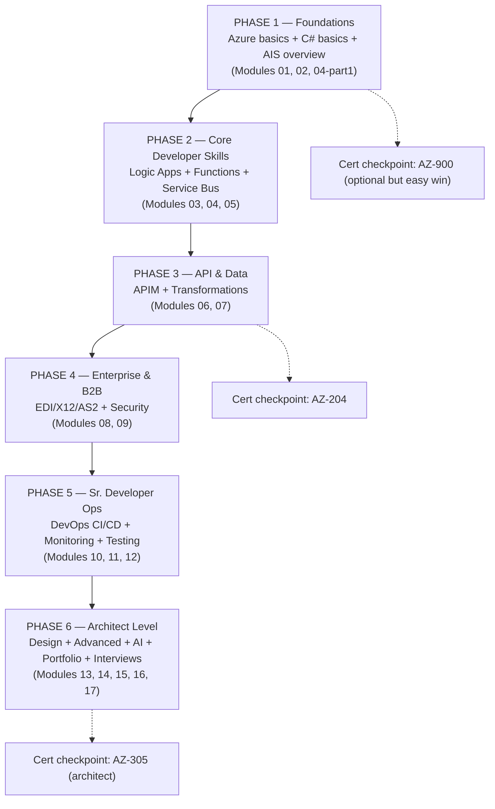

# 00 — The Roadmap: MuleSoft Developer → AIS Expert

This is the master plan. It is sequenced in **6 phases**. Each phase has modules to study, labs to complete, and **exit criteria** — do not move on until you meet them. Because you already have 7 years of integration experience, you are *not* learning integration — you are learning **where Azure puts the buttons** and **how .NET/C# works**. That's a much smaller hill than it looks.

---

## Visual roadmap



---

## How this maps to the target job description

The JD you shared is a **skills ladder**: Developer → Sr. Developer → Architect. Here's the exact mapping:

| JD line item | Band | Covered in module |
|---|---|---|
| Integration (iPaaS) and APIM fundamental knowledge | Developer | 02, 06 |
| Payload / Message formats (JSON, XML, CSV, Flat file, EDI, DB profile) | Developer | 02, 07, 08 |
| Logic App & workflows (set properties, Branch, Decision, Doc cache, Try/Catch) | Developer | 03 |
| Routing (Process Route, Simple route) | Developer | 03 |
| EDI formats (X12, EDIFACT, SWIFT) | Developer | 08 |
| Communication protocols (JMS, HTTP(s), SFTP, FTP, Azure Service Bus, Events) | Developer | 02, 05 |
| Flows, Process call (sync and async), .NET coding, Scripting, Azure Functions | Sr. Dev | 03, 04 |
| Connectors Knowledge (Service Bus, MQ, Salesforce, Oracle Fusion, Webserver, SAP, DB, SFTP) | Sr. Dev | 03, 05 |
| Transformation and Maps, Azure DevOps (CI/CD) | Sr. Dev | 07, 10 |
| Error handling, Logging framework, Monitoring (App Insights, Log Analytics, Splunk/Cribl) | Sr. Dev | 11 |
| Integration testing using Postman, SOAP UI, test automation | Sr. Dev | 12 |
| Caching, Document & Process Properties, Business Rules, Data Process Flow (Split, Combine, Encryption/Decryption) | Architect | 03, 07, 09, 14 |
| Logging, Security (policy, OAuth, HTTPS, SSL), Monitoring, Alerts | Architect | 09, 11 |
| Cloud & On-premises — Architecture, Deployment, Connection Licensing, Environments | Architect | 13 |
| EDI Integration Design (AS2, SFTP), Archiving, Re-processing, Partner Management | Architect | 08 |
| Advanced Features (Parallel processing, Clustering, Design Patterns), AI augmented design (Copilot) | Architect | 14 |
| Write Technical Specification, HLD (UML, deployment diagrams), LLD, Solutioning | Architect | 13 |
| Platform architecture, Best practices, Performance tuning, Security implementations | Architect | 13, 14 |
| Integration complexity, Effort estimations | Architect | 13 |
| E2E architecture, Tool Selection, Reusable Assets, Accelerators, Templates, Automation | Architect | 13, 14 |

> **Note on SWIFT:** SWIFT is a financial-messaging standard; Azure supports it via Logic Apps SWIFT connectors (MT encoder/decoder). Unless your employer does treasury integrations, X12/EDIFACT matter far more for manufacturing/building-tech companies (orders, invoices, ASNs with suppliers). Module 08 covers all three with weight on X12.

### What *other companies* add on top of this JD (from real 2025–2026 job postings)

These showed up repeatedly in AIS job descriptions at NTT DATA, Cloud Kinetics, Accenture, Cognizant, EY, and product companies — **many enterprise JDs don't list them explicitly, but interviews will ask**:

1. **Infrastructure as Code: Bicep / ARM templates / Terraform** → covered in Module 10.
2. **Event Grid vs Event Hubs vs Service Bus decision-making** → Module 05 (a top-5 interview question everywhere).
3. **Azure Data Factory awareness** (batch/ETL vs integration) → Module 13 tool-selection section.
4. **Durable Functions** (stateful orchestration in code) → Module 04.
5. **Microservices + containers awareness (AKS, Container Apps)** → Module 14.
6. **PowerShell scripting** → Module 10.
7. **API-first / OpenAPI design** → Module 06.
8. **Certifications: AZ-204, AZ-305** are "preferred" in almost every posting → Module 17.
9. **Hybrid connectivity: on-premises data gateway, ExpressRoute/VPN awareness** → Modules 02, 13.
10. **Cost optimization / licensing tiers** (Consumption vs Standard Logic Apps, APIM tiers) → Module 13.

---

## Phase-by-phase plan

> **Cadence note:** Do phases sequentially. Ordering is by dependency: C# basics before Functions, Logic Apps before EDI (EDI runs *inside* Logic Apps), Service Bus before advanced patterns. Within a phase you can interleave. Track your own pace — the exit criteria, not time spent, decide when you move on.

### Phase 1 — Foundations
**Goal:** Speak Azure. Read/write basic C#. Know what every AIS service is *for*.

- **Study:** Module 02 fully; Module 01 (bridge) as reference; Module 04 sections 1–4 (C# language basics only).
- **Labs:**
  - Create a free Azure account, a resource group, and explore the portal.
  - Deploy a "Hello World" Logic App (consumption) triggered by HTTP.
  - Write and run 5 small C# console programs (variables, loops, classes, LINQ, async/await).
- **Exit criteria:**
  - You can explain resource group / subscription / region / ARM to someone else.
  - You can name the right AIS service for 10 different scenarios without looking.
  - You can read a C# class and predict what it does.

### Phase 2 — Core Developer Skills (the biggest phase)
**Goal:** Build real integrations with Logic Apps, Functions, and Service Bus.

- **Study:** Modules 03, 04 (rest), 05.
- **Labs (minimum):**
  - Logic App: HTTP → condition → switch → call external API → try/catch scope with error notification.
  - Logic App Standard: stateful vs stateless workflow, local dev in VS Code.
  - Function: HTTP-triggered C# function; Service Bus-triggered function; deploy from VS Code.
  - Service Bus: queue + topic with 2 subscriptions + SQL filters; dead-letter handling; sessions for ordering.
  - Wire them together: Logic App → Service Bus topic → Function subscriber (this is Portfolio Project 1).
- **Exit criteria:**
  - You can build a fan-out pub/sub flow end-to-end without a tutorial.
  - You can explain consumption vs standard Logic Apps trade-offs.
  - You can explain peek-lock vs receive-and-delete, dead-lettering, and duplicate detection.

### Phase 3 — API & Data
**Goal:** Front everything with APIM; transform any payload shape.

- **Study:** Modules 06, 07.
- **Labs:**
  - Import a Function + a Logic App into APIM; apply rate-limit, JWT validation, and transformation policies; create products & subscriptions.
  - Transformations: JSON↔JSON with Data Operations + expressions; XML→JSON with Liquid; XML→XML with XSLT in an Integration Account.
- **Exit criteria:**
  - You can write APIM policy XML by hand for the top 10 policies.
  - Given any source/target payload pair, you can pick the right transformation tool and justify it.

### Phase 4 — Enterprise & B2B
**Goal:** The differentiator skills for enterprise AIS roles — EDI + security.

- **Study:** Modules 08, 09.
- **Labs:**
  - Integration Account: create trading partners, X12 agreement, decode an inbound 850, generate a 997, map 850→JSON order (Portfolio Project 3).
  - Security: put a Logic App + Function behind APIM with OAuth (Entra ID), secrets in Key Vault via managed identity, HTTPS-only, IP restrictions.
- **Exit criteria:**
  - You can narrate the full lifecycle of an inbound X12 850 through Azure, including 997/999 acknowledgments, archiving, and reprocessing failures.
  - You can draw the OAuth client-credentials flow from memory.

### Phase 5 — Senior Developer Operations
**Goal:** Ship and run like a senior: CI/CD, monitoring, testing.

- **Study:** Modules 10, 11, 12.
- **Labs:**
  - Azure DevOps: repo + YAML pipeline that deploys a Function and a Logic App Standard via Bicep to dev → (approval) → test.
  - Monitoring: App Insights on your Function; KQL queries over traces; alert rule → action group (email); workbook dashboard.
  - Testing: Postman collection with tests + Newman in the pipeline; unit tests for your Function with xUnit.
- **Exit criteria:**
  - A commit to main automatically deploys and runs tests.
  - You can find a failed run's root cause in Log Analytics with KQL in under 5 minutes.

### Phase 6 — Architect Level & Interview Sprint
**Goal:** Design end-to-end, estimate, document, and interview.

- **Study:** Modules 13, 14, and 18 (the integration-patterns catalog — your design-round ammunition); build remaining projects in 15; drill 16; plan certs from 17.

> **Note on Module 18 (Integration Patterns):** you can — and should — dip into it earlier: read file 01 (channels) with Phase 2, file 02 (routing) with Phase 2–3, file 03 (transformation) with Phase 3, and files 04–05 in Phases 5–6. The pattern names attach best right after you've built the corresponding thing.
- **Labs:**
  - Write a full HLD + LLD (templates provided in Module 13) for Portfolio Project 6 (the capstone).
  - Do 3 mock system-design sessions using scenarios from Module 16.
- **Exit criteria:**
  - You can whiteboard an E2E AIS architecture (hybrid, secure, monitored, CI/CD) in 20 minutes.
  - You can answer 90% of the interview bank confidently out loud.

---

## Your unfair advantages as a MuleSoft developer (use them!)

| You already know… | So in Azure you only need to learn… |
|---|---|
| Integration patterns (routing, aggregation, pub/sub, scatter-gather) | The Azure service names & config for each pattern |
| API-led connectivity (experience/process/system APIs) | How the same layering is done with APIM + Logic Apps + Functions |
| DataWeave thinking (declarative mapping) | Liquid/XSLT/expression syntax — the *thinking* transfers |
| Error handling strategy (on-error-continue/propagate) | Scopes + run-after + retry policies in Logic Apps |
| Anypoint MQ / JMS semantics | Service Bus (it's conceptually ~90% identical) |
| CI/CD with Maven + Anypoint CLI | Azure DevOps + Bicep (new tools, same discipline) |
| B2B via Anypoint Partner Manager | Integration Account (agreements, partners, maps, schemas) |

**Your two genuinely-new mountains:** (1) **C#/.NET** — treat it as a first-class subject, not a side quest; (2) **the Azure platform itself** (identity, networking, ARM). Everything else is renaming.

---

## Progress tracker

Copy this into your own notes and tick things off:

```text
[ ] Phase 1 exit criteria met          [ ] AZ-900 (optional)
[ ] Phase 2 exit criteria met          [ ] Portfolio Project 1
[ ] Phase 3 exit criteria met          [ ] Portfolio Project 2 + AZ-204 scheduled
[ ] Phase 4 exit criteria met          [ ] Portfolio Project 3
[ ] Phase 5 exit criteria met          [ ] Portfolio Projects 4, 5
[ ] Phase 6 exit criteria met          [ ] Portfolio Project 6 (capstone) + interview-ready
```
