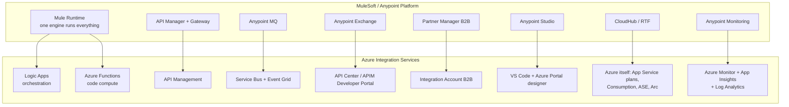
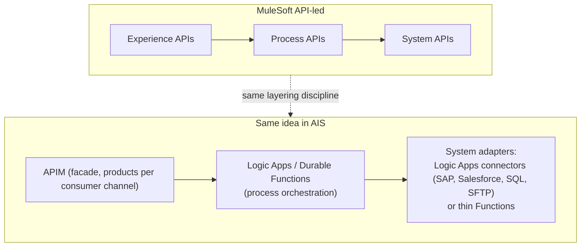

# 01 — The MuleSoft → AIS Bridge (Your Translation Dictionary)

**Keep this file open while studying every other module.** Whenever Azure introduces a concept, look up what you already know it as. This is the single highest-leverage document in the course.

---

## 1. The platform-level mapping

**Key mindset shift #1 — decomposition:** In Mule, one runtime hosts flows, connectors, transformations, and batch. In Azure, these are *separate managed services* that you compose. A "Mule application" becomes "a Logic App + maybe a Function + a Service Bus namespace + APIM policies," deployed together.

**Key mindset shift #2 — serverless & consumption pricing:** CloudHub charges by vCore, always-on. Much of AIS is pay-per-execution (Logic Apps Consumption: per action; Functions Consumption: per execution+GB-s). Architecture decisions become cost decisions per-run, not per-core.

**Key mindset shift #3 — the platform is the ecosystem:** Anypoint is a closed, curated platform. Azure is a giant open toolbox — AIS services integrate natively with 200+ other Azure services (Key Vault, Entra ID, Storage, SQL, Cosmos, AI). Your solutions will routinely reach outside "integration" services.

---

## 2. Concept-by-concept dictionary

### Runtime & flow concepts

| MuleSoft | Azure equivalent | Notes / gotchas |
|---|---|---|
| Mule application | Logic App (workflow) and/or Function App | An "app" may span multiple Azure resources |
| Flow | Logic App workflow | Visual designer in portal or VS Code |
| Sub-flow / flow-ref | Nested workflow / child Logic App called via HTTP or built-in "Workflow" action (Standard) | "Process call (sync/async)" in the JD = calling child workflows synchronously (wait for response) or async (fire-and-forget) |
| Private flow with VM queue | Logic App + Service Bus queue between workflows | VM-queue-like in-process handoff doesn't exist; use Service Bus or built-in queues |
| Batch job | Logic Apps until/for-each with batching, or Azure Data Factory, or Functions + queues | ADF is the true batch/ETL tool |
| Scheduler endpoint | Recurrence trigger / sliding-window trigger | Cron expressions supported |
| Event listener (HTTP Listener) | HTTP Request trigger (Logic Apps) / HTTP trigger (Functions) | |
| Object Store | Blob Storage / Table Storage / Redis Cache / Logic Apps Standard built-in state | "Doc cache" in the JD ≈ caching documents/config — usually Blob or Redis |
| Watermarking (On New/Updated rows) | Trigger state in connectors (e.g., SQL trigger), or manual watermark in Blob/Table | Same concept, sometimes manual |
| DataWeave | Data Operations actions + workflow expression language, Liquid templates, XSLT maps, or C# in a Function | No single DataWeave equivalent — see Module 07 |
| Set Variable / Set Payload | Initialize/Set Variable actions, Compose action | "Set properties" in the JD |
| Choice router | Condition (if/else) + Switch actions | "Branch, Decision" in the JD |
| Scatter-Gather | Parallel branches in Logic Apps; fan-out/fan-in in Durable Functions | |
| For Each / Parallel For Each | For each action (with concurrency control setting) | Default runs parallel (20); set to 1 for sequential |
| Until Successful | Retry policy on actions (fixed/exponential) + Until loop | Retry is a *setting* on every action, which is nicer than Mule |
| Error handler (on-error-continue / on-error-propagate) | Scopes + "Run after" configuration (has failed / is skipped / has timed out) | Try/Catch = Scope A, then Scope B configured to run after A "has failed" |
| Transaction (XA/local) | No distributed transactions; use Service Bus peek-lock + idempotency, sagas via Durable Functions | Big architectural difference — interviews love this |
| Mule expression language `#[...]` | Workflow definition language expressions `@{...}` / functions like `triggerBody()`, `body('Action')`, `items('For_each')` | See Module 03 §5 |
| Anypoint connectors | Managed connectors (1400+) + built-in (in-app) connectors in Standard | Same idea: SAP, Salesforce, Oracle, SQL, SFTP, etc. |
| Custom connector (SDK) | Custom APIM connector / custom Logic Apps connector (OpenAPI-based) | Much easier: define OpenAPI, get a connector |
| MUnit | Functions: xUnit/NUnit; Logic Apps Standard: automated testing framework + mock outputs | Module 12 |

### API management

| MuleSoft | Azure equivalent | Notes |
|---|---|---|
| API Manager | API Management (APIM) | |
| API Gateway / Flex Gateway | APIM gateway (managed, self-hosted gateway for on-prem) | Self-hosted gateway ≈ Flex Gateway |
| API policies (rate limiting, client ID enforcement) | APIM policies (XML): `rate-limit`, `validate-jwt`, `subscription key` | Policies are XML snippets in inbound/backend/outbound/on-error sections |
| SLA tiers + client applications | Products + subscriptions + subscription keys | |
| Anypoint Exchange (catalog) | APIM Developer Portal + Azure API Center | |
| RAML | OpenAPI (Swagger) | Azure world is OpenAPI-first |
| API autodiscovery | APIM import (from Function App, Logic App, OpenAPI, WSDL) | |

### Messaging

| MuleSoft | Azure equivalent | Notes |
|---|---|---|
| Anypoint MQ queue | Service Bus queue | Peek-lock ≈ MQ ack mode |
| Anypoint MQ exchange (fan-out) | Service Bus topic + subscriptions | Subscriptions can have SQL filters — more powerful than MQ exchanges |
| JMS connector to broker | Service Bus connector / AMQP 1.0 | Service Bus speaks AMQP; JMS 2.0 API supported on Premium |
| DLQ | Dead-letter queue (built into every queue/subscription) | Auto dead-letter on max delivery count / TTL expiry |
| Message ordering (FIFO queue) | Service Bus sessions | Session ID groups ordered messages |
| Redelivery policy | Max delivery count + abandon/complete/dead-letter operations | |
| VM queues | Storage queues (lightweight) or Service Bus | |
| CloudHub notifications / platform events | Event Grid | Reactive, push-based, per-event pricing |
| (no real equivalent) | Event Hubs — big-data event streaming (≈ Kafka) | New concept: telemetry/streaming ingestion |

### B2B / EDI

| MuleSoft | Azure equivalent | Notes |
|---|---|---|
| Anypoint Partner Manager | Integration Account + B2B actions in Logic Apps | |
| Trading partner config | Integration Account **Partners** (with qualifiers e.g. ZZ, 01/DUNS) | |
| Partner agreement | Integration Account **Agreements** (X12, EDIFACT, AS2) | Host partner + guest partner, send/receive settings |
| EDI document types | **Schemas** (XSD) uploaded to Integration Account | Microsoft ships standard X12/EDIFACT schemas |
| B2B message tracking | Azure Monitor + tracking in Integration Account, archive to Blob | Build archiving explicitly (Module 08) |
| AS2 endpoints | AS2 encode/decode actions + agreements | MDN handling built in |

### Deployment & ops

| MuleSoft | Azure equivalent | Notes |
|---|---|---|
| CloudHub worker sizing (vCores) | App Service plan SKUs / Consumption / Premium plans | WS1-WS3 plans for Logic Apps Standard |
| Runtime Fabric (RTF) | AKS / Container Apps (for containerized workloads); Logic Apps on Azure Arc | Rarely needed for AIS itself |
| On-prem Mule runtime | On-premises data gateway (for connectors) / self-hosted APIM gateway / hybrid connections | Key hybrid-connectivity concept |
| Anypoint CLI + Maven plugin | Azure CLI, `az` + Bicep/ARM + Azure DevOps pipelines / GitHub Actions | Module 10 |
| Properties files + secure properties | App settings + Key Vault references | Never store secrets in app settings directly |
| Environments (Design/Sandbox/Prod) | Resource groups / subscriptions per environment; APIM workspaces; DevOps stages | Common pattern: separate subscription or RG per env |
| Anypoint Monitoring + Insight | Application Insights + Log Analytics + Azure Monitor alerts | KQL replaces log search |
| Runtime Manager alerts | Azure Monitor alert rules + action groups | |

### Security

| MuleSoft | Azure equivalent | Notes |
|---|---|---|
| Client ID enforcement | APIM subscription keys | |
| OAuth 2.0 policy (external provider) | APIM `validate-jwt` with Entra ID (Azure AD) | Entra ID is *the* identity provider in Azure |
| Secure properties (encrypted) | Azure Key Vault + managed identity | Managed identity = credential-less auth between Azure services — learn this deeply, it's everywhere |
| TLS context | App Service TLS settings / APIM certificates / Key Vault certs | |
| IP allowlists | APIM `ip-filter` policy; App Service access restrictions; NSGs; Private Endpoints | Network isolation is richer in Azure |

---

## 3. API-led connectivity → Azure layering

Your Mule "experience / process / system API" habit maps cleanly:

In interviews, explicitly saying *"I applied API-led layering from my MuleSoft background: APIM as the experience layer, Logic Apps as process orchestration, connector-based system APIs"* lands very well — it shows transferable architecture skill.

---

## 4. "How do I say it in Azure?" — vocabulary flashcards

| You'd say in Mule… | Say in Azure… |
|---|---|
| "Deploy the app to CloudHub" | "Deploy the workflow/Function to the App Service plan / Consumption plan" |
| "Check Runtime Manager logs" | "Check Application Insights / Log Analytics" |
| "Add a Choice router" | "Add a Condition / Switch action" |
| "Write a DataWeave script" | "Add a Compose/Select action with expressions" or "a Liquid map" |
| "Publish to Exchange" | "Publish to the APIM developer portal / API Center" |
| "Enforce a rate-limiting policy" | "Apply a `rate-limit-by-key` policy in APIM" |
| "Put it on Anypoint MQ" | "Send it to a Service Bus queue/topic" |
| "The message went to the DLQ" | "The message was dead-lettered" (same words!) |
| "vCore sizing" | "SKU / plan sizing, scale-out rules" |
| "RAML spec" | "OpenAPI spec" |
| "MUnit test" | "xUnit test / Logic Apps mocked-run test" |
| "Secure property placeholder" | "Key Vault reference" |
| "On-error-propagate" | "Run-after: has failed → rethrow / terminate with Failed" |

---

## 5. What has NO good Mule equivalent (net-new learning)

1. **Entra ID (Azure AD) & managed identities** — identity is the security backbone of everything in Azure. (Module 09)
2. **ARM / Bicep — declarative infrastructure** — you deploy *infrastructure* as code, not just apps. (Module 10)
3. **KQL (Kusto Query Language)** — how you query all logs/telemetry. (Module 11)
4. **Durable Functions** — orchestration *in C# code* (function chaining, fan-out/fan-in, human interaction patterns). (Module 04)
5. **Event Grid / Event Hubs** — reactive eventing and streaming at platform scale. (Module 05)
6. **Azure networking for PaaS** — private endpoints, VNet integration, service endpoints. (Modules 09, 13)
7. **C# / .NET itself** — your biggest single investment. (Module 04)

## 6. What MuleSoft does *better* (know these for honest interview answers)

- **DataWeave** is more powerful than any single Azure mapping tool — in Azure you pick per-case (expressions vs Liquid vs XSLT vs code).
- **Single unified platform/IDE** — Azure spreads across portal + VS Code + DevOps; more surface area.
- **Uniform connector experience** — Azure connectors vary in quality between managed vs built-in.

When asked "MuleSoft vs AIS?" — give a balanced answer: AIS wins on cost model, Azure-native ecosystem, elasticity, and Microsoft-stack alignment; MuleSoft wins on unified developer experience and DataWeave. The right answer is "it depends on the enterprise's cloud strategy" — JCI is a Microsoft shop, hence AIS.
