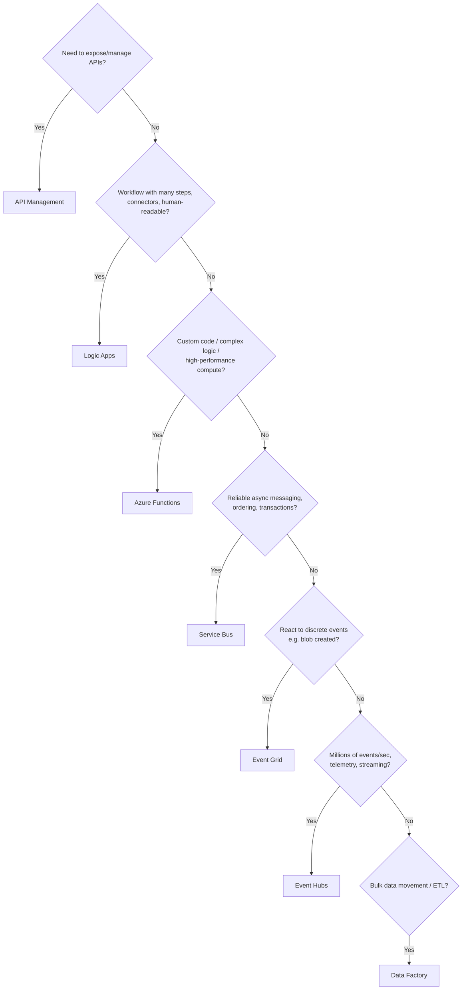
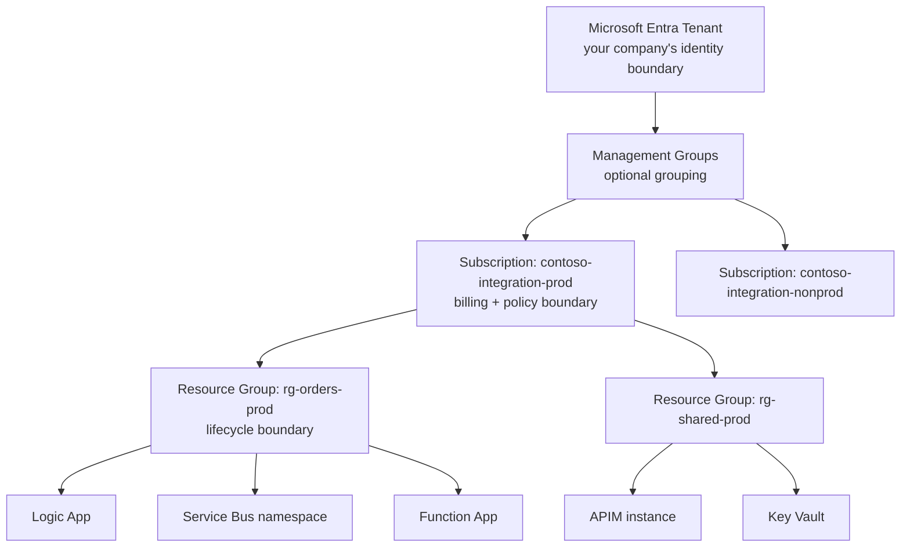
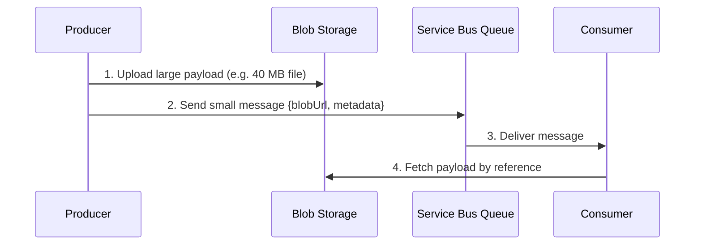
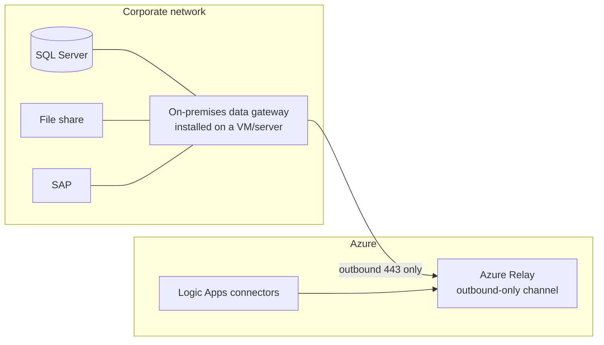

# 02 — Integration & Azure Fundamentals

**JD coverage:** "Integration (iPaaS) and APIM fundamental knowledge", "Payload / Message formats (JSON, XML, CSV, Flat file, EDI, DB profile)", "Communication protocols (JMS, HTTP(s), SFTP, FTP, Azure Service Bus, Events)".

**Goal of this module:** Understand what Azure *is* (the platform mechanics every AIS engineer must know), what each AIS service is *for*, and refresh the message-format/protocol fundamentals in Azure terms.

---

## 1. What is iPaaS, and where AIS sits

**iPaaS (Integration Platform as a Service)** = a cloud-hosted suite for connecting applications, data, and B2B partners without managing your own integration servers. You know this — Anypoint Platform is an iPaaS. **Azure Integration Services (AIS)** is Microsoft's iPaaS, but unlike Anypoint it's *not one product* — it's a family:

| Service | Purpose (one-liner) | MuleSoft analogy |
|---|---|---|
| **Logic Apps** | Visual workflow orchestration with 1400+ connectors | Mule flows |
| **Azure Functions** | Run small pieces of code (C#, etc.) serverlessly | Custom Java/DataWeave-heavy logic |
| **Service Bus** | Enterprise message broker (queues, topics) | Anypoint MQ / JMS |
| **Event Grid** | Reactive event routing (pub/sub for discrete events) | Platform events (loosely) |
| **Event Hubs** | High-throughput event streaming (≈ Kafka) | *(no Mule equivalent)* |
| **API Management** | Full API gateway + lifecycle + developer portal | API Manager + Exchange |
| **Integration Account** | B2B/EDI artifacts: partners, agreements, schemas, maps | Partner Manager |
| **Data Factory** *(adjacent)* | Batch ETL/ELT data pipelines | Mule batch jobs (roughly) |

📖 **Docs:** [What are Azure Integration Services?](https://learn.microsoft.com/en-us/azure/logic-apps/azure-integration-services-overview) · [AIS landing page](https://azure.microsoft.com/en-us/products/category/integration/)

### Choosing the right service (memorize this decision tree — it's a top interview question)

---

## 2. Azure platform mechanics (the stuff Mule never made you learn)

### 2.1 The resource hierarchy

- **Tenant** = your Entra ID (Azure Active Directory) instance. One per company, holds all users/apps.
- **Subscription** = billing + access boundary. Enterprises typically use separate subscriptions per environment (dev/test/prod) or per domain.
- **Resource Group (RG)** = a folder of resources that share a lifecycle (deploy together, delete together).
- **Resource** = the actual service instance (a Logic App, a namespace…).
- **Region** = physical datacenter geography (East US, West Europe…). Resources live in a region; pairs of regions support disaster recovery.

📖 [Azure fundamentals concepts (MS Learn)](https://learn.microsoft.com/en-us/training/paths/microsoft-azure-fundamentals-describe-cloud-concepts/) · [Resource groups & ARM overview](https://learn.microsoft.com/en-us/azure/azure-resource-manager/management/overview)

### 2.2 ARM — Azure Resource Manager

Every create/update/delete in Azure — portal clicks, CLI, SDK — goes through **ARM**, a single control-plane API. This means *everything* can be automated and templated (ARM templates / Bicep, Module 10). There is no Azure action you can't script.

### 2.3 Ways to work with Azure

| Tool | Use when |
|---|---|
| **Azure Portal** ([portal.azure.com](https://portal.azure.com)) | Learning, exploring, monitoring, one-off ops |
| **Azure CLI** (`az`) | Scripting, quick automation. `az group create -n rg-demo -l eastus` |
| **PowerShell** (`Az` module) | Windows-shop automation (JD-adjacent skill) |
| **VS Code + Azure extensions** | Real development: Logic Apps Standard, Functions |
| **Bicep/ARM/Terraform** | Repeatable infrastructure (Module 10) |

### 2.4 Identity in 90 seconds (deep dive in Module 09)

- **Microsoft Entra ID** (formerly Azure AD): the identity provider. Users, groups, **service principals** (app identities), **managed identities** (auto-managed app identities).
- **RBAC (role-based access control)**: rights like "Contributor on this resource group" are granted to identities at a *scope* (subscription/RG/resource).
- Golden rule you'll hear constantly: **use managed identity + RBAC instead of connection strings/keys wherever possible.**

---

## 3. Message formats refresher (in Azure terms)

You know these formats; this section is about *how Azure handles each*.

| Format | Azure handling | Notes for you |
|---|---|---|
| **JSON** | Native everywhere. Logic Apps: Parse JSON action + schemas; Functions: `System.Text.Json` | Like Mule's default weave targets |
| **XML** | Logic Apps XML actions (validate, transform via XSLT), APIM can validate/convert (`xml-to-json` policy) | Integration Account holds XSDs |
| **CSV / Flat file** | **Flat File encode/decode** actions with a flat-file schema (from Integration Account / Standard artifacts) | Equivalent of Mule's fixed-width/CSV in DataWeave; schema-driven here |
| **EDI (X12/EDIFACT)** | X12 / EDIFACT encode/decode actions + agreements (Module 08) | Schema + agreement driven |
| **DB profile** (JD term) | DB connectors (SQL Server, Oracle) return typed row sets; "profile" ≈ table/procedure metadata shaping the payload | Like Mule DB connector metadata |
| **Binary / files** | Blob Storage; base64 in Logic Apps when passed inline | Watch message-size limits! |

**Size limits worth memorizing (interview bait):** Logic Apps message size limit ~100 MB with chunking for some connectors (default direct limits much lower per connector); Service Bus Standard = 256 KB/message, Premium = 100 MB; Event Grid = 1 MB; Storage queues = 64 KB. **Pattern:** use the **claim-check pattern** — store the big payload in Blob Storage, pass a reference through messaging.

---

## 4. Communication protocols in Azure

| Protocol | Azure service/connector | Key notes |
|---|---|---|
| **HTTP/HTTPS** | HTTP trigger/action, APIM | TLS 1.2+ enforced by policy; APIM fronting recommended |
| **SFTP / FTP** | SFTP-SSH connector, FTP connector; **Blob SFTP endpoint** (Storage can *be* an SFTP server!) | SFTP-SSH connector supports key auth; polling triggers "when file added" |
| **AMQP** | Service Bus & Event Hubs native protocol | What the SDKs use under the hood |
| **JMS** | Service Bus Premium supports JMS 2.0 API | Migration path for JMS apps |
| **AS2** | AS2 actions + Integration Account (Module 08) | B2B with MDN receipts |
| **SOAP** | APIM (import WSDL, SOAP passthrough or SOAP→REST), Logic Apps custom connector | Yes, still alive in enterprises |
| **SMTP / Graph mail** | Office 365 Outlook connector, SendGrid | |
| **File shares (on-prem)** | File System connector via **on-premises data gateway** | The gateway is the hybrid bridge — know it |

### The on-premises data gateway (hybrid access — asked in every enterprise interview)

Key point: the gateway makes **outbound** connections only — no inbound firewall holes. Alternatives for deeper hybrid: VNet integration + ExpressRoute/VPN (Module 13).

📖 [On-premises data gateway docs](https://learn.microsoft.com/en-us/azure/logic-apps/logic-apps-gateway-install)

---

## 5. Labs

1. **Account & explore:** Create free account → create `rg-learn-ais` resource group → pin Logic Apps, Service Bus, APIM, Function App to your portal dashboard.
2. **CLI basics:** Install Azure CLI. `az login`, `az group list -o table`, create/delete a storage account from CLI.
3. **First workflow:** Consumption Logic App with HTTP trigger → Compose action that reshapes the JSON → Response. Test with Postman.
4. **Claim-check mini-lab:** Upload a file to Blob via portal; build a Logic App that reads blob metadata and posts it to a request bin.

---

## 6. Video & documentation library

**Microsoft Learn paths (free, canonical):**
- [Azure Fundamentals learning path (AZ-900)](https://learn.microsoft.com/en-us/training/paths/microsoft-azure-fundamentals-describe-cloud-concepts/)
- [Examine core integration services on Azure](https://learn.microsoft.com/en-us/training/modules/examine-primary-integration-services/)
- [Architecture: Basic enterprise integration on Azure](https://learn.microsoft.com/en-us/azure/architecture/reference-architectures/enterprise-integration/basic-enterprise-integration) ⭐ study this diagram hard
- [Azure Architecture Center — Integration patterns](https://learn.microsoft.com/en-us/azure/architecture/patterns/)

**YouTube (search these exact titles/channels):**
- **John Savill's Technical Training** — "Azure Master Class" & "AZ-900 Azure Fundamentals Full Course" (the best free Azure grounding on the internet)
- **Adam Marczak — Azure for Everyone** — short, brilliantly visual per-service explainers ("Azure Logic Apps Tutorial", "Azure Service Bus Explained", "Azure Functions Tutorial")
- **Microsoft Azure Developers** (official channel) — AIS-specific sessions and "Integration happy hour"
- **Azure Friday** (official) — 15-min service deep dives with product teams
- Search: **"Azure Integration Services overview 2025"** for current-state overviews

**Blogs to bookmark:**
- [Azure Integration Services Blog (Tech Community)](https://techcommunity.microsoft.com/category/azure/blog/integrationsonazureblog)
- [Serverless360 blog](https://www.serverless360.com/blog) — AIS-focused, ops-heavy, lots of comparisons

---

## 7. Interview questions for this module

1. What is AIS and which services make it up? When would you pick each?
2. Service Bus vs Event Grid vs Event Hubs — differences and use cases? *(the #1 AIS interview question)*
3. What's a resource group vs a subscription? How would you organize environments?
4. How do Logic Apps reach an on-premises SQL Server? (gateway, and what alternatives exist)
5. What is the claim-check pattern and when is it needed in Azure? (message size limits)
6. Coming from MuleSoft — how does AIS's decomposition into services change how you design?
7. What is ARM? Why does "everything through ARM" matter for automation?
8. How does consumption-based pricing change integration architecture decisions vs vCore-based CloudHub?
