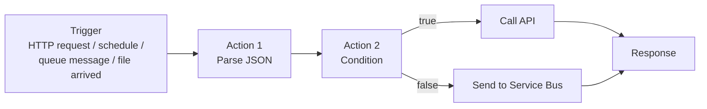
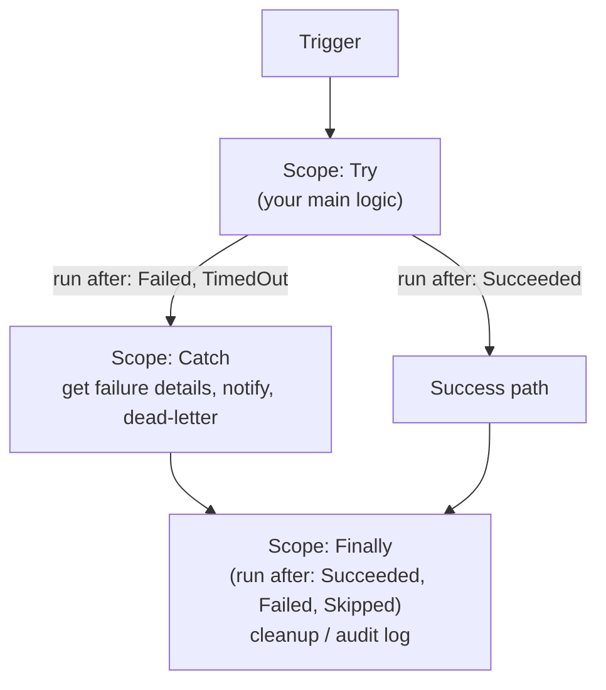
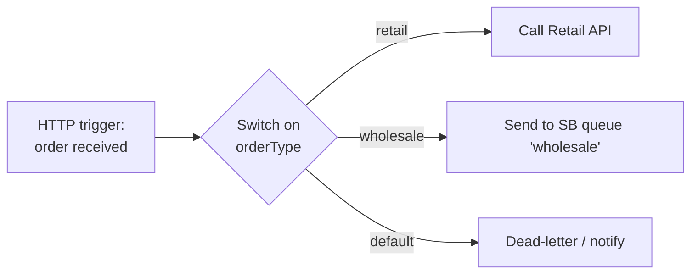
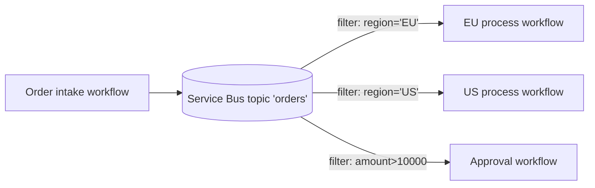
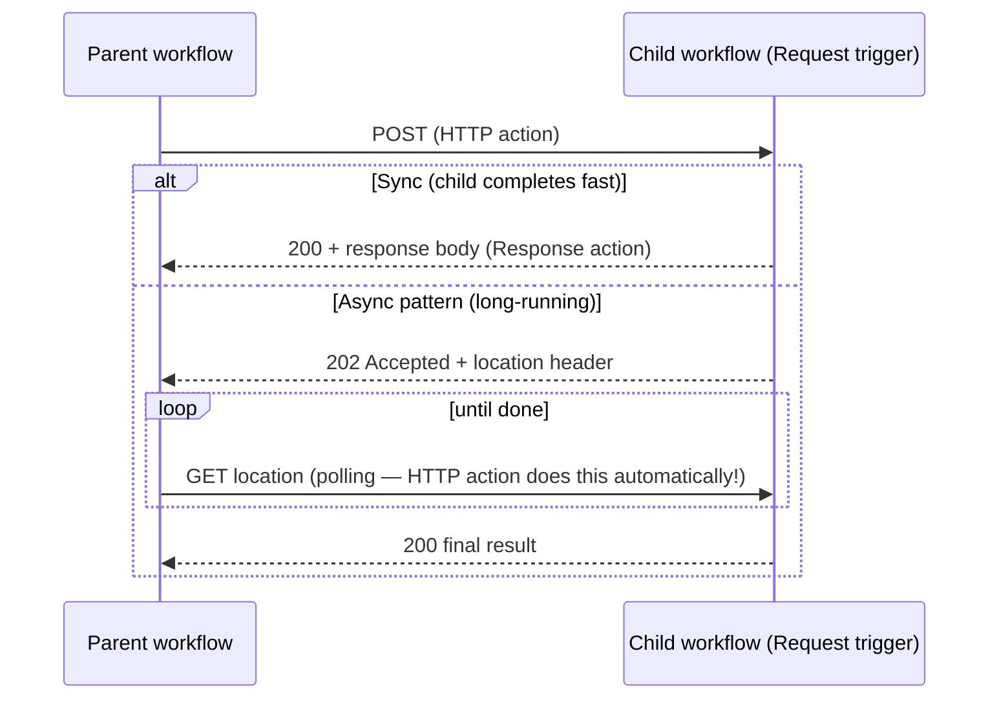

# 03 — Azure Logic Apps (Your New "Mule Flows")

**JD coverage:** "Logic App & workflows (set properties, Branch, Decision, Doc cache, Try/Catch etc.)", "Routing (Process Route, Simple route)", "Flows, Process call (sync and async)", "Connectors Knowledge (Azure Service Bus, MQ, Salesforce, Oracle Fusion, Webserver, SAP, DB, SFTP…)", "Caching, Document and Process Properties".

**This is the heart of AIS development. Spend the most time here.**

---

## 1. What a Logic App is

A **Logic App** is a serverless workflow: a **trigger** (what starts it) followed by **actions** (what it does), designed visually, saved as JSON (**workflow definition language**), executed by Azure with per-action state persisted (for stateful workflows). It is the closest thing to a Mule flow: trigger ≈ message source, actions ≈ processors.



📖 [Logic Apps overview](https://learn.microsoft.com/en-us/azure/logic-apps/logic-apps-overview)

---

## 2. Consumption vs Standard — the first decision, always

This is *the* foundational Logic Apps interview question and a real design decision on every project.

| | **Consumption** | **Standard** |
|---|---|---|
| Hosting | Multi-tenant, shared Azure infra | Single-tenant, runs on App Service (workflow runtime based on Functions runtime) |
| Pricing | Pay-per-action execution | Fixed plan (WS1/WS2/WS3) — pay for the compute |
| Workflows per app | 1 workflow per Logic App resource | **Many workflows** in one Logic App resource |
| State | Always stateful | **Stateful or stateless** per workflow (stateless = faster, cheaper, no run history detail) |
| Connectors | Managed (Azure-hosted) connectors | Managed **+ built-in (in-process)** connectors — faster, cheaper, no per-call cost |
| Networking | Limited (no VNet) | **VNet integration, private endpoints** ✅ |
| Local development | Portal designer only (mostly) | **VS Code local dev, run locally, unit-testable** |
| CI/CD | ARM template of the whole definition | Proper code project (workflow.json files) → zip deploy ✅ |
| B2B | Needs Integration Account | Built-in artifacts (maps/schemas) support; Integration Account for full B2B |
| When to use | Spiky/low volume, simple, cost-sensitive | Enterprise workloads, VNet/security needs, high volume, dev-loop rigor |

> **MuleSoft lens:** Consumption ≈ "fully managed pay-per-use," Standard ≈ "your dedicated worker (like a CloudHub worker) that hosts many flows in one deployable app."

📖 [Single-tenant vs multi-tenant comparison](https://learn.microsoft.com/en-us/azure/logic-apps/single-tenant-overview-compare)

---

## 3. Triggers

| Trigger type | Examples | Mule analogy |
|---|---|---|
| **Request** | HTTP request received (gives you a URL) | HTTP Listener |
| **Recurrence** | Every 15 minutes / cron | Scheduler |
| **Polling** | "When a file is added to SFTP", "When rows are inserted" | On New File / watermark listeners |
| **Push/Webhook** | "When a message arrives in Service Bus", Event Grid events | JMS listener / event source |

Key trigger concepts:
- **Split-on:** a trigger returning an array can auto-split into one run per item (like Mule's `foreach` at the source).
- **Concurrency control:** limit parallel runs (like maxConcurrency).
- **Trigger conditions:** an expression gate — trigger fires only if condition true (saves cost on Consumption!).

---

## 4. Actions & control flow — mapping every JD keyword

| JD term | Logic Apps feature | Details |
|---|---|---|
| **Set properties** | *Initialize variable*, *Set variable*, *Compose* | Variables are workflow-scoped; Compose creates an unnamed output (like set-payload into a temp) |
| **Branch** | *Parallel branches* — add multiple actions after one action | True parallel execution; join with run-after |
| **Decision** | *Condition* (if/else), *Switch* (case) | = Mule Choice router |
| **Doc cache** | No native action — pattern: cache documents/lookups in **Blob Storage**, **Table Storage**, or **Azure Cache for Redis**; in Standard you can also use built-in connectors for speed | = Object Store usage patterns; e.g., cache an OAuth token or a currency-rate document with TTL |
| **Try/Catch** | **Scope** actions + **run-after** configuration | See §6 — this is critical |
| **Routing — simple route** | Condition/Switch on message content → different actions | Content-based router pattern |
| **Routing — process route** | Route to different **child workflows/processes** (call another Logic App / workflow) based on rules; or publish to Service Bus **topics with subscription filters** for dynamic routing | Recipient list / dynamic router pattern |
| **Process call (sync)** | HTTP action calling child Logic App's Request trigger and **waiting for Response** | flow-ref to a flow that returns |
| **Process call (async)** | Child returns **202 Accepted** immediately (async pattern) or fire-and-forget via Service Bus queue | async flow-ref / VM queue handoff |
| **Document & process properties** | Trigger/action **tracked properties**, workflow **metadata**, variables carried through the run; message properties on Service Bus | Like flow variables + message attributes |
| **Split / Combine (Data Process Flow)** | *For each* (split), **SplitOn**, *Select*/*Join*/*Union* data operations, batch/aggregate patterns | Splitter/Aggregator EIP |

### Loops
- **For each** — parallel by default (up to 50 concurrent, configurable; set concurrency=1 for ordered processing).
- **Until** — do-until loop with count + timeout limits.
- **Batching:** Logic Apps has a *batch trigger/batch action* mechanism (Consumption) to collect messages and release by size/count/schedule — like a polling aggregator.

---

## 5. Expressions — the "mini-DataWeave" you must learn

Workflow definition language (WDL) expressions appear everywhere: `@{...}` inline or `@` prefixed in JSON. The essential function families:

```text
Reference data:
  triggerBody()                  -- the trigger payload (≈ payload at source)
  body('ActionName')             -- output body of an action
  outputs('ActionName')          -- full outputs incl. headers/status
  items('For_each')              -- current loop item
  variables('myVar')             -- variable value
  parameters('env')              -- workflow parameter
  triggerOutputs()['headers']    -- trigger headers

Manipulate:
  concat(a, b), substring(s, i, n), replace(s, x, y), split(s, ','), toUpper/ toLower
  json(xmlString), xml(jsonString), base64(s), base64ToString(s), decodeUriComponent(s)
  coalesce(a, b), if(cond, x, y), equals(a,b), and(), or(), not(), empty(x), contains()
  addDays(utcNow(), 7), formatDateTime(utcNow(), 'yyyy-MM-dd'), convertTimeZone(...)
  int(s), string(n), float(s), length(arr), first(arr), last(arr), union(a1,a2)
  workflow().run.name            -- the run ID (great for correlation logging!)
```

Example — build an order summary:

```json
{
  "orderId": "@{triggerBody()?['order']?['id']}",
  "total": "@{mul(triggerBody()?['qty'], triggerBody()?['unitPrice'])}",
  "receivedAtIst": "@{convertTimeZone(utcNow(),'UTC','India Standard Time')}",
  "status": "@{if(greater(triggerBody()?['qty'], 100), 'BULK', 'STANDARD')}"
}
```

> The `?` is the null-safe navigator — like DataWeave's default-safe navigation. Use it everywhere to avoid runtime failures on missing fields.

📖 [Workflow definition language functions reference](https://learn.microsoft.com/en-us/azure/logic-apps/workflow-definition-language-functions-reference) ⭐ bookmark permanently

---

## 6. Error handling — Try/Catch/Finally done properly

The magic mechanism is **run-after**: every action declares *which statuses of the previous action allow it to run* — `Succeeded` (default), `Failed`, `Skipped`, `TimedOut`.

**The Try/Catch/Finally pattern:**



Inside Catch, get error details with:

```text
result('Try')                 -- array of all action results in the Try scope
@body('Filter_array')         -- filter result('Try') where status == 'Failed' to find the failing action & error
```

**Retry policies** (per action — like Until-Successful, but built-in): default (4 retries, exponential), fixed interval, exponential backoff with min/max, or none. Configure in action settings.

**Terminate action:** end the run explicitly with status Succeeded/Failed/Cancelled + error code/message — use in Catch to mark the run failed after handling.

> **MuleSoft translation:** on-error-continue = Catch scope that handles and lets the flow proceed with Succeeded terminate; on-error-propagate = Catch that notifies then Terminates with Failed status.

Module 11 builds a full **error-handling framework** (centralized error Logic App + Service Bus error topic + alerting + resubmission).

---

## 7. Connectors — the JD's named systems

**Connector types:** *Built-in* (run in-process — Standard only; fast, no extra cost) vs *Managed* (Microsoft-hosted; Standard & Consumption; per-call billing on Consumption) vs *Custom* (you define via OpenAPI). Some connectors are both (Service Bus, SQL have built-in + managed versions).

| System (from JD) | Connector notes |
|---|---|
| **Azure Service Bus** | Send/receive (peek-lock or auto-complete), sessions, dead-letter ops. Built-in version in Standard for high throughput. |
| **MQ (IBM MQ)** | IBM MQ connector — needs on-prem data gateway for on-prem queue managers. |
| **Salesforce** | Triggers (record created/modified) + CRUD actions; OAuth connection. Compare with your Mule Salesforce connector — very similar surface. |
| **Oracle Fusion** | Usually via REST (Oracle Fusion exposes REST/SOAP APIs) — use HTTP action or custom connector; some use Oracle ERP Cloud adapters via APIM facade. |
| **Webserver / HTTP** | HTTP action (any REST/SOAP endpoint), with auth options: none/basic/client cert/OAuth/managed identity ⭐ |
| **SAP** | SAP connector (BAPI, RFC, IDoc, tRFC) — requires on-prem data gateway + SAP NCo libraries, or SAP built-in connector in Standard. IDoc receive is a classic enterprise scenario. |
| **DB (SQL Server / Oracle DB)** | SQL connector: query/insert/execute stored procedure/triggers on row changes. Oracle DB connector via gateway. |
| **SFTP** | SFTP-SSH connector: when-file-added trigger, get/create/delete file; key-based auth; chunking for large files. |

📖 [Connectors overview](https://learn.microsoft.com/en-us/azure/connectors/introduction) · [Managed connectors reference](https://learn.microsoft.com/en-us/connectors/connector-reference/connector-reference-logicapps-connectors) · [SAP connector](https://learn.microsoft.com/en-us/azure/logic-apps/connectors/sap)

**Connections are resources:** each connector login creates an *API connection* resource (with its own auth lifecycle). In CI/CD you must parameterize/recreate these per environment (Module 10 covers how — a classic real-world pain point worth mentioning in interviews).

---

## 8. Patterns you must be able to build cold

### 8.1 Content-based routing ("simple route")



### 8.2 Process routing via pub/sub ("process route")


Routing logic lives in **subscription filters**, not in code — add consumers without touching the producer. This is the architecture answer interviewers want for "how do you decouple processes?"

### 8.3 Sync process call with async fallback


The Logic Apps HTTP action follows the **async polling pattern automatically** when it receives 202 + `location` header (can be disabled). Know this — it explains "process call sync vs async" perfectly.

### 8.4 Scatter-gather

Parallel branches → each calls a system → a final action with run-after on *all* branches joins results (`union()` / Compose). In Durable Functions this is fan-out/fan-in (Module 04).

---

## 9. Run history, resubmission & operations

- Every stateful run stores **inputs/outputs of every action** — visible in run history (amazing for debugging; mind PII → use `secureData` settings to hide sensitive inputs/outputs!).
- **Resubmit:** re-run a failed run from the trigger (Consumption & Standard); Standard also supports **resubmit from a specific action** — huge for ops.
- Runs are subject to limits: [Logic Apps limits & config](https://learn.microsoft.com/en-us/azure/logic-apps/logic-apps-limits-and-config) (bookmark; e.g., 90-day run retention on Consumption, action repetition limits, message size limits).

---

## 10. Labs

1. **Control-flow kata:** HTTP trigger receives an order JSON → Parse JSON → Condition (amount > 1000?) → Switch on category → Response. Add a deliberate failure (bad URL) and build Try/Catch/Finally with Terminate.
2. **Routing lab:** Build 8.1 and 8.2 above (topic + 3 filtered subscriptions).
3. **Process call lab:** Parent + child Logic Apps; child does both sync response and 202-async version; watch the HTTP action poll.
4. **File integration:** SFTP (or Blob as stand-in) trigger → flat-file-ish CSV parse (split by newline, Select to objects) → insert rows into SQL (or post to a mock API).
5. **Standard-specific:** Install VS Code + Azure Logic Apps (Standard) extension → create project → run a stateful and a stateless workflow locally → deploy with VS Code.
6. **Doc-cache lab:** Workflow that fetches an FX-rate document from an API, stores it in Blob with a timestamp; a second workflow reads it and only refreshes if older than 1 hour.

---

## 11. Video & documentation library

**Microsoft Learn:**
- [Introduction to Logic Apps](https://learn.microsoft.com/en-us/training/modules/intro-to-logic-apps/)
- [Build workflows with Logic Apps learning path](https://learn.microsoft.com/en-us/training/paths/build-workflows-with-logic-apps/)
- [Error & exception handling](https://learn.microsoft.com/en-us/azure/logic-apps/logic-apps-exception-handling)
- [Create Standard workflows in VS Code](https://learn.microsoft.com/en-us/azure/logic-apps/create-single-tenant-workflows-visual-studio-code)

**YouTube:**
- **Adam Marczak** — "Azure Logic Apps Tutorial for Beginners" (best visual intro)
- **Microsoft Azure Developers** — "Logic Apps Community Standup" sessions (deep, current)
- Search **"Logic Apps Standard vs Consumption"** — several strong comparisons
- Search **"Logic Apps error handling scopes run after"** for the try/catch pattern demoed
- **Serverless360 / Turbo360** channel — ops-oriented Logic Apps content

**Blogs:**
- [Logic Apps team blog](https://techcommunity.microsoft.com/category/azure/blog/integrationsonazureblog)
- Michał Smereczyński / Sandro Pereira's blog ([blog.sandro-pereira.com](https://blog.sandro-pereira.com/)) — the most prolific Logic Apps blogger; hundreds of "Friday fact" posts and patterns

---

## 12. Interview questions for this module

1. Consumption vs Standard Logic Apps — differences, and how do you choose? *(guaranteed question)*
2. Stateful vs stateless workflows — trade-offs?
3. How does Try/Catch work in Logic Apps? Explain run-after.
4. How do you implement content-based routing? Two ways (Switch vs topic filters) and when each?
5. How do you call one workflow from another synchronously vs asynchronously? What does the HTTP action do with a 202?
6. How do you control For-each concurrency and why would you set it to 1?
7. What are trigger conditions and split-on?
8. How do connectors differ (built-in vs managed vs custom)? Cost implications on Consumption?
9. How would you cache a lookup document used by many runs? (doc cache pattern)
10. How do you secure the HTTP request trigger URL? (SAS in URL, restrict IPs, front with APIM + OAuth — Module 09)
11. How do you handle a 40 MB payload arriving over SFTP? (chunking, claim-check)
12. A run failed at action 14 of 20 — how do you recover? (resubmit; Standard: resubmit from action; idempotency concerns)
13. From your MuleSoft experience: what's the equivalent of flow variables, and how do variable scopes differ in a For-each running in parallel? *(gotcha: variables are shared across parallel iterations — use Compose/Select instead)*
