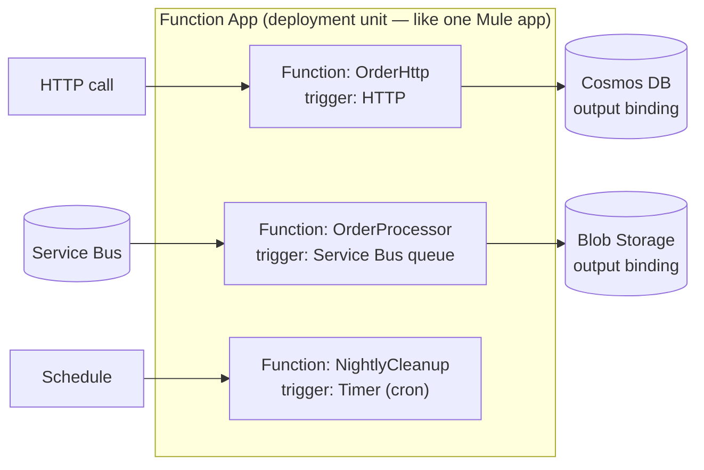
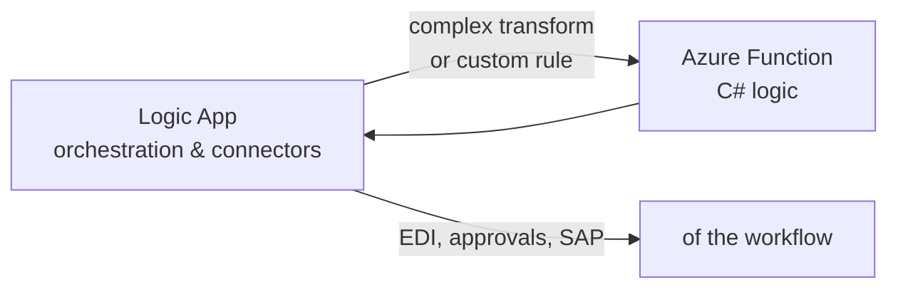

# 04 — C#, .NET & Azure Functions (From Absolute Beginner to Durable Orchestrations)

**JD coverage:** ".Net coding, Scripting, Azure Functions".

**This is your biggest net-new skill.** You said you're a beginner in .NET — this module takes you from zero. Treat sections 1–4 (the C# language) as a first-class course, not a warm-up. In AIS delivery, Functions are used wherever Logic Apps hit their limits: complex transformations, high-performance processing, custom business logic, reusable utilities.

---

## 1. The .NET landscape — 5-minute orientation

- **.NET** = the platform (runtime + libraries). Modern versions: **.NET 8 (LTS)**, .NET 9. ("`.NET Framework 4.x`" is the *legacy Windows-only* one — you'll see it in old enterprise code.)
- **C#** = the language (think: Java's close cousin — you'll feel at home; ~80% of syntax feels familiar from any C-family exposure).
- **NuGet** = package manager (≈ Maven Central).
- **dotnet CLI** = build/run tool (≈ mvn): `dotnet new`, `dotnet build`, `dotnet run`, `dotnet test`.
- IDE: **VS Code + C# Dev Kit** (free) or **Visual Studio 2022 Community** (free, Windows, richer).

**Install now:** [.NET SDK](https://dotnet.microsoft.com/download) → `dotnet --version` → `dotnet new console -n Hello && cd Hello && dotnet run`.

📖 [C# for beginners — official free course](https://learn.microsoft.com/en-us/training/paths/get-started-c-sharp-part-1/) · [C# documentation](https://learn.microsoft.com/en-us/dotnet/csharp/)
🎥 **"C# for Beginners" full course — dotnet YouTube channel (official)**; also freeCodeCamp's "C# Full Course".

---

## 2. C# essentials (with Java/DataWeave anchors)

### 2.1 Program structure, types, variables

```csharp
// Modern C# top-level program (Program.cs)
using System;

string name = "Anna";            // explicit type
var qty = 42;                    // type inference (compiler still strongly types it)
decimal price = 19.99m;          // decimal for money (m suffix)
bool isBulk = qty > 100;
DateTime now = DateTime.UtcNow;

Console.WriteLine($"Order for {name}: {qty} x {price:C}");  // string interpolation
```

Key types: `int`, `long`, `double`, `decimal` (money!), `bool`, `string`, `DateTime`, `Guid`, arrays `int[]`, and **nullable** forms `int?`, `string?` (null-safety annotations).

### 2.2 Control flow (you know all of this — just syntax)

```csharp
if (qty > 100) { /* ... */ } else if (qty > 10) { } else { }

switch (orderType)
{
    case "retail":    Handle(); break;
    case "wholesale": HandleWholesale(); break;
    default:          throw new ArgumentException($"Unknown: {orderType}");
}

// switch EXPRESSION (very DataWeave-match-like!)
string band = qty switch
{
    > 100 => "BULK",
    > 10  => "MEDIUM",
    _     => "SMALL"
};

foreach (var item in items) { }
for (int i = 0; i < 10; i++) { }
while (retries < 3) { }
```

### 2.3 Classes, records, interfaces (OOP)

```csharp
// A record = immutable data carrier — perfect for payload models (like a DW object type)
public record Order(string Id, string Customer, decimal Amount, List<OrderLine> Lines);
public record OrderLine(string Sku, int Qty, decimal UnitPrice);

// A class with behavior
public class OrderValidator : IValidator<Order>          // implements an interface
{
    private readonly decimal _maxAmount;                  // field
    public OrderValidator(decimal maxAmount) => _maxAmount = maxAmount;  // constructor

    public bool IsValid(Order order) =>
        order.Amount > 0 && order.Amount <= _maxAmount && order.Lines.Count > 0;
}

public interface IValidator<T> { bool IsValid(T item); }
```

### 2.4 Collections & LINQ — *your DataWeave muscle lives here*

LINQ is C#'s declarative data-transformation language. Every DataWeave `map/filter/reduce/groupBy` has a direct LINQ twin:

```csharp
using System.Linq;

var lines = order.Lines;

// DataWeave: lines filter ($.qty > 0) map { sku: $.sku, total: $.qty * $.unitPrice }
var totals = lines
    .Where(l => l.Qty > 0)                               // filter
    .Select(l => new { l.Sku, Total = l.Qty * l.UnitPrice }) // map
    .OrderByDescending(x => x.Total)                     // orderBy
    .ToList();

// DataWeave: lines groupBy $.sku
var bySku = lines.GroupBy(l => l.Sku)
                 .ToDictionary(g => g.Key, g => g.Sum(l => l.Qty));  // reduce per group

decimal grandTotal = lines.Sum(l => l.Qty * l.UnitPrice);   // reduce
bool anyBig = lines.Any(l => l.Qty > 100);                  // some
var firstOrNull = lines.FirstOrDefault(l => l.Sku == "ABC");
var distinctSkus = lines.Select(l => l.Sku).Distinct().ToList();
```

| DataWeave | LINQ |
|---|---|
| `map` | `.Select()` |
| `filter` | `.Where()` |
| `reduce` | `.Aggregate()` / `.Sum()` / `.Count()` |
| `groupBy` | `.GroupBy()` |
| `orderBy` | `.OrderBy()` / `.OrderByDescending()` |
| `distinctBy` | `.DistinctBy()` |
| `flatten` | `.SelectMany()` |
| `joinBy`-ish | `.Join()` |

### 2.5 JSON handling (constant in integration work)

```csharp
using System.Text.Json;

var order = JsonSerializer.Deserialize<Order>(jsonString,
    new JsonSerializerOptions { PropertyNameCaseInsensitive = true });

string outJson = JsonSerializer.Serialize(order,
    new JsonSerializerOptions { WriteIndented = true });
```
(Older codebases use `Newtonsoft.Json` / `JObject` — recognize both.)

### 2.6 Exceptions

```csharp
try
{
    await ProcessAsync(order);
}
catch (HttpRequestException ex)      // catch specific first
{
    logger.LogError(ex, "Downstream call failed for {OrderId}", order.Id);
    throw;                           // rethrow preserving stack trace (like propagate)
}
catch (Exception ex)
{
    logger.LogError(ex, "Unexpected error");
    // swallow = on-error-continue; rethrow = on-error-propagate
}
finally
{
    // cleanup — always runs
}
```

### 2.7 async/await — *must master; it's everywhere in Azure SDKs*

```csharp
public async Task<string> GetCustomerAsync(string id)
{
    using var http = new HttpClient();
    HttpResponseMessage resp = await http.GetAsync($"https://api.example.com/customers/{id}");
    resp.EnsureSuccessStatusCode();
    return await resp.Content.ReadAsStringAsync();
}

// Parallel fan-out (≈ scatter-gather):
var tasks = ids.Select(GetCustomerAsync);
string[] results = await Task.WhenAll(tasks);
```

Mental model: `await` releases the thread while I/O happens (like non-blocking Mule 4 event processing); `Task` ≈ a future/promise. Rule: **async all the way** — never `.Result`/`.Wait()` (deadlocks).

### 2.8 Dependency injection & configuration (how real .NET apps are wired)

```csharp
// In a Function app's Program.cs
var host = new HostBuilder()
    .ConfigureFunctionsWebApplication()
    .ConfigureServices(services =>
    {
        services.AddHttpClient();                          // typed HttpClient factory
        services.AddSingleton<IValidator<Order>, OrderValidator>();
    })
    .Build();
host.Run();
```
Configuration comes from **app settings** (environment variables in Azure) via `IConfiguration` — and secrets via Key Vault references (Module 09).

**Practice plan for C#:** do the whole [C# for Beginners path](https://learn.microsoft.com/en-us/training/paths/get-started-c-sharp-part-1/) (parts 1–6), then re-implement 5 of your old DataWeave transformations as C# console programs using LINQ. That exercise alone will teach you 70% of what AIS Functions work needs.

---

## 3. Azure Functions — concepts

An **Azure Function** = a piece of code that runs in response to a **trigger**, with declarative **bindings** for input/output data. Serverless: Azure handles servers, scaling, patching.



### Triggers & bindings you'll actually use

| Trigger | Fires when | Typical AIS use |
|---|---|---|
| **HTTP** | Request arrives | Lightweight APIs, webhooks, utilities called from Logic Apps |
| **Service Bus** | Queue/topic message | The workhorse message processor |
| **Timer** | Cron schedule | Housekeeping, polling |
| **Blob / Event Grid** | File lands | File processing pipelines |
| **Event Hubs** | Stream events | Telemetry processing |

**Bindings** = declarative I/O without SDK plumbing (e.g., an output binding writes your return value to Cosmos DB automatically).

### Hosting plans (interview staple)

| Plan | Traits |
|---|---|
| **Consumption** | Pure serverless; scale to zero; ~5–10 min max duration; **cold starts** |
| **Flex Consumption** | Newer serverless: faster scale, VNet support, per-instance concurrency |
| **Premium (Elastic)** | Pre-warmed instances (no cold start), VNet, longer runs |
| **Dedicated (App Service plan)** | Runs on your existing plan; predictable cost |

### Isolated worker vs in-process (current-state knowledge)

Modern Functions use the **isolated worker model** (your code runs in a separate process; supports latest .NET). The old **in-process** model is retired for new work — say "isolated worker on .NET 8" in interviews to sound current.
📖 [Isolated worker model guide](https://learn.microsoft.com/en-us/azure/azure-functions/dotnet-isolated-process-guide)

---

## 4. Your first real functions

### HTTP-triggered (C#, isolated)

```csharp
public class OrderHttp
{
    private readonly ILogger<OrderHttp> _logger;
    public OrderHttp(ILogger<OrderHttp> logger) => _logger = logger;

    [Function("OrderHttp")]
    public async Task<HttpResponseData> Run(
        [HttpTrigger(AuthorizationLevel.Function, "post", Route = "orders")] HttpRequestData req)
    {
        var order = await req.ReadFromJsonAsync<Order>();
        _logger.LogInformation("Received order {OrderId}", order!.Id);

        if (order.Amount <= 0)
        {
            var bad = req.CreateResponse(HttpStatusCode.BadRequest);
            await bad.WriteAsJsonAsync(new { error = "Amount must be positive" });
            return bad;
        }

        var ok = req.CreateResponse(HttpStatusCode.Accepted);
        await ok.WriteAsJsonAsync(new { status = "queued", order.Id });
        return ok;
    }
}
```

### Service Bus-triggered (the AIS workhorse)

```csharp
public class OrderProcessor
{
    [Function("OrderProcessor")]
    public async Task Run(
        [ServiceBusTrigger("orders", Connection = "ServiceBusConnection")]
        ServiceBusReceivedMessage message,
        ServiceBusMessageActions messageActions)
    {
        var order = message.Body.ToObjectFromJson<Order>();
        try
        {
            await _service.ProcessAsync(order);
            await messageActions.CompleteMessageAsync(message);       // ack
        }
        catch (TransientException)
        {
            await messageActions.AbandonMessageAsync(message);        // retry (redelivery)
        }
        catch (Exception ex)
        {
            await messageActions.DeadLetterMessageAsync(message,
                deadLetterReason: "ProcessingFailed",
                deadLetterErrorDescription: ex.Message);              // DLQ with reason
        }
    }
}
```
Notice the exact Anypoint MQ/JMS semantics: complete = ack, abandon = nack/redeliver, dead-letter = DLQ.

**Local dev loop:** VS Code + Azure Functions extension + Azure Functions Core Tools → `func start` runs locally; hit `http://localhost:7071/api/orders` with Postman; deploy with the extension or `func azure functionapp publish`.

📖 [Create your first C# function](https://learn.microsoft.com/en-us/azure/azure-functions/create-first-function-vs-code-csharp) · [Functions developer guide](https://learn.microsoft.com/en-us/azure/azure-functions/functions-reference)

---

## 5. Durable Functions — orchestration *in code*

Durable Functions add **stateful orchestrations** to serverless code — the code-first sibling of Logic Apps. Other companies' JDs ask for this a lot.

```csharp
[Function(nameof(OrderOrchestration))]
public static async Task<OrderResult> OrderOrchestration(
    [OrchestrationTrigger] TaskOrchestrationContext ctx)
{
    var order = ctx.GetInput<Order>();

    // Function chaining
    var validated = await ctx.CallActivityAsync<Order>("ValidateOrder", order);

    // Fan-out / fan-in (scatter-gather!)
    var tasks = validated.Lines.Select(l => ctx.CallActivityAsync<Reservation>("ReserveStock", l));
    var reservations = await Task.WhenAll(tasks);

    // Human interaction / external event with timeout
    using var cts = new CancellationTokenSource();
    var approvalTask = ctx.WaitForExternalEvent<bool>("ManagerApproval");
    var timeoutTask = ctx.CreateTimer(ctx.CurrentUtcDateTime.AddHours(24), cts.Token);
    var winner = await Task.WhenAny(approvalTask, timeoutTask);

    bool approved = winner == approvalTask && approvalTask.Result;
    return await ctx.CallActivityAsync<OrderResult>(approved ? "ConfirmOrder" : "CancelOrder", validated);
}
```

Patterns to know by name: **function chaining, fan-out/fan-in, async HTTP APIs, monitor, human interaction, saga/compensation**. Durable state is checkpointed in Storage — orchestrations survive restarts and can run for days.

**Logic Apps vs Durable Functions?** Logic Apps: visual, connector-rich, ops-friendly, better for business-visible processes; Durable: code-first, testable, better for developer-owned complex logic. Perfect interview answer: *"Both orchestrate; I pick Logic Apps when connectors and visibility dominate, Durable when logic complexity and unit-testability dominate — and often Logic Apps calls Functions for the hard steps."*

📖 [Durable Functions overview](https://learn.microsoft.com/en-us/azure/azure-functions/durable/durable-functions-overview)

---

## 6. Functions ↔ Logic Apps together (the standard AIS pairing)


Rule of thumb heard on real teams: *"Logic Apps for the plumbing, Functions for the thinking."* Call a Function from a Logic App with the built-in Azure Functions action (or HTTP). Secure Function → Logic App calls with function keys or (better) managed identity + Entra ID (Module 09).

---

## 7. Labs

1. **C# katas (do these before touching Functions):** console apps for (a) parse a JSON order & compute totals with LINQ, (b) group a CSV of transactions by category, (c) call a public REST API with `HttpClient` + async, (d) re-write 3 of your old DataWeave maps in LINQ.
2. **HTTP function:** the OrderHttp function above — run locally, test with Postman, deploy, test in Azure.
3. **Service Bus function:** queue-triggered processor with complete/abandon/dead-letter paths; send poison messages and watch DLQ.
4. **Durable:** build the fan-out/fan-in orchestration; inspect state in Storage; raise the external event via HTTP admin API.
5. **Pairing:** Logic App calls your function for a "complex transformation" step.

---

## 8. Video & documentation library

- 🎥 **dotnet (official) YouTube** — "C# for Beginners" playlist ⭐ start here
- 🎥 **freeCodeCamp** — "C# Tutorial – Full Course for Beginners"
- 🎥 **IAmTimCorey** — deep, practical C# (DI, async, LINQ explained slowly)
- 🎥 **Adam Marczak** — "Azure Functions Tutorial" (visual overview)
- 🎥 Search **"Durable Functions patterns"** — Microsoft sessions on the 6 patterns
- 📖 [Foundational C# Certification (free, freeCodeCamp + Microsoft)](https://learn.microsoft.com/en-us/training/paths/get-started-c-sharp-part-1/)
- 📖 [Azure Functions docs home](https://learn.microsoft.com/en-us/azure/azure-functions/)
- 📖 [Functions best practices](https://learn.microsoft.com/en-us/azure/azure-functions/functions-best-practices) ⭐ read twice

---

## 9. Interview questions for this module

1. What are triggers and bindings? Give three examples of each.
2. Consumption vs Premium vs Dedicated hosting — trade-offs? What's a cold start and how do you mitigate it?
3. In-process vs isolated worker model — which do you use and why?
4. How do you handle a poison message in a Service Bus-triggered function?
5. What is `async/await`? Why can calling `.Result` deadlock?
6. Explain LINQ `Select` vs `SelectMany`. How would you group and sum order lines by SKU?
7. Durable Functions: name and explain the six patterns. How is state persisted?
8. Logic Apps vs (Durable) Functions — how do you choose? *(guaranteed)*
9. How do you manage configuration and secrets in a Function App?
10. How do you make a function idempotent (Service Bus at-least-once delivery)?
11. What is dependency injection and why does it matter for testability?
12. How do Functions scale on Consumption? What limits concurrency for a Service Bus trigger? (scale controller, `maxConcurrentCalls`, prefetch)
