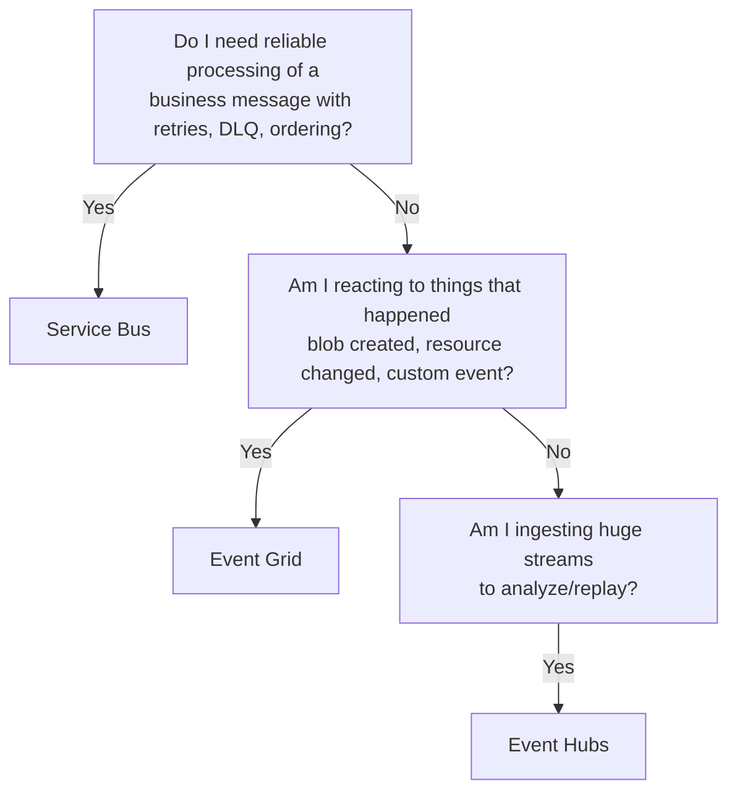
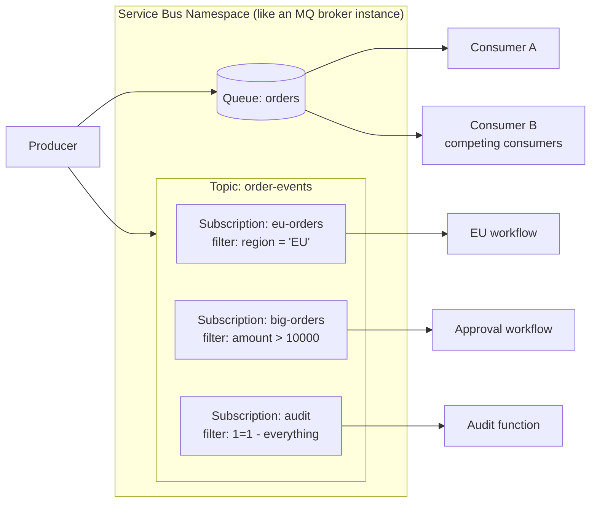
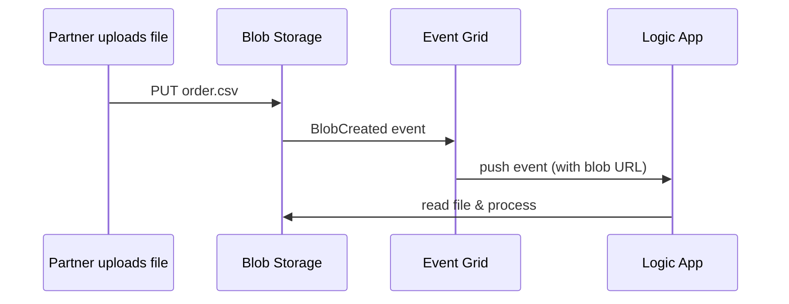

# 05 — Messaging: Service Bus, Event Grid, Event Hubs

**JD coverage:** "Communication protocols (JMS, HTTP(s), SFTP, FTP, Azure Service Bus, Events)", "Connectors Knowledge (Azure Service Bus, MQ…)".

Coming from Anypoint MQ / JMS, this module is mostly *renaming + a few genuinely new ideas*. The genuinely new ideas: **subscription filters**, **sessions**, **Event Grid**, and **Event Hubs**.

---

## 1. Messages vs Events — the mental model Azure forces on you

- **Message** = a command/data with an *expectation of processing* ("process this order"). Producer cares what happens. → **Service Bus**.
- **Event** = a fact/notification ("a blob was created"). Producer doesn't care who reacts. → **Event Grid** (discrete events) / **Event Hubs** (event *streams*).

### The big-three comparison (top interview question in every AIS interview)

| | **Service Bus** | **Event Grid** | **Event Hubs** |
|---|---|---|---|
| Purpose | Enterprise messaging (commands, business transactions) | Reactive event routing (notifications) | Big-data event streaming (telemetry, logs, clickstreams) |
| Model | Pull (competing consumers, peek-lock) | Push (HTTP webhook / to handlers) | Partitioned consumer (like Kafka consumer groups) |
| Order/transaction features | FIFO (sessions), transactions, dedup, DLQ, scheduled delivery | At-least-once push, retry with DLQ (storage) | Per-partition ordering, replayable stream (retention) |
| Size | 256 KB (Std) / 100 MB (Premium) | 1 MB | 1 MB |
| Throughput | High | Very high (millions/sec routing) | Extremely high (millions/sec ingest) |
| MuleSoft analogy | Anypoint MQ / JMS | (webhooks/platform events) | Kafka |
| Example | Order queue between systems | "New file arrived → start Logic App" | IoT device telemetry into analytics |

📖 [Choose between messaging services](https://learn.microsoft.com/en-us/azure/service-bus-messaging/compare-messaging-services) ⭐ the canonical answer sheet

---

## 2. Service Bus deep dive

### 2.1 Building blocks

- **Namespace** = the broker (Basic/Standard/Premium tiers).
- **Queue** = point-to-point with competing consumers.
- **Topic + Subscriptions** = pub/sub; each subscription is a *virtual queue* receiving a filtered copy.
- **Filters:** SQL-like (`region = 'EU' AND amount > 100`), correlation filters (cheaper, exact-match on properties), boolean. *Actions* can also modify properties on match. This is content-based routing without code — the killer feature vs Anypoint MQ.

### 2.2 Receive semantics (identical concepts to JMS/Anypoint MQ)

- **Peek-lock (default):** message locked (default 30s–5min renewable) → you `Complete` (delete), `Abandon` (unlock, redeliver, DeliveryCount+1), `Dead-letter`, or `Defer` (park for later retrieval by sequence number).
- **Receive-and-delete:** at-most-once, fastest, riskiest.
- **MaxDeliveryCount** (default 10) exceeded → automatic dead-letter.
- **Dead-letter queue (DLQ):** every queue/subscription has one built in (`queue/$DeadLetterQueue`). Messages carry `DeadLetterReason`. **Build DLQ monitoring + resubmission into every design** (Module 11).

### 2.3 The power features (interview differentiators)

| Feature | What it does | Classic use |
|---|---|---|
| **Sessions** | FIFO ordering per session ID; one consumer owns a session at a time | Per-customer or per-order-id ordered processing |
| **Duplicate detection** | Drops repeat `MessageId` within a time window | Idempotency at the broker |
| **Scheduled messages** | Deliver at a future time | Delayed retry, reminders |
| **Message deferral** | Set aside until you're ready (fetch by sequence number) | Out-of-order handling |
| **Auto-forwarding** | Chain queue→queue/topic automatically | Fan-in, decoupling namespaces |
| **Transactions** | Atomic group of sends/completes on one namespace | Complete inbound + send outbound atomically |
| **Auto-delete / TTL** | Expire messages/entities | Hygiene |
| **Geo-DR (Premium)** | Namespace metadata failover to paired region | DR designs (Module 13) |

### 2.4 Reliability patterns you must articulate

1. **At-least-once + idempotent consumer** (the default correct posture): dedup by business key or Service Bus duplicate detection; consumers safe to reprocess.
2. **Claim check** for large payloads (Module 02 §3).
3. **Retry with backoff → DLQ → alert → operator resubmit** (build in Module 11).
4. **Ordered processing:** sessions + single consumer per session; or ForEach concurrency 1 in Logic Apps (slower).
5. **Outbox pattern** when "write DB + send message" must be consistent (no distributed transactions in the cloud!). *(Interviewers love this one.)*

📖 [Service Bus overview](https://learn.microsoft.com/en-us/azure/service-bus-messaging/service-bus-messaging-overview) · [Queues, topics, subscriptions](https://learn.microsoft.com/en-us/azure/service-bus-messaging/service-bus-queues-topics-subscriptions) · [DLQ docs](https://learn.microsoft.com/en-us/azure/service-bus-messaging/service-bus-dead-letter-queues)

---

## 3. Event Grid in 15 minutes

- **Sources:** Azure services (Blob "created", resource events), custom topics (your apps), partner topics (SAP, Auth0…).
- **Subscribers/handlers:** Logic Apps, Functions, webhooks, Service Bus, Storage queues.
- **Filtering:** by event type + subject prefix/suffix + advanced data filters.
- **Delivery:** push with retries over 24h; undeliverable → storage-account dead-letter.
- **MQTT broker** capability exists for IoT scenarios (know it exists).

Classic AIS pattern — file processing without polling:

vs the old way (SFTP polling trigger every N minutes): Event Grid is instant, cheaper, and scales.

📖 [Event Grid overview](https://learn.microsoft.com/en-us/azure/event-grid/overview)

---

## 4. Event Hubs in 10 minutes (awareness level)

Kafka-compatible event streaming: **partitions**, **consumer groups**, **offsets/checkpoints**, retention (1–90 days) with replay, Capture (auto-archive to Blob). AIS relevance: high-volume telemetry ingestion feeding Functions/Stream Analytics. Know when to *say* "that's an Event Hubs job, not Service Bus" — e.g., 50k sensor readings/sec from IoT devices or building-management systems.

📖 [Event Hubs overview](https://learn.microsoft.com/en-us/azure/event-hubs/event-hubs-about)

---

## 5. Labs

1. **Queue basics:** create namespace + queue (CLI or portal); send/receive with Service Bus Explorer (built into portal); observe peek-lock, abandon, delivery count, dead-letter.
2. **Pub/sub with filters:** topic + 3 subscriptions (SQL filter, correlation filter, catch-all); prove each subscriber gets the right subset.
3. **Sessions:** enable sessions on a queue; send 10 messages across 2 session IDs; consume with a session-aware Function; verify per-session FIFO.
4. **DLQ handling:** poison a message → watch it dead-letter after MaxDeliveryCount → build a small Logic App that reads the DLQ and resubmits.
5. **Event Grid:** Blob-created event → Logic App handler; compare latency vs an SFTP polling trigger.
6. **Duplicate detection:** enable it, send same MessageId twice, observe.

---

## 6. Video & documentation library

- 🎥 **Adam Marczak** — "Azure Service Bus Tutorial" and "Azure Event Grid Tutorial" (best visuals)
- 🎥 **John Savill** — "Azure Messaging Services Deep Dive" (SB vs EG vs EH in one video)
- 🎥 Search **"Service Bus sessions ordering demo"**, **"Service Bus dead letter queue handling"**
- 📖 [Service Bus performance best practices](https://learn.microsoft.com/en-us/azure/service-bus-messaging/service-bus-performance-improvements)
- 📖 [Enterprise integration using message broker & events (Architecture Center)](https://learn.microsoft.com/en-us/azure/architecture/example-scenario/integration/queues-events)
- 🛠️ [Serverless360 / Turbo360 blog](https://www.serverless360.com/blog) — deep Service Bus ops articles

---

## 7. Interview questions for this module

1. Service Bus vs Event Grid vs Event Hubs — with a use case each. *(the #1 question)*
2. Peek-lock vs receive-and-delete; what happens on lock expiry?
3. How do you guarantee message ordering? (sessions) What's the throughput cost?
4. How does a message end up in the DLQ, and what's your operational strategy for DLQs?
5. Queues vs topics — when each? How do subscription filters work (SQL vs correlation)?
6. How do you achieve exactly-once-like behavior? (at-least-once + idempotency + dup detection; explain why true exactly-once doesn't exist)
7. Standard vs Premium namespaces? (256KB vs 100MB, messaging units, VNet/private endpoints, geo-DR, JMS 2.0)
8. What's the claim-check pattern? The outbox pattern?
9. Coming from Anypoint MQ: what's better/worse in Service Bus? (better: filters, sessions, transactions; watch out: no built-in message browsing UI as friendly — use Service Bus Explorer)
10. A consumer processes each message twice occasionally — walk me through your diagnosis. (lock lost mid-processing? processing > lock duration? renew lock / shorter work / idempotency)
