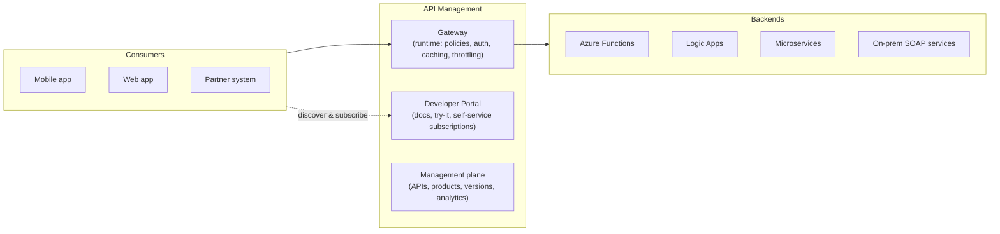
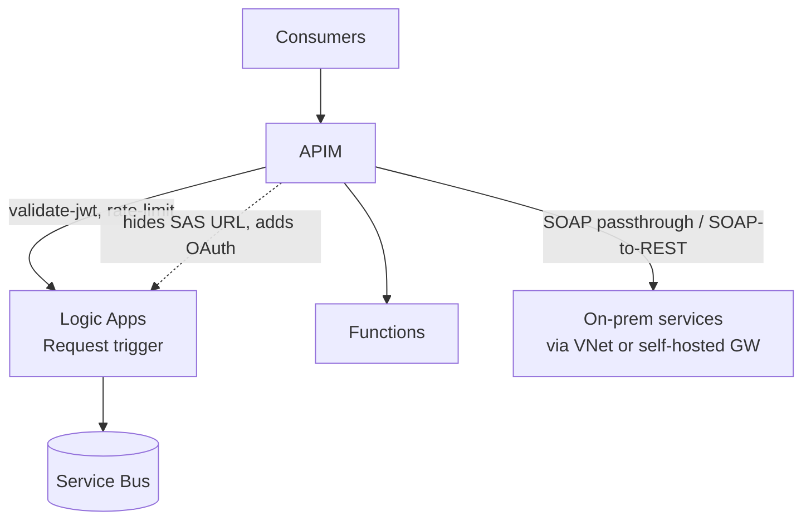

# 06 — Azure API Management (APIM)

**JD coverage:** "Integration (iPaaS) and APIM fundamental knowledge" — plus APIM is central to every other company's AIS JD.

You know API Manager + Exchange from Anypoint. APIM merges both plus the gateway into one service. Your API-led instincts transfer directly.

---

## 1. What APIM is



Three planes: **gateway** (≈ Mule gateway/Flex), **developer portal** (≈ Exchange public portal), **management** (≈ API Manager).

**Core objects:**
- **API** = a facade over a backend (import from OpenAPI, WSDL, Function App, Logic App, or blank). Has **operations** (GET /orders/{id}…).
- **Product** = a bundle of APIs offered to consumers with terms (≈ SLA tier + portal listing). Consumers get **subscriptions** → **subscription keys** (≈ client ID enforcement).
- **Policies** = the superpower. XML pipeline applied at global/product/API/operation scope, in four sections: `inbound`, `backend`, `outbound`, `on-error`.

📖 [APIM overview](https://learn.microsoft.com/en-us/azure/api-management/api-management-key-concepts)

---

## 2. Policies — learn these 12 by hand

```xml
<policies>
  <inbound>
    <base />                                                   <!-- inherit parent scope -->
    <rate-limit-by-key calls="100" renewal-period="60"
        counter-key="@(context.Subscription.Id)" />            <!-- throttling -->
    <quota-by-key calls="10000" renewal-period="86400"
        counter-key="@(context.Subscription.Id)" />            <!-- daily quota -->
    <validate-jwt header-name="Authorization"
        failed-validation-httpcode="401">                      <!-- OAuth! see Module 09 -->
      <openid-config url="https://login.microsoftonline.com/{tenant}/v2.0/.well-known/openid-configuration" />
      <audiences><audience>api://my-api</audience></audiences>
      <required-claims>
        <claim name="roles" match="any"><value>Orders.Read</value></claim>
      </required-claims>
    </validate-jwt>
    <ip-filter action="allow"><address-range from="10.0.0.0" to="10.0.255.255" /></ip-filter>
    <set-header name="x-correlation-id" exists-action="skip">
      <value>@(Guid.NewGuid().ToString())</value>              <!-- policy expressions are C#! -->
    </set-header>
    <cache-lookup vary-by-developer="false" vary-by-developer-groups="false" />
    <rewrite-uri template="/internal/orders" />
  </inbound>
  <backend>
    <retry condition="@(context.Response.StatusCode >= 500)" count="3" interval="2">
      <forward-request timeout="30" />
    </retry>
  </backend>
  <outbound>
    <base />
    <cache-store duration="300" />
    <set-header name="X-Powered-By" exists-action="delete" />  <!-- hide backend details -->
    <xml-to-json kind="direct" apply="content-type-xml" consider-accept-header="true" />
  </outbound>
  <on-error>
    <set-status code="500" reason="Internal error" />
    <set-body>@{ return new JObject(new JProperty("error", context.LastError.Message)).ToString(); }</set-body>
  </on-error>
</policies>
```

Note: **policy expressions are C#** (`@(...)` / `@{...}`) — another reason Module 04 matters.

The dozen to know cold: `rate-limit(-by-key)`, `quota(-by-key)`, `validate-jwt`, `ip-filter`, `cors`, `set-header`, `rewrite-uri`, `cache-lookup`/`cache-store`, `mock-response`, `xml-to-json`/`json-to-xml`, `send-request` (call-out mid-policy), `emit-metric`/`trace`.

📖 [Policy reference (all policies)](https://learn.microsoft.com/en-us/azure/api-management/api-management-policies) · [Policy expressions](https://learn.microsoft.com/en-us/azure/api-management/api-management-policy-expressions)

---

## 3. Versions, revisions, and lifecycle

- **Revisions** = non-breaking iterations of the same API (test a change, then set current) — like a draft/promote cycle.
- **Versions** = breaking changes side-by-side (`/v1/`, `/v2/`, or header/query versioning).
- **API-first flow:** design OpenAPI spec → import → mock (`mock-response` policy) so consumers build in parallel → implement backend → swap mock off. Say exactly this in interviews; it's the modern answer to "how do you run API delivery?"

---

## 4. Tiers & deployment topologies (architect band)

| Tier | Use | Notes |
|---|---|---|
| **Consumption** | Serverless, per-call billing | No portal; lightweight facades |
| **Developer** | Non-prod | No SLA |
| **Basic/Standard** | Small-medium prod | |
| **Premium** | Enterprise | **VNet injection, multi-region gateways, availability zones**, self-hosted gateway |
| **v2 tiers (Basic v2/Standard v2/Premium v2)** | Newer, faster provisioning, VNet integration options | Increasingly the default choice |

**Self-hosted gateway:** containerized APIM gateway you run on-prem/other clouds, managed from Azure (≈ Flex Gateway). Key hybrid answer.

**Multi-region + caching + circuit-style retries** make APIM part of your DR/performance story (Module 13).

---

## 5. APIM + the rest of AIS



Fronting a Logic App Request trigger with APIM is *the* standard pattern: the raw trigger URL contains a SAS key (anyone with the URL can call it) — APIM adds OAuth/subscription keys, throttling, a stable URL, and analytics. **Expect an interview question on exactly this.**

---

## 6. Labs

1. Provision APIM (Developer tier — takes ~30–45 min) → import your Module 04 Function → test in the built-in console.
2. Add policies: rate limit 5/min (test the 429!), set-header correlation ID, cache a GET for 60s, mock an unbuilt operation.
3. Products & subscriptions: create Bronze (rate-limited) and Gold products; subscribe; call with subscription keys.
4. Front your Logic App with APIM; then lock the Logic App so only APIM can call it (restrict inbound IPs to APIM's IP).
5. Import a public WSDL (SOAP passthrough) and try SOAP→REST.
6. Explore the developer portal; publish it; sign up as a fake consumer.

---

## 7. Video & documentation library

- 📖 [APIM documentation home](https://learn.microsoft.com/en-us/azure/api-management/)
- 📖 [Explore APIM (MS Learn module)](https://learn.microsoft.com/en-us/training/modules/explore-api-management/)
- 📖 [Architecture: Protect APIs with APIM](https://learn.microsoft.com/en-us/azure/architecture/reference-architectures/apis/protect-apis)
- 🎥 **Adam Marczak** — "Azure API Management Tutorial"
- 🎥 **Microsoft Azure Developers** — APIM deep dives & "API Management Community Live"
- 🎥 Search **"APIM policies tutorial validate-jwt"**, **"APIM landing zone accelerator"**

---

## 8. Interview questions for this module

1. What problems does APIM solve that a raw Function/Logic App URL doesn't? *(security, throttling, analytics, stable contract, portal)*
2. Explain the policy pipeline: inbound/backend/outbound/on-error; scopes and `<base/>` inheritance.
3. How do you throttle per consumer? Difference between rate-limit and quota?
4. Versions vs revisions?
5. How do you secure APIM→backend? (managed identity to Functions/Logic Apps, client certs, IP restrictions, VNet)
6. How do you validate OAuth tokens in APIM? Walk through `validate-jwt`.
7. Products and subscriptions — how do you model Bronze/Gold consumer tiers?
8. Premium tier features? When do you need VNet injection? Self-hosted gateway use case?
9. Caching in APIM — what would you cache and how do you vary the cache key?
10. Compare Anypoint API Manager with APIM. (policies: XML+C# vs UI-applied; Exchange vs dev portal; Flex GW vs self-hosted GW)
