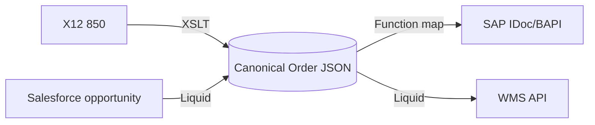

# 07 — Data Transformation & Maps (Life After DataWeave)

> **Deep-dive subfolder:** [`Liquid-Data-Mapping/`](./Liquid-Data-Mapping/README.md) — the complete Liquid mapping course: 20 mapping scenarios with working templates, a printable [mapping quick-reference sheet](./Liquid-Data-Mapping/MAPPING-SHEET.md), and a [DataWeave→Liquid correlation sheet](./Liquid-Data-Mapping/DATAWEAVE-TO-LIQUID.md).

**JD coverage:** "Transformation and Maps", "Payload / Message formats", "Data Process Flow (Split, Combine, Encryption/Decryption…)".

Hard truth first: **there is no single DataWeave equivalent in Azure.** Instead there's a *toolbox*, and choosing the right tool per case is itself an interview topic. Your transformation *thinking* (source shape → target shape, mapping spec, null-safety, functions) transfers 100%.

---

## 1. The transformation toolbox — decision table

| Tool | Best for | Where it runs | DataWeave feel? |
|---|---|---|---|
| **Workflow expressions + Data Operations** (Compose, Select, Filter array, Join, Create CSV/HTML table, Parse JSON) | Simple-to-medium JSON→JSON | Logic Apps actions | Low — imperative-ish |
| **Liquid templates** | Template-driven JSON↔JSON, JSON→text, XML→JSON with control flow | Logic Apps action (needs Integration Account on Consumption; native artifact in Standard) | Medium — closest "template" feel |
| **XSLT maps** | XML→XML (and XML→anything), EDI mapping | Transform XML action + Integration Account/Standard artifacts | For XML pros |
| **.NET code in Azure Functions** (LINQ) | Complex logic, lookups, performance, unit-tested maps | Function called from workflow | High — LINQ ≈ DataWeave (see Module 04 §2.4) |
| **Data Mapper (Logic Apps Standard)** | Visual drag-drop mapping XML/JSON, generates XSLT | VS Code designer | Like Anypoint's graphical mapper |
| **APIM policies** (`xml-to-json`, `set-body` with C#) | Lightweight tweaks at the gateway | APIM | Light |
| **Integration Account maps/schemas** | Enterprise artifact store for XSLT/XSD/flat-file schemas | Shared resource | = your B2B mapping repo |

**Rule of thumb to quote:** *expressions for small, Liquid for template-shaped, XSLT for XML/EDI, Functions for complex/tested, Data Mapper when a visual artifact helps the team.*

---

## 2. Data Operations in Logic Apps (the everyday 80%)

- **Parse JSON** — declare a schema (generate from sample) so later steps get typed tokens (≈ metadata in Studio).
- **Compose** — build any JSON with expressions (your set-payload).
- **Select** — map over an array: input array + per-item mapping → new array (**this is your `map`**).
- **Filter array** — your `filter`.
- **Join** — array → delimited string.
- **Create CSV table / HTML table** — arrays → CSV/HTML (flat-file-ish output).

Example — Select action mapping order lines (DataWeave `map` equivalent):

```json
// From: triggerBody()?['lines']
// Map each item to:
{
  "sku": "@item()?['productCode']",
  "quantity": "@item()?['qty']",
  "lineTotal": "@mul(item()?['qty'], item()?['price'])"
}
```

**Split & Combine (JD's "Data Process Flow"):**
- Split: **SplitOn** at trigger, **For each**, or `chunk()`-style manual batching; EDI decode splits interchanges → transactions.
- Combine: **Batch trigger** (collect then release), `union()`, `join()`, append-to-array variable, or aggregate in a Function.
- Encryption/decryption in flows: PGP has no native action → Function with a PGP library, or Key Vault-backed encryption; AS2 handles S/MIME encryption for B2B (Module 08).

---

## 3. Liquid templates (closest to a DW script)

Liquid = a templating language (from Shopify, used in Logic Apps via DotLiquid). One action: *Transform JSON to JSON* (also JSON→text, XML→JSON).

```liquid
{
  "orderId": "{{ content.order.id }}",
  "customer": "{{ content.order.customer.name | upcase }}",
  "orderDate": "{{ content.order.date | date: '%Y-%m-%d' }}",
  "lines": [
    
    {
      "sku": "{{ line.productCode }}",
      "qty": {{ line.qty }},
      "total": {{ line.qty | times: line.price }}
    },
    
  ],
  "isBulk": truefalse
}
```

Filters (`| upcase`, `| date:`, `| times:`) ≈ DataWeave functions; `` ≈ `map`; `` ≈ `when/otherwise`. Gotchas: Logic Apps Liquid is **case-sensitive**, root is `content`, and complex nesting gets ugly — that's your cue to switch to a Function.

> **Go deeper:** the [`Liquid-Data-Mapping/`](./Liquid-Data-Mapping/README.md) subfolder covers all 20 mapping scenarios (filter/aggregate/group-by/flatten/CSV/XML/escaping…), DotLiquid-vs-Shopify differences, and a full DataWeave correlation sheet.

📖 [Transform JSON/XML with Liquid](https://learn.microsoft.com/en-us/azure/logic-apps/logic-apps-enterprise-integration-liquid-transform) · [Liquid language docs](https://shopify.github.io/liquid/)

---

## 4. XML: XSD validation + XSLT maps

The enterprise/EDI world runs on XML inside Azure B2B: EDI decodes to XML, then XSLT maps XML→XML.

- **Validate XML** action against an XSD schema (uploaded to Integration Account or Standard artifacts).
- **Transform XML** action runs an **XSLT** map (1.0/2.0/3.0 supported in Standard with limitations by runtime; classic Integration Account maps are XSLT 1.0 + can call C# in some paths).

Minimal XSLT to recognize the shape:

```xml
<xsl:stylesheet version="1.0" xmlns:xsl="http://www.w3.org/1999/XSL/Transform">
  <xsl:template match="/Order">
    <PurchaseOrder>
      <Id><xsl:value-of select="@id"/></Id>
      <xsl:for-each select="Lines/Line">
        <Item>
          <Sku><xsl:value-of select="Sku"/></Sku>
          <Amount><xsl:value-of select="Qty * Price"/></Amount>
        </Item>
      </xsl:for-each>
    </PurchaseOrder>
  </xsl:template>
</xsl:stylesheet>
```

**Data Mapper** (Logic Apps Standard, VS Code): visual source-to-target mapping over XSD/JSON schemas with functions (concat, conditional, loops) that **generates XSLT** — the closest thing to Anypoint's graphical DataWeave view.

📖 [Add XSLT maps](https://learn.microsoft.com/en-us/azure/logic-apps/logic-apps-enterprise-integration-maps) · [Data Mapper](https://learn.microsoft.com/en-us/azure/logic-apps/create-maps-data-transformation-visual-studio-code)

---

## 5. Flat files & CSV

- **Flat File encode/decode** actions use a *flat-file schema* (XSD with flat-file annotations — BizTalk heritage) describing delimiters/positions → converts flat file ↔ XML. Schemas built with the **Flat File Schema Wizard** (VS extension) or hand-edited.
- Quick-and-dirty CSV: `split()` expressions + Select (fine for simple files); Create CSV table for output.
- Big/batch files: Azure Data Factory or a Function with `CsvHelper` (NuGet).

---

## 6. Where to put *complex* maps: the Function pattern

For anything you'd have written 100+ lines of DataWeave for, the clean AIS answer is a **mapping Function**:

```csharp
[Function("MapOrderToSap")]
public async Task<HttpResponseData> Run(
    [HttpTrigger(AuthorizationLevel.Function, "post")] HttpRequestData req)
{
    var order = await req.ReadFromJsonAsync<CanonicalOrder>();

    var sapOrder = new SapOrder
    {
        Bukrs = order!.CompanyCode,
        Items = order.Lines
            .Where(l => l.Qty > 0)
            .Select((l, i) => new SapItem
            {
                Posnr = (i + 1) * 10,        // SAP line numbering 10,20,30…
                Matnr = l.Sku.PadLeft(18, '0'),
                Menge = l.Qty
            })
            .ToList()
    };

    var resp = req.CreateResponse(HttpStatusCode.OK);
    await resp.WriteAsJsonAsync(sapOrder);
    return resp;
}
```

Benefits you can cite: unit-testable (xUnit, Module 12), version-controlled like real code, fast, debuggable — things DataWeave scripts embedded in flows struggled with.

---

## 7. Canonical data model (architecture tie-in)

Keep your Mule habit: map **edge formats → canonical model → edge formats** rather than N×N point maps. In AIS: canonical JSON schemas stored centrally (repo + Integration Account/Standard artifacts), used by Parse JSON, Functions models, and APIM schema validation. Mention *canonical model + map-per-edge* in design interviews — it's the difference between developer and architect answers.



---

## 8. Labs

1. Rebuild one of your real DataWeave transformations three ways: (a) Select/Compose, (b) Liquid, (c) C# Function with LINQ. Write down where each got painful — that comparison *is* the interview answer.
2. XML lab: upload an XSD + XSLT to an Integration Account (or Standard artifacts); Validate XML → Transform XML in a workflow.
3. Liquid lab: XML→JSON with a Liquid map including a loop + conditional + date formatting.
4. Flat file: take a fixed-width sample, decode to XML via flat-file schema, map to JSON.
5. Data Mapper: visually map a JSON order schema to a different JSON shape in VS Code; inspect the generated XSLT.

---

## 9. Video & documentation library

- 📖 [Data Operations in Logic Apps](https://learn.microsoft.com/en-us/azure/logic-apps/logic-apps-perform-data-operations)
- 📖 [Enterprise integration transformations overview](https://learn.microsoft.com/en-us/azure/logic-apps/logic-apps-enterprise-integration-overview)
- 🎥 Search **"Logic Apps Liquid transform tutorial"**, **"Logic Apps Data Mapper demo"**, **"Transform XML XSLT Logic Apps"**
- 🎥 **Microsoft Azure Developers** — Data Mapper announcement/demo sessions
- 📖 W3Schools XSLT tutorial (fast refresher) — [w3schools.com/xml/xsl_intro.asp](https://www.w3schools.com/xml/xsl_intro.asp)

---

## 10. Interview questions for this module

1. Azure has no DataWeave — what are the transformation options and how do you choose? *(your signature question as a Mule convert — nail it)*
2. What are the Data Operations actions? Select vs Compose?
3. When would you use Liquid vs XSLT vs a Function?
4. How do you validate messages against schemas in Logic Apps? In APIM?
5. What's a flat-file schema and how does flat-file decode work?
6. How do you handle a transformation that needs a lookup against a database mid-map? (Function with cached lookup / pre-fetch in workflow then pass in)
7. Canonical data model — why, and how do you implement it in AIS?
8. How do you unit test transformations? (Functions: xUnit; Liquid/XSLT: golden-file tests in pipeline)
9. Split and combine strategies for a 100k-line file? (chunking, batch, ADF hand-off, claim check)
10. How is the Data Mapper different from the old Integration Account maps? (visual, generates XSLT, Standard-only, local dev)
