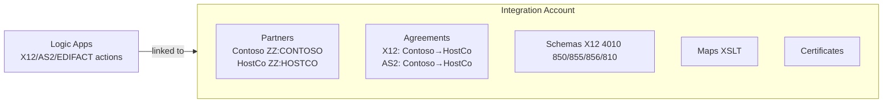
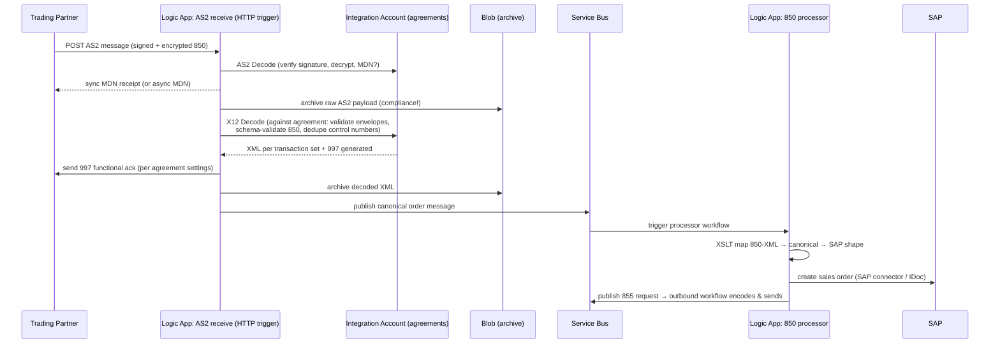

# 08 — EDI & B2B Integration (X12, EDIFACT, SWIFT, AS2, Partner Management)

**JD coverage:** "EDI formats (X12, EDIFACT, SWIFT…)", "EDI Integration Design (AS2, SFTP), Archiving, Re-processing, Partner Management".

**This is a differentiator module for enterprise AIS roles.** A manufacturer exchanges purchase orders, invoices, ship notices with hundreds of suppliers/customers via EDI. Many AIS developers are weak here — being strong at EDI makes you the candidate.

---

## 1. EDI fundamentals (format literacy)

**EDI (Electronic Data Interchange)** = standardized, machine-readable business documents between companies. Two big standards families:

| | **ANSI X12** (North America) | **UN/EDIFACT** (International) |
|---|---|---|
| Structure | Interchange (ISA/IEA) → Group (GS/GE) → Transaction set (ST/SE) → Segments → Elements | Interchange (UNB/UNZ) → Message (UNH/UNT) → Segments |
| Doc examples | **850** PO, **855** PO ack, **856** ASN, **810** invoice, **997** functional ack, **820** payment, **867/846** inventory | ORDERS, ORDRSP, DESADV, INVOIC, CONTRL |
| Separators | Defined in ISA (e.g., `*` element, `~` segment) | `+` element, `'` segment, `:` component |

**Anatomy of an X12 850 (read this until it's boring):**

```text
ISA*00*          *00*          *ZZ*SENDERID       *ZZ*RECEIVERID     *260714*1015*U*00401*000000101*0*P*>~
GS*PO*SENDERID*RECEIVERID*20260714*1015*101*X*004010~
ST*850*0001~
BEG*00*SA*PO-4512**20260714~          <- purpose, type, PO number, date
REF*DP*038~
N1*ST*Acme Plant 7*92*P7~ <- ship-to party
PO1*1*100*EA*9.75**BP*SKU-8871~       <- line 1: qty 100, each, $9.75, buyer part
PO1*2*50*EA*4.20**BP*SKU-2231~
CTT*2~                                 <- total line count
SE*8*0001~
GE*1*101~
IEA*1*000000101~
```

- **ISA/IEA** = envelope (who→whom, control number `000000101`, test/prod flag).
- **GS/GE** = functional group (document family + version `004010`).
- **ST/SE** = one transaction set (one PO).
- **Control numbers** must be unique/sequential — duplicate control number detection is a real ops topic.

**Acknowledgments (the part interviewers probe):**
- **TA1** = interchange-level ack (envelope readable?).
- **997 / 999** = functional ack (did the transaction set parse against the standard? 999 adds detail, used in HIPAA).
- Business-level response (e.g., 855 PO Acknowledgment) is a *separate business document*, not an EDI ack. Distinguish these clearly.

**SWIFT** (finance): MT messages (MT103 payments…) / ISO 20022 (MX). Logic Apps has SWIFT MT encode/decode connectors (Standard). For manufacturing/enterprise roles, know it exists + that it's treasury/banking integration; X12/EDIFACT carry the interview weight.

📖 X12 primer: [x12.org](https://x12.org/) · [EDI on Azure overview](https://learn.microsoft.com/en-us/azure/logic-apps/logic-apps-enterprise-integration-b2b)

---

## 2. Azure's B2B stack: the Integration Account

The **Integration Account** is the artifact store + B2B engine companion for Logic Apps (≈ Anypoint Partner Manager):

| Artifact | Holds |
|---|---|
| **Partners** | Business identities with **qualifiers** (ZZ = mutually defined, 01 = DUNS, etc.) |
| **Agreements** | Pairwise contracts: **X12**, **EDIFACT**, or **AS2**; host partner ↔ guest partner; **receive settings** + **send settings** (validation, acks, control numbers, batching, character sets) |
| **Schemas** | XSDs for each transaction set/version (MS ships standard X12/EDIFACT schemas — customize for partner quirks) |
| **Maps** | XSLT (X12-XML ↔ canonical/target formats) |
| **Certificates** | Signing/encryption certs for AS2 |

Tiers: Free (1/region, dev), Basic, Standard (more artifacts, SLA). Logic Apps **Standard** can hold schemas/maps as app artifacts, but full EDI/AS2 processing still uses an Integration Account link.



📖 [Create integration accounts](https://learn.microsoft.com/en-us/azure/logic-apps/enterprise-integration/create-integration-account) · [X12 in Logic Apps](https://learn.microsoft.com/en-us/azure/logic-apps/logic-apps-enterprise-integration-x12) · [AS2](https://learn.microsoft.com/en-us/azure/logic-apps/logic-apps-enterprise-integration-as2)

---

## 3. The end-to-end inbound flow (be able to narrate this cold)

**Scenario: supplier sends an X12 850 PO over AS2; it must land in SAP as a sales order.**



**Key beats to hit when narrating:** AS2 security (sign/encrypt/MDN) → archive *before* processing → X12 decode does validation + dedup + splits interchanges into transactions → 997 back per agreement → canonical mapping → business processing → business ack (855) as a separate outbound EDI flow.

**Outbound = mirror image:** business event → map canonical → X12 Encode (agreement assigns control numbers, envelopes) → AS2 Encode (sign/encrypt) → HTTP to partner (or drop on SFTP) → track MDN → archive.

### EDI over SFTP (the other JD transport)
Same flow but transport is SFTP: partner drops `.edi` files → SFTP trigger (or Blob+Event Grid if partner writes to storage SFTP endpoint) → X12 decode → … Outbound writes files to partner's SFTP. No AS2 encode/MDN; security = SSH keys + PGP if required (Function for PGP).

---

## 4. The operational trio the JD names: Archiving, Re-processing, Partner Management

### Archiving
- Archive **raw inbound** (exact bytes received — legal/audit), **decoded XML**, and **outbound as-sent** to **Blob Storage with lifecycle policies** (hot→cool→archive tiers; e.g., retain 7 years for invoices).
- Name blobs by partner/doc-type/date/control-number: `contoso/850/2026/07/14/000000101.edi` — makes reprocessing & audits trivial.
- Optionally index metadata in Table Storage/SQL for a searchable "EDI tracking portal" (common accelerator — see Module 14).

### Re-processing
Design for failure replay from day one:
- **Validation failures** (bad EDI): 997 rejection back to partner; park message + alert; partner resends OR ops fixes & resubmits.
- **Downstream failures** (SAP down): message is safe in Service Bus → retries → DLQ → **resubmission Logic App** re-injects from DLQ or from the Blob archive (by control number!).
- Logic Apps run **resubmit** for one-off replays.
- **Idempotency matters:** replay must not create duplicate SAP orders — dedupe by PO number/control number.

### Partner management (lifecycle)
Onboarding checklist you can recite: exchange IDs/qualifiers + certs + endpoints → create Partner → create test agreement (usage indicator = Test, ISA15 = T) → connectivity test (AS2 ping / test file) → validate 3-way (our 997, their 997, business docs) → promote agreement to production → monitor. Changes (cert rotation! version upgrades 4010→5010) and offboarding are part of the story. Scale problem: 200 partners = automation → provision partners/agreements via ARM/Bicep or scripts (Module 10), not portal clicks.

---

## 5. B2B monitoring

- Azure Monitor / Log Analytics capture **B2B tracking** (AS2 + X12 tracking schemas): interchange control numbers, ack status, MDN status.
- Build/buy a tracking dashboard: workbook over tracking data, or **Turbo360 / Serverless360**-style tooling.
- Alert on: 997 not received within SLA, MDN missing, agreement nearing cert expiry, DLQ depth.

---

## 6. Labs

> Integration Account Free tier + two Logic Apps = a full EDI lab without partners: you play both sides.

1. **Partner & agreement setup:** create Integration Account (Free) → partners `FABRIKAM` (guest) & `HOSTCO` (host), qualifier ZZ → X12 agreement both directions (4010, 850/997).
2. **Inbound 850:** Logic App with HTTP trigger → X12 Decode → inspect XML output + generated 997 → archive both to Blob. Send the sample 850 above with Postman.
3. **Mapping:** XSLT map 850-XML → canonical JSON order (via XML→JSON) → post to a mock API.
4. **Outbound 855:** take a JSON ack → map to 855 XML → X12 Encode → deliver 855 + capture control numbers.
5. **AS2 (stretch):** self-signed certs → AS2 agreement → AS2 encode/decode pair of Logic Apps → verify MDN.
6. **Failure drill:** send an 850 with a broken segment → observe 997 rejection → build the "park + alert + resubmit" path.

---

## 7. Video & documentation library

- 📖 [B2B enterprise integration workflows overview](https://learn.microsoft.com/en-us/azure/logic-apps/logic-apps-enterprise-integration-b2b) ⭐
- 📖 [Exchange X12 messages](https://learn.microsoft.com/en-us/azure/logic-apps/logic-apps-enterprise-integration-x12) · [EDIFACT](https://learn.microsoft.com/en-us/azure/logic-apps/logic-apps-enterprise-integration-edifact) · [AS2](https://learn.microsoft.com/en-us/azure/logic-apps/logic-apps-enterprise-integration-as2)
- 📖 [Monitor B2B messages with Azure Monitor](https://learn.microsoft.com/en-us/azure/logic-apps/monitor-b2b-messages-log-analytics-portal)
- 🎥 Search **"Azure Logic Apps EDI X12 tutorial"**, **"AS2 Logic Apps demo"**, **"Integration Account trading partner agreement"**
- 🎥 **Microsoft Azure Developers** — B2B/EDI sessions from Integration events
- 📖 EDI literacy: search "X12 850 segment reference" (e.g., EDI Academy / Stedi's free EDI reference at [stedi.com/edi](https://www.stedi.com/edi/x12) — excellent segment browser)

---

## 8. Interview questions for this module

1. Walk me through an inbound X12 850 over AS2 end-to-end in Azure. *(the money question — practice narrating §3)*
2. What's the difference between TA1, 997/999, and an 855? Ack levels!
3. What's in an X12 envelope? ISA vs GS vs ST? What are control numbers for?
4. What is an Integration Account? What artifacts live in it?
5. How do agreements work? What do receive settings vs send settings control?
6. AS2: what do signing, encryption, and MDN each protect? Sync vs async MDN?
7. How do you handle duplicate interchanges? (control number dedup in agreement + business-key idempotency)
8. Archiving strategy for EDI — what, where, how long, and why raw bytes?
9. A partner says "we sent the PO but got no order" — your triage steps? (MDN received? 997 status? decode tracking? DLQ? archive lookup by control number)
10. How do you onboard 50 new partners efficiently? (templated agreements, IaC automation, migration tooling)
11. X12 vs EDIFACT structural differences? When would a North American manufacturer use each? (US suppliers vs EU/APAC)
12. How would you upgrade a partner from 4010 to 5010 without downtime? (parallel agreement, test indicator, cutover)
13. Compare Anypoint Partner Manager to Integration Account. (similar model; IA is artifact-centric, tracking is DIY-ish; PM has slicker UI, IA is cheaper/deeper in Azure)
