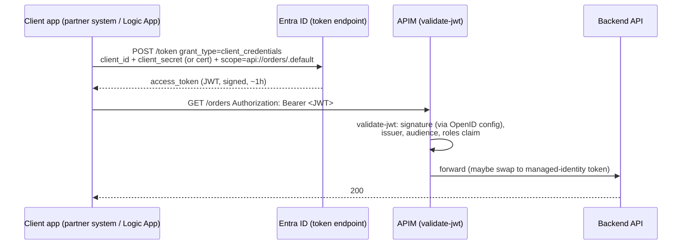
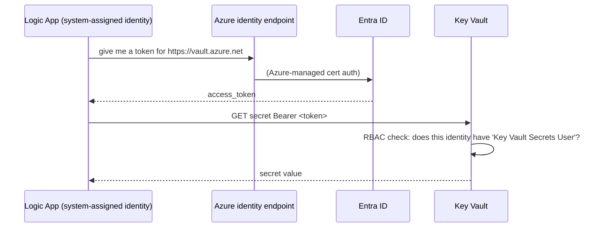
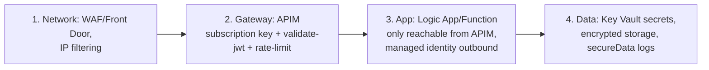

# 09 — Security for AIS (OAuth, Entra ID, Managed Identity, Key Vault, Networking)

**JD coverage:** "Logging, Security (policy, OAuth, HTTPS, SSL), Monitoring, Alerts etc.", "Encryption/Decryption", "Performance tuning, Security Implementations, Deployment standards".

Security is where Azure differs most from Anypoint. In Anypoint, security = platform features you configure. In Azure, security = **identity (Entra ID) as the foundation** + per-service features. Master managed identity and OAuth and you'll outshine most AIS candidates.

---

## 1. Microsoft Entra ID (formerly Azure AD) — the foundation

Every security conversation in Azure routes through Entra ID:

| Concept | What it is | Analogy |
|---|---|---|
| **Tenant** | Your org's identity directory | Anypoint organization |
| **User / Group** | Human identities | |
| **App registration** | An application's identity definition (client ID) + who can call it (exposed scopes/roles) | API definition + client app in API Manager |
| **Service principal** | The instantiation of an app in a tenant (the "account" the app uses) | Connected app credentials |
| **Managed identity** | A service principal *automatically created and rotated by Azure* for a resource (Logic App, Function, APIM…) — **no secret to store, ever** | *(no Mule equivalent — this is new gold)* |
| **RBAC role assignment** | Identity X has Role Y at Scope Z | Team permissions, but resource-level |

📖 [Entra ID fundamentals](https://learn.microsoft.com/en-us/entra/fundamentals/whatis) · [Managed identities overview](https://learn.microsoft.com/en-us/entra/identity/managed-identities-azure-resources/overview)

---

## 2. OAuth 2.0 in Azure — the flows you must draw from memory

### 2.1 Client credentials flow (service-to-service — 90% of integration auth)

**The JWT** carries: `iss` (issuer = your tenant), `aud` (audience = the API), `exp`, `roles`/`scp` (permissions), signature (validated against Entra's published keys — that's what the `openid-config` URL in the APIM policy fetches).

### 2.2 Authorization code flow (user sign-in — know it conceptually)
User → redirected to Entra login → consents → app gets code → exchanges for token. Used by user-facing apps; in integration you mostly meet it inside **connector connections** (e.g., the Salesforce/Office 365 connector OAuth consent dance — same as Mule connector OAuth).

### 2.3 Managed identity flow (the Azure-native replacement for secrets)

**No credentials stored anywhere.** Enable identity on the resource → grant it an RBAC role on the target → use "managed identity" auth in the connector/HTTP action. Works for: Key Vault, Service Bus, Storage, SQL, calling your own APIs, Logic App→Function, APIM→backend… **Default to this everywhere; mention it constantly in interviews.**

---

## 3. Key Vault — secrets, keys, certificates

- **Secrets** (connection strings, API keys), **Keys** (crypto keys for encrypt/sign), **Certificates** (TLS/AS2 certs with renewal hooks).
- Access via **RBAC** (modern) with roles like *Key Vault Secrets User*.
- **App-setting references**: in Functions/Logic Apps Standard, an app setting can be `@Microsoft.KeyVault(SecretUri=...)` — code just reads config; the platform fetches from vault with managed identity.
- Rotation: versioned secrets; consumers pick up new versions; Event Grid can notify on near-expiry.
- **Never** put secrets in: workflow JSON, ARM parameter defaults, pipeline YAML, app settings in plaintext when a vault ref would do.

📖 [Key Vault overview](https://learn.microsoft.com/en-us/azure/key-vault/general/overview)

---

## 4. HTTPS / TLS ("SSL" in the JD)

- Everything public in Azure is HTTPS by default; enforce **HTTPS-only** + **min TLS 1.2** on App Services/Functions/Logic Apps Standard; APIM lets you disable weak ciphers/protocols.
- **Custom domains + certificates**: APIM custom domain with Key Vault cert (auto-renew), App Service managed certs.
- **mTLS (client certificates):** partner systems authenticate with a client cert; APIM can require & validate client certs (common in B2B). Know the difference: TLS = server proves identity + encrypts channel; mTLS = both sides prove identity.
- **Message-level vs transport-level security:** TLS protects the pipe; AS2 signing/encryption or JWS/JWE protects the *message* end-to-end even at rest. EDI often needs both.

---

## 5. Securing each AIS service — the checklist

| Service | Inbound protection | Outbound/backend auth | Data protection |
|---|---|---|---|
| **Logic Apps** | SAS in trigger URL (rotate!), restrict inbound IP to APIM only, Standard: private endpoints; front with APIM+OAuth | Managed identity in connectors/HTTP; Key Vault refs | `secureData` on actions (hide inputs/outputs in run history!), obfuscate PII |
| **Functions** | Function keys (weak alone), Entra "Easy Auth", APIM front, network restrictions | Managed identity, Key Vault refs | App settings encrypted at rest; log hygiene |
| **Service Bus** | RBAC (Sender/Receiver roles) or SAS policies (legacy-ish); private endpoints; disable public network | n/a | Encryption at rest (optionally customer-managed keys) |
| **APIM** | subscription keys + validate-jwt + ip-filter + client certs | managed identity to backends, stored named values in Key Vault | policies to strip sensitive headers |
| **Storage/Blob (archives)** | RBAC + SAS with expiry; private endpoints | n/a | encryption at rest, immutability policies for compliance archives |

**Defense in depth for a public API:**

---

## 6. Network isolation (architect band — deep dive in Module 13)

- **Private endpoint** = the service gets a private IP in your VNet; public access disabled. Available: Logic Apps Standard, Functions (Premium), Service Bus Premium, Key Vault, Storage, APIM (v2/Premium options).
- **VNet integration** = your app's *outbound* traffic goes through a VNet (to reach private systems).
- Direction matters — say it precisely in interviews: **private endpoints protect inbound; VNet integration handles outbound.**
- Hybrid reach: VPN/ExpressRoute + VNet integration, or on-premises data gateway (Module 02), or self-hosted APIM gateway.

---

## 7. Encryption/decryption in flows (JD's "Data Process Flow: Encryption/Decryption")

- **In transit:** TLS/mTLS (above).
- **B2B message-level:** AS2 S/MIME encrypt + sign (Integration Account certs).
- **PGP files** (classic SFTP requirement): no native Logic Apps action → Azure Function with a PGP library (e.g., PgpCore NuGet), keys in Key Vault.
- **Field-level:** encrypt specific fields via Function + Key Vault keys before persisting.
- **At rest:** all Azure storage encrypted by default; customer-managed keys (CMK) when compliance demands.

---

## 8. Labs

1. **Managed identity chain:** Logic App with system-assigned identity → grant *Key Vault Secrets User* → read a secret in the workflow → then call a Function secured with Entra auth using the same identity. Zero secrets stored anywhere — feel the magic.
2. **OAuth end-to-end:** register an API app (expose a role) + a client app in Entra → get a token with Postman (client credentials) → APIM `validate-jwt` protecting your API → test 401 (no token), 401 (wrong audience), 200.
3. **Lock the trigger:** restrict a Logic App HTTP trigger to APIM's IP; prove direct calls fail.
4. **Key Vault reference:** move a Function's connection string into Key Vault via app-setting reference.
5. **secureData:** flip secure inputs/outputs on an action handling "PII" and check run history.
6. **(Stretch) mTLS:** require a client cert in APIM, call with cert in Postman.

---

## 9. Video & documentation library

- 📖 [Secure access in Logic Apps](https://learn.microsoft.com/en-us/azure/logic-apps/logic-apps-securing-a-logic-app) ⭐ read fully
- 📖 [Authentication with managed identities in Logic Apps](https://learn.microsoft.com/en-us/azure/logic-apps/authenticate-with-managed-identity)
- 📖 [APIM authentication & authorization overview](https://learn.microsoft.com/en-us/azure/api-management/authentication-authorization-overview)
- 📖 [Microsoft identity platform docs (OAuth flows explained)](https://learn.microsoft.com/en-us/entra/identity-platform/v2-oauth2-client-creds-grant-flow)
- 🎥 **John Savill** — "Managed Identities Deep Dive" and "OAuth 2.0 and OpenID Connect" (the clearest explanations anywhere)
- 🎥 Search **"validate-jwt APIM tutorial"**, **"Logic Apps managed identity Key Vault"**

---

## 10. Interview questions for this module

1. What is a managed identity? System vs user-assigned? Why is it better than a service principal with a secret? *(guaranteed question)*
2. Draw the client credentials flow. What claims do you validate in the JWT and why does audience matter?
3. How do you secure a Logic App HTTP trigger end-to-end? *(SAS + IP restriction + APIM + OAuth — layered answer)*
4. How do secrets flow from Key Vault into a Function without code changes? (app-setting references + managed identity)
5. TLS vs mTLS vs message-level security — when do you need each? (EDI/AS2 example)
6. Private endpoint vs VNet integration — inbound vs outbound?
7. Service Bus: RBAC vs SAS — which and why?
8. How do you keep PII out of Logic Apps run history? (secureData, and why run history is a data store!)
9. Cert rotation strategy for AS2 partners and APIM custom domains?
10. A pen test found your Function callable directly, bypassing APIM — fixes? (Easy Auth requiring APIM's identity, network restriction, key rotation)
