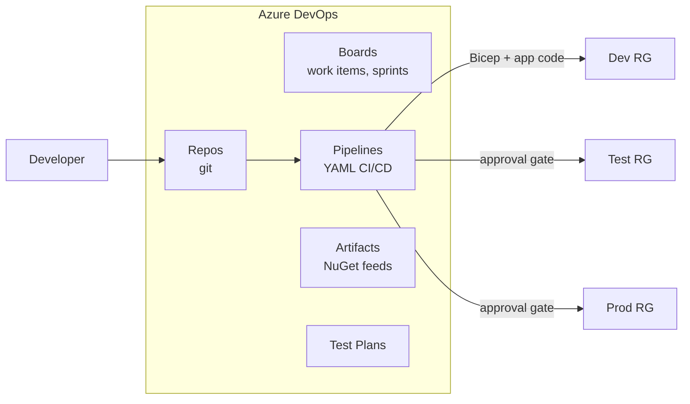
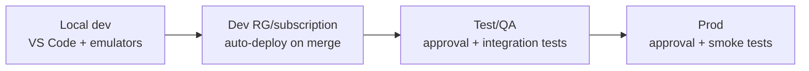

# 10 — DevOps & CI/CD for AIS (Azure DevOps, Bicep/ARM, Pipelines)

**JD coverage:** "Azure DevOps (CI/CD)", plus "ARM templates / Bicep / Terraform" and "PowerShell scripting" from other companies' JDs.

You know CI/CD discipline from Maven + Anypoint CLI. New here: **infrastructure itself is code** (Bicep/ARM), and each AIS service has its own deployment quirks (especially Logic Apps connections — the classic pain point).

---

## 1. Azure DevOps in one picture



(GitHub + GitHub Actions is the equally common alternative — concepts map 1:1: workflow=pipeline, environment protection=approvals.)

📖 [Azure DevOps docs](https://learn.microsoft.com/en-us/azure/devops/?view=azure-devops) · [Pipelines YAML schema](https://learn.microsoft.com/en-us/azure/devops/pipelines/yaml-schema/?view=azure-pipelines)

---

## 2. Infrastructure as Code: ARM → Bicep (→ Terraform awareness)

- **ARM template** = JSON declaration of resources; verbose but universal.
- **Bicep** = the modern DSL that *compiles to ARM* — cleaner syntax, modules, great VS Code tooling. **Learn Bicep, read ARM.**
- **Terraform** = multi-cloud alternative; know it exists, mention "azurerm provider" if asked.

Bicep example — a Service Bus namespace with a queue and a topic:

```bicep
param env string = 'dev'
param location string = resourceGroup().location

resource sbNamespace 'Microsoft.ServiceBus/namespaces@2022-10-01-preview' = {
  name: 'sb-orders-${env}'
  location: location
  sku: { name: env == 'prod' ? 'Premium' : 'Standard', tier: env == 'prod' ? 'Premium' : 'Standard' }
}

resource ordersQueue 'Microsoft.ServiceBus/namespaces/queues@2022-10-01-preview' = {
  parent: sbNamespace
  name: 'orders'
  properties: {
    maxDeliveryCount: 5
    lockDuration: 'PT1M'
    deadLetteringOnMessageExpiration: true
    requiresDuplicateDetection: true
    duplicateDetectionHistoryTimeWindow: 'PT10M'
  }
}

resource orderEvents 'Microsoft.ServiceBus/namespaces/topics@2022-10-01-preview' = {
  parent: sbNamespace
  name: 'order-events'
}
```

Deploy: `az deployment group create -g rg-orders-dev -f main.bicep -p env=dev`. Idempotent — run it 100 times, same result (that's the point).

📖 [Bicep documentation](https://learn.microsoft.com/en-us/azure/azure-resource-manager/bicep/) · [MS Learn: Fundamentals of Bicep](https://learn.microsoft.com/en-us/training/paths/fundamentals-bicep/) ⭐ excellent free path

---

## 3. Deploying each AIS service (the quirks interviewers probe)

| Service | How you deploy | Quirks to mention |
|---|---|---|
| **Logic Apps Consumption** | Whole workflow definition inside an ARM/Bicep template | Parameterize per env; **API connections** are separate resources needing post-deploy auth for OAuth connectors (the classic pain — automate with service principals where possible) |
| **Logic Apps Standard** | Infra (Bicep: plan + app + storage) **separately from** code (zip-deploy of workflow project) — like a normal app! | Use `parameters.json` + app settings per env; connections via `connections.json` with managed-identity auth = fully automatable ⭐ |
| **Functions** | Infra via Bicep; code via `func azure functionapp publish` / zip deploy / pipeline task | Deployment slots for zero-downtime swap |
| **APIM** | Bicep for instance; **APIOps** (extractor/publisher tooling) or Bicep per API+policy files | Policies as XML files in repo — reviewable diffs! |
| **Service Bus / Event Grid / Storage** | Pure Bicep | Easy |
| **Integration Account artifacts** | Bicep/ARM or CLI upload of schemas/maps/partners/agreements | Automate partner onboarding at scale (Module 08) |

---

## 4. A real multi-stage YAML pipeline (template to reuse)

```yaml
trigger:
  branches: { include: [ main ] }

stages:
- stage: Build
  jobs:
  - job: build
    pool: { vmImage: 'ubuntu-latest' }
    steps:
    - task: UseDotNet@2
      inputs: { packageType: 'sdk', version: '8.x' }
    - script: dotnet build src/OrderFunctions --configuration Release
      displayName: Build Functions
    - script: dotnet test tests/OrderFunctions.Tests --logger trx
      displayName: Unit tests
    - script: az bicep build --file infra/main.bicep
      displayName: Validate Bicep
    - task: DotNetCoreCLI@2
      inputs:
        command: publish
        projects: src/OrderFunctions
        arguments: '-c Release -o $(Build.ArtifactStagingDirectory)/functions'
    - publish: $(Build.ArtifactStagingDirectory)
      artifact: drop

- stage: DeployDev
  dependsOn: Build
  jobs:
  - deployment: dev
    environment: ais-dev          # environments carry approvals & history
    pool: { vmImage: 'ubuntu-latest' }
    strategy:
      runOnce:
        deploy:
          steps:
          - task: AzureCLI@2
            displayName: Deploy infra (Bicep)
            inputs:
              azureSubscription: 'sc-ais-dev'   # service connection (SPN / workload identity)
              scriptType: bash
              scriptLocation: inlineScript
              inlineScript: |
                az deployment group create -g rg-orders-dev \
                  -f $(Pipeline.Workspace)/drop/infra/main.bicep -p env=dev
          - task: AzureFunctionApp@2
            displayName: Deploy function code
            inputs:
              azureSubscription: 'sc-ais-dev'
              appName: func-orders-dev
              package: $(Pipeline.Workspace)/drop/functions/*.zip

- stage: DeployTest
  dependsOn: DeployDev
  jobs:
  - deployment: test
    environment: ais-test         # configure approval on this environment in ADO UI
    # ... same steps with env=test ...
```

**Concepts to be fluent in:** service connections (pipeline's identity into Azure — prefer workload identity federation over secrets), variable groups (+ Key Vault-linked), environments with approvals/checks, templates for reuse, branch policies + PR validation builds.

---

## 5. Environment strategy



- Same Bicep, different parameter files (`dev.bicepparam`, `prod.bicepparam`) — **never** hand-edit prod.
- Naming conventions: `type-workload-env` (`la-orders-prod`, `sb-orders-dev`) — mention the [Cloud Adoption Framework naming guidance](https://learn.microsoft.com/en-us/azure/cloud-adoption-framework/ready/azure-best-practices/resource-naming) for architect points.
- Config lives in app settings/Key Vault per env — the *artifact* (code/definition) is identical across envs.

## 6. PowerShell & CLI scripting (the JD's "Scripting")

Ops/glue scripting you should be able to write:

```powershell
# PowerShell: requeue all DLQ messages older than 1 hour (sketch)
$msgs = az servicebus queue show ... # inventory & metadata via CLI
# real DLQ replay uses the SDK: Receive from queue/$DeadLetterQueue, re-send to queue
```

```bash
# Bash + az: rotate a Logic App trigger SAS key
az rest --method post --uri "https://management.azure.com/.../regenerateAccessKey?api-version=2016-06-01"
```

Get comfortable with: `az resource list`, `az functionapp config appsettings set`, `az logic workflow` group, and the Service Bus/KeyVault SDK basics in PowerShell. 📖 [Azure PowerShell docs](https://learn.microsoft.com/en-us/powershell/azure/)

---

## 7. Labs

1. **Bicep starter:** write Bicep for RG-scoped: storage + Service Bus (queue/topic) + Function App + App Insights. Deploy to `dev`, then `test` with parameter files. Change a queue property and redeploy — observe idempotency.
2. **Pipeline:** put Module 04's Function in Azure Repos (or GitHub) → build+test+deploy YAML pipeline → add a `test` stage with manual approval.
3. **Logic Apps Standard CI/CD:** deploy your Standard project via pipeline (zip deploy), parameterizing `connections.json` for managed identity.
4. **APIM as code:** export an API + policy XML into the repo; deploy a policy change via pipeline (Bicep or APIOps).
5. **Key Vault-linked variable group:** pipeline pulls a secret from Key Vault instead of storing it.

---

## 8. Video & documentation library

- 📖 [MS Learn: Fundamentals of Bicep path](https://learn.microsoft.com/en-us/training/paths/fundamentals-bicep/) ⭐
- 📖 [CI/CD for Logic Apps Standard (DevOps)](https://learn.microsoft.com/en-us/azure/logic-apps/devops-deployment-single-tenant-azure-logic-apps)
- 📖 [Functions CI/CD](https://learn.microsoft.com/en-us/azure/azure-functions/functions-continuous-deployment) · [APIOps](https://learn.microsoft.com/en-us/azure/architecture/example-scenario/devops/automated-api-deployments-apiops)
- 🎥 **John Savill** — "Bicep Deep Dive", "Azure DevOps Master Class" playlist ⭐
- 🎥 Search **"Logic Apps Standard CI/CD pipeline"**, **"APIOps tutorial"**
- 📖 [Azure Pipelines key concepts](https://learn.microsoft.com/en-us/azure/devops/pipelines/get-started/key-pipelines-concepts?view=azure-devops)

---

## 9. Interview questions for this module

1. How do you deploy Logic Apps across environments? Consumption vs Standard differences? *(the classic — the connections story is the differentiator)*
2. What is Bicep vs ARM vs Terraform? Why is idempotency important?
3. Walk through your ideal AIS pipeline from PR to prod. Where do tests and approvals sit?
4. How does the pipeline authenticate to Azure? (service connection, SPN vs workload identity federation)
5. How do you manage per-environment config and secrets in pipelines? (variable groups, Key Vault linking, parameter files)
6. How do you version and deploy APIM policies safely? (policy files in repo, revisions, APIOps)
7. Zero-downtime deployment for a Function? (slots + swap)
8. How would you automate onboarding of 50 EDI partners? (IaC for partners/agreements — ties Module 08 to this one)
9. What branch strategy do you use? (trunk-based with PR validation is the safe modern answer)
10. Compare with MuleSoft: Maven/Anypoint CLI vs Bicep/ADO — what changed in your workflow? (infra-as-code scope is bigger; connections/identities are first-class deployment artifacts)
