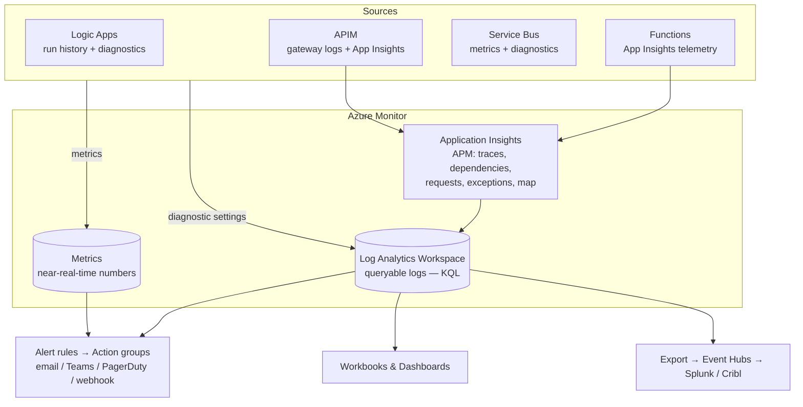
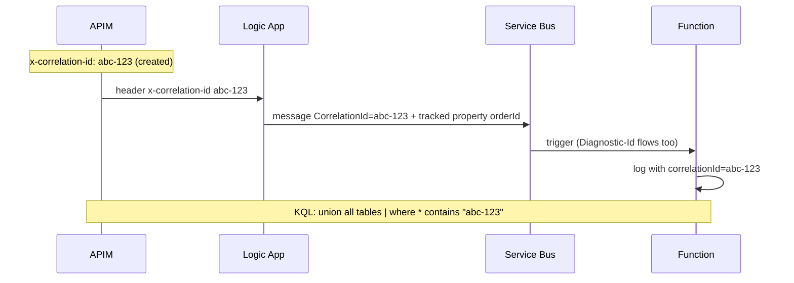
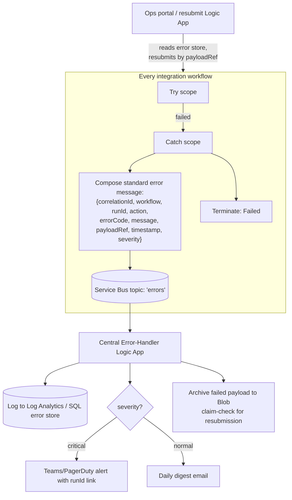

# 11 — Monitoring, Logging & Error-Handling Frameworks

**JD coverage:** "Error handling concepts, Logging framework, Monitoring tools (Azure Application Insights, Log Analytics, Splunk or Cribl etc.)", "Alerts".

This is the module that separates people who *build* integrations from people who *run* them. Senior/architect interviews are full of "it broke at 2 AM — what do you do?" questions.

---

## 1. The Azure Monitor stack in one picture



**Vocabulary:**
- **Azure Monitor** = the umbrella (metrics + logs + alerts).
- **Log Analytics Workspace (LAW)** = the log database; you query it with **KQL**.
- **Application Insights** = APM on top (per-app telemetry: requests, dependencies, exceptions, **distributed tracing**, Application Map).
- **Diagnostic settings** = per-resource switch that ships its logs/metrics to LAW (turn on for *everything* — a resource without diagnostics is invisible at 2 AM).
- **Splunk / Cribl** (JD mentions): enterprises often centralize logs off-Azure — pattern is *diagnostic settings → Event Hubs → Splunk connector / Cribl Stream pipeline*. Know the pattern; you won't manage Splunk itself.

📖 [Azure Monitor overview](https://learn.microsoft.com/en-us/azure/azure-monitor/overview) · [App Insights overview](https://learn.microsoft.com/en-us/azure/azure-monitor/app/app-insights-overview)

---

## 2. KQL — your new log-search superpower

KQL (Kusto Query Language) reads like a data pipeline: table → filters → transforms → aggregation.

```kusto
// Failed Logic App runs in the last 24h, by workflow
AzureDiagnostics
| where TimeGenerated > ago(24h)
| where Category == "WorkflowRuntime" and status_s == "Failed"
| summarize failures = count() by resource_workflowName_s, bin(TimeGenerated, 1h)
| order by failures desc

// Function exceptions with the message that caused them
exceptions
| where timestamp > ago(1h)
| project timestamp, operation_Name, type, outerMessage, customDimensions
| order by timestamp desc

// End-to-end: slow dependencies called by my function
dependencies
| where timestamp > ago(6h) and duration > 3000
| summarize avg(duration), count() by target, name
| order by avg_duration desc

// APIM: 4xx/5xx rate per API
requests
| where timestamp > ago(24h)
| summarize total = count(), errors = countif(resultCode startswith "5") by name
| extend errorRate = round(100.0 * errors / total, 2)
```

Learn these operators cold: `where`, `project`, `extend`, `summarize` (+ `count/avg/percentile/dcount`), `bin()`, `join`, `parse_json()`, `render timechart`.

📖 [KQL tutorial](https://learn.microsoft.com/en-us/kusto/query/tutorials/learn-common-operators) · free practice: [Kusto Detective Agency](https://detective.kusto.io/) (genuinely fun)

---

## 3. Correlation & distributed tracing (the architect answer)

One business transaction may cross APIM → Logic App → Service Bus → Function → SAP. To debug it as *one* story:

1. **Correlation ID discipline:** generate/propagate `x-correlation-id` at the edge (APIM `set-header` policy) → Logic App passes it in headers & Service Bus `CorrelationId` property → Function logs it in every entry (`ILogger` scopes / custom dimension) → include it in error notifications.
2. **W3C trace context:** App Insights does automatic distributed tracing for HTTP+SDK hops (`traceparent` header) — the **Application Map** visualizes the chain; Service Bus hops carry `Diagnostic-Id`.
3. **Tracked properties** (Logic Apps): promote business keys (orderId, partnerId, control number) into diagnostics — then KQL can answer "show me everything about order PO-4512."



---

## 4. A production-grade error-handling framework (build once, reuse everywhere)

This is the "Logging framework / Error handling concepts" JD line — the pattern below is what mature AIS shops (and accelerator kits) implement:



**Principles to recite:**
1. **Standard error schema** across all integrations (the JSON above) — dashboards and ops tooling depend on uniformity.
2. **Errors are messages too** — publish to an error topic; don't just log and lose them.
3. **Transient vs business errors:** transient → retry policies (exponential backoff) before failing; business (validation) → no retry, route to human/partner.
4. **Every error must be actionable:** run link, correlation ID, payload reference, resubmission path.
5. **Resubmission is designed, not improvised** (idempotency! Module 05).
6. **Don't log secrets/PII** — secureData + log hygiene.

---

## 5. Alerting that doesn't cry wolf

| Alert | Signal | Why |
|---|---|---|
| Logic App run failures > N in 15 min | LAW query alert | Broken integration |
| Service Bus **DLQ depth > 0** (or growing) | Metric alert | Stuck messages ⭐ the one everyone forgets |
| Service Bus active messages > threshold | Metric | Consumer down/slow |
| Function failure rate / exceptions spike | App Insights | Code or dependency issue |
| APIM 5xx rate, latency P95 | App Insights/metric | Backend degradation |
| **No runs in X hours** (heartbeat) | Scheduled query | Silent death — trigger broke, partner stopped sending |
| Cert/secret near expiry | Key Vault events | AS2/TLS outage prevention |

**Action groups** fan out to email/SMS/Teams webhook/ITSM/Logic App (self-healing hooks). Severity discipline: page only for customer-impacting; digest the rest.

📖 [Monitor Logic Apps](https://learn.microsoft.com/en-us/azure/logic-apps/monitor-workflows-collect-diagnostic-data) · [Alerts overview](https://learn.microsoft.com/en-us/azure/azure-monitor/alerts/alerts-overview)

---

## 6. Dashboards

- **Workbooks** = interactive, parameterized dashboards over KQL (build a "Daily Integration Health" workbook: runs by status, DLQ depths, top errors, partner EDI volumes, P95 latencies).
- **Azure dashboards** = pin-and-share tiles.
- **Turbo360 (Serverless360)** = the popular third-party AIS ops product — worth knowing by name for interviews ("business-activity-monitoring style tracking on top of AIS").

---

## 7. Labs

1. Turn on diagnostic settings → LAW for every resource you've built so far; verify tables fill.
2. Write 5 KQL queries: failed runs by workflow; slowest actions; exceptions by type; requests by resultCode; a `render timechart` of hourly volume.
3. Build the error-framework skeleton: error topic + central handler Logic App + standard error schema + Teams webhook notification.
4. Alerts: DLQ-depth metric alert + a scheduled-query "no runs in 4 hours" heartbeat alert → action group to your email.
5. Correlation drill: pass `x-correlation-id` APIM → Logic App → Service Bus → Function; then write ONE KQL query that shows the full journey.
6. Build a mini workbook with 3 tiles.

---

## 8. Video & documentation library

- 📖 [KQL learning path (MS Learn)](https://learn.microsoft.com/en-us/training/paths/analyze-monitoring-data-with-kql/) ⭐
- 📖 [Application Insights distributed tracing](https://learn.microsoft.com/en-us/azure/azure-monitor/app/distributed-trace-data)
- 🎥 **John Savill** — "Azure Monitor Deep Dive"
- 🎥 Search **"KQL tutorial for beginners"**, **"Logic Apps monitoring Log Analytics"**, **"Application Insights Application Map demo"**
- 📖 [Turbo360 blog on AIS monitoring patterns](https://turbo360.com/blog)

---

## 9. Interview questions for this module

1. App Insights vs Log Analytics vs Azure Monitor — how do they relate? *(most-asked ops question)*
2. Write (talk through) a KQL query for failed Logic App runs in the last hour grouped by workflow.
3. How do you trace one order across APIM → Logic App → Service Bus → Function? (correlation ID + tracked properties + App Map)
4. Describe an error-handling framework you'd standardize across 100 integrations. *(§4 is your answer)*
5. Transient vs business errors — different handling?
6. What alerts would you configure for a Service Bus-based integration? (don't forget DLQ depth + heartbeat)
7. How does Splunk/Cribl fit with Azure logging? (Event Hubs export pattern)
8. Run history shows customer PII — response? (secureData, purge considerations, log hygiene policy)
9. Ops asks "resubmit these 200 failed EDI orders" — how does your design make that a 5-minute task? (archive + error store + resubmit workflow + idempotency)
10. What's a workbook? What's on your integration-health dashboard?
