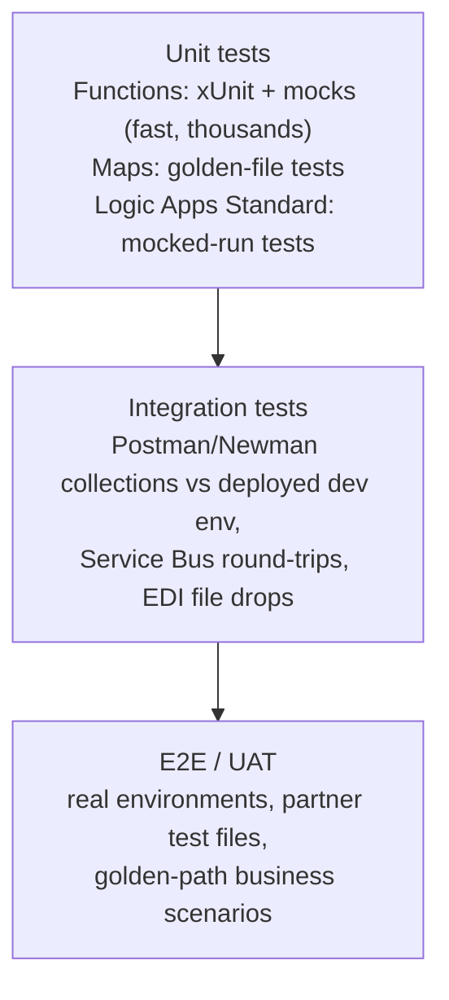

# 12 — Testing AIS Solutions (Postman, SOAP UI, Unit Tests, Automation)

**JD coverage:** "Integration testing using Postman, SOAP UI, other tools and test automation framework".

Coming from MUnit, the AIS testing story is more fragmented — which means having a *coherent testing strategy* makes you stand out.

---

## 1. The AIS test pyramid



Strategy sentence for interviews: *"Unit-test the logic (Functions, maps) heavily, integration-test the wiring with Postman/Newman in the pipeline against a dev environment, and keep a small automated E2E smoke pack per release; EDI adds partner-file regression suites."*

---

## 2. Postman (your integration workhorse)

- **Collections + environments:** variables per env (`{{baseUrl}}`, `{{subscriptionKey}}`); folder per API.
- **Auth helpers:** built-in OAuth 2.0 client-credentials token fetch (Module 09 lab reuses this).
- **Tests in JavaScript:**

```javascript
pm.test("status is 202", () => pm.response.to.have.status(202));
pm.test("returns order id", () => {
    const body = pm.response.json();
    pm.expect(body.orderId).to.match(/^PO-\d+$/);
    pm.collectionVariables.set("orderId", body.orderId);  // chain to next request
});
pm.test("responds under 2s", () => pm.expect(pm.response.responseTime).to.be.below(2000));
```

- **Chaining** requests = a business scenario (create order → poll status → assert completed).
- **Newman** = CLI runner → pipeline step:

```yaml
- script: |
    npm install -g newman
    newman run tests/orders.postman_collection.json \
      -e tests/dev.postman_environment.json \
      --reporters cli,junit --reporter-junit-export results.xml
- task: PublishTestResults@2
  inputs: { testResultsFiles: 'results.xml' }
```

📖 [Postman docs — writing tests](https://learning.postman.com/docs/tests-and-scripts/write-scripts/test-scripts/)

---

## 3. SOAP UI (for the SOAP/legacy corners)

Still relevant: SAP web services, legacy ERPs, partner SOAP endpoints, and testing APIM SOAP passthrough/SOAP-to-REST facades.
- Import WSDL → generated requests per operation → assertions (schema compliance, XPath match, SLA).
- **Mock services**: SOAP UI can *host* a mock of a partner's SOAP service — great when the real system isn't ready (classic delivery situation, good interview story).
- Groovy scripting for data-driven tests.

📖 [SoapUI docs](https://www.soapui.org/docs/soap-and-wsdl/getting-started/)

---

## 4. Unit testing Functions (xUnit) — where your logic lives

```csharp
public class OrderValidatorTests
{
    private readonly OrderValidator _sut = new(maxAmount: 50_000m);

    [Fact]
    public void Valid_order_passes()
        => Assert.True(_sut.IsValid(TestData.Order(amount: 100m, lines: 2)));

    [Theory]
    [InlineData(0)]
    [InlineData(-5)]
    [InlineData(50_001)]
    public void Invalid_amounts_fail(decimal amount)
        => Assert.False(_sut.IsValid(TestData.Order(amount: amount, lines: 1)));
}
```

- Keep functions thin: trigger method delegates to injected services → services are trivially testable (why DI matters, Module 04 §2.8).
- Mock dependencies with **Moq**/**NSubstitute**; fake `HttpClient` with a handler stub.
- **Transformation golden-file tests:** input JSON/XML + expected output stored in repo; test runs map (Function, or XSLT via a runner) and diffs — your regression net for maps (including EDI maps!).
- Run in pipeline: `dotnet test` (already in Module 10's YAML).

📖 [xUnit docs](https://xunit.net/) · [Unit testing best practices (.NET)](https://learn.microsoft.com/en-us/dotnet/core/testing/unit-testing-best-practices)

---

## 5. Testing Logic Apps (the honest story)

- **Standard (single-tenant):** run **locally** in VS Code → hit local endpoints; and the **automated testing framework** lets you write unit tests that execute a workflow with **mocked trigger/action outputs** (no real connectors touched) and assert on action results — MUnit-like at last. 📖 [Automated testing for Standard workflows](https://learn.microsoft.com/en-us/azure/logic-apps/testing-framework/create-single-tenant-workflows-azure-portal)
- **Consumption:** no true unit tests — strategy is (a) keep logic out of the workflow (push to Functions/maps), (b) integration-test deployed workflows via their HTTP trigger with Postman, (c) use **static results** (mock an action's output at runtime) for manual what-if testing.
- **Service Bus flows:** test by sending messages (Service Bus Explorer, or a Postman/CLI script using the SB REST API) and asserting downstream effects (poll a result endpoint / check a table).
- **EDI regression:** folder of partner sample files (850s with edge cases) → script drops them through the decode workflow → assert canonical outputs + 997 statuses.

---

## 6. Performance & chaos (senior flavor)

- **Load testing:** **Azure Load Testing** (managed JMeter/Locust) against APIM/Functions; watch App Insights live metrics during runs; find the Service Bus prefetch/concurrency sweet spot.
- **What to measure:** P95 latency, throughput, DLQ growth under load, Logic Apps action throttling (429s from connectors!), Function cold starts.
- **Failure drills:** kill the backend mid-run — do retries/DLQ/alerts behave as designed? (Interviewers love "how did you *prove* your error handling works?")

📖 [Azure Load Testing](https://learn.microsoft.com/en-us/azure/load-testing/overview-what-is-azure-load-testing)

---

## 7. Labs

1. Postman collection for your Module 06 APIM APIs: env vars, OAuth token fetch, 5 chained requests with tests; run via Newman locally, then in your pipeline.
2. xUnit project for your mapping Function: 10 tests incl. golden-file comparison; wire into `dotnet test` pipeline step.
3. Logic Apps Standard: one mocked-run unit test with the testing framework; plus try static results on a Consumption workflow.
4. SOAP UI: import a public WSDL (e.g., a currency-converter sample), assert with XPath; create a mock service and point a Logic App at it.
5. EDI regression mini-suite: 3 sample 850 files (one valid, one bad segment, one duplicate control number) + script + expected outcomes.
6. Azure Load Testing: 100 RPS for 5 minutes against your APIM façade; capture P95 before/after enabling APIM caching.

---

## 8. Video & documentation library

- 🎥 Search **"Postman API testing full course"** (freeCodeCamp) · **"Newman Azure DevOps pipeline"**
- 🎥 Search **"Logic Apps automated testing framework"** — Microsoft demo sessions
- 📖 [Test Functions locally](https://learn.microsoft.com/en-us/azure/azure-functions/functions-develop-local)
- 📖 [Static results in Logic Apps](https://learn.microsoft.com/en-us/azure/logic-apps/test-logic-apps-mock-data-static-results)

---

## 9. Interview questions for this module

1. Describe your testing strategy for an AIS solution end-to-end. *(§1 sentence + pyramid)*
2. How do you test Logic Apps, given there's no MUnit? (Standard testing framework, static results, thin-workflow principle, Postman integration tests)
3. How do you automate API tests in CI/CD? (Newman + JUnit publish)
4. How do you test asynchronous, message-driven flows? (inject → poll/assert; correlation IDs make assertions possible)
5. What are golden-file tests and why are they ideal for maps/EDI?
6. When would you still use SOAP UI? What are mock services good for?
7. How do you unit test an Azure Function that calls SQL and an external API? (DI + mocks; test the service, not the trigger)
8. How do you load-test and what do you watch for? (429 throttling, DLQ growth, cold starts, P95)
9. How did you prove your error handling works before go-live? (failure-injection drills)
10. Test data for EDI partners — how do you build a regression pack? (anonymized partner samples + edge cases + expected 997 outcomes)
