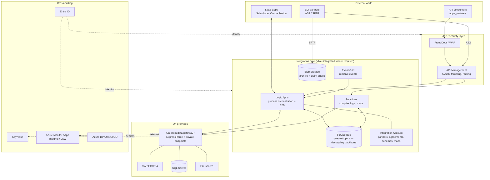
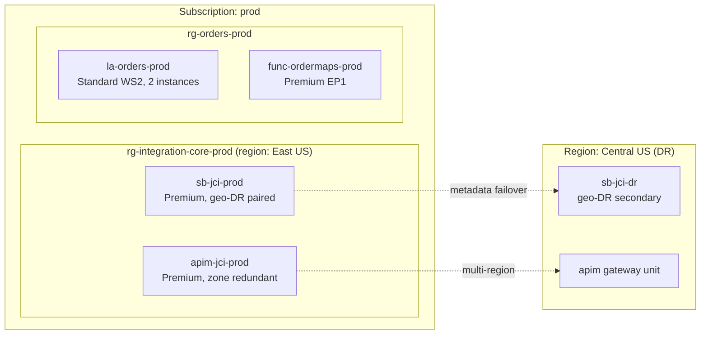

# 13 — Architecture & Design (HLD/LLD, UML, Patterns, Environments, Licensing, Estimation)

**JD coverage (the Architect band):** "High Level Design (UML, Deployment diagrams, technical and functional specifications)", "Low Level Design, Solutioning and Proposals (end to end)", "Platform architecture and features", "Best practices, Standards, and guidelines", "Cloud and On-premises — Architecture, Deployment, Connection Licensing, Environments", "Integration complexity, Effort estimations", "E2E architecture, Tool Selection", "Write Technical Specification".

You've seen these deliverables in MuleSoft programs. This module gives you the Azure-flavored versions + templates you can reuse.

---

## 1. The reference E2E AIS architecture (memorize, then adapt)

Also study Microsoft's canonical version: 📖 [Basic enterprise integration reference architecture](https://learn.microsoft.com/en-us/azure/architecture/reference-architectures/enterprise-integration/basic-enterprise-integration) and [Enterprise integration with queues and events](https://learn.microsoft.com/en-us/azure/architecture/example-scenario/integration/queues-events).

---

## 2. Tool selection (the architect's core skill)

The decision framework — practice saying it out loud:

| Question | Leads to |
|---|---|
| Real-time request/response API? | APIM + Function (light) or Logic App (connector-heavy) |
| Long-running / multi-step / human approval? | Logic Apps (visual) or Durable Functions (code) |
| Async decoupling, load leveling, guaranteed delivery? | Service Bus |
| React to state changes / files landing? | Event Grid |
| Streaming telemetry at scale? | Event Hubs (+ Stream Analytics) |
| Bulk data / ETL / nightly loads (GBs)? | **Data Factory** — *not* Logic Apps loops! |
| B2B documents with partners? | Logic Apps + Integration Account |
| Complex compute/transform? | Functions |
| RPA / UI automation / citizen workflows? | Power Automate (know the boundary: PA = personal/departmental, Logic Apps = enterprise/IT) |

**Anti-patterns to name-drop (instant credibility):** Logic Apps for-each over 100k rows (use ADF/Functions); Service Bus as a database; Event Grid for commands needing ordering; putting business logic in APIM policies; one giant workflow instead of composable ones; polling when Event Grid exists.

---

## 3. HLD — what to produce (template)

A good AIS High-Level Design contains:

1. **Context & goals** — business capability, systems in scope, NFRs (volumes, latency, availability, compliance).
2. **Architecture diagram** — like §1 (C4 "container level" works great; Mermaid or draw.io).
3. **Integration catalog** — table: interface ID, source→target, pattern (sync API / async msg / batch / B2B), format, protocol, volume/peak, SLA.
4. **UML/behavior diagrams** — **sequence diagrams** per key interface (your Module 08 §3 diagram is exactly this); deployment diagram showing environments/regions/networks.
5. **Security architecture** — identity flows, network isolation, data classification.
6. **Environments & topology** — subscriptions/RGs, dev/test/prod, region + DR strategy.
7. **NFR mapping** — how the design meets each NFR (scaling, HA/DR, RTO/RPO).
8. **Licensing & cost model** — see §5.
9. **Risks & decisions log** — ADRs (architecture decision records): "We chose Service Bus over Event Grid for X because…".

**LLD** then details, per interface: exact resources + names, workflow step-by-step, mapping specs (field-level source→target tables!), error handling paths, retry configs, alert rules, test cases, deployment notes. Rule: *someone else can build it from your LLD without asking you anything.*

Deployment diagram example (UML-style, as Mermaid):

---

## 4. HA / DR (architect interview staple)

- **HA within region:** availability zones (APIM Premium, SB Premium, Functions across instances); stateless where possible.
- **DR across regions:** Service Bus Geo-DR (metadata failover — messages don't replicate! know this nuance), APIM multi-region gateways, Logic Apps: redeploy-from-IaC (Consumption) or paired deployment (Standard), storage GRS for archives.
- Define **RTO/RPO per interface** — an EDI invoice flow can tolerate hours (files archived, replayable); a real-time pricing API cannot.
- Your IaC (Module 10) *is* your DR plan for stateless components — say that.

## 5. Licensing, tiers & cost ("Connection Licensing, Environments" in the JD)

What actually drives AIS cost — be able to whiteboard this:

| Service | Cost model | Design lever |
|---|---|---|
| Logic Apps Consumption | Per action execution + per connector call (standard vs enterprise connector rates — **SAP/enterprise connectors cost more per call**) | Trigger conditions to avoid empty runs; fewer chatty actions; batch |
| Logic Apps Standard | Fixed WS1/WS2/WS3 plan + storage | Consolidate many workflows per app; built-in connectors are free per-call |
| Functions | Consumption: per exec + GB-s; Premium: per instance | Right-size memory; avoid Premium if cold starts acceptable |
| Service Bus | Basic/Standard: ops-based; Premium: per messaging unit | Premium only when needed (VNet, >256KB, predictability) |
| APIM | Per tier/unit (Premium = $$$) | v2 tiers; Consumption tier for light facades; shared instance across teams |
| Integration Account | Free/Basic/Standard fixed monthly | Free for dev only |

Environment strategy ties in: dev/test on cheap tiers (Consumption, Developer APIM, Free IA) — prod on the SLA-bearing tiers. Estimate with the [Azure pricing calculator](https://azure.microsoft.com/en-us/pricing/calculator/) — bring a calculator-backed estimate to a design review and you're instantly credible.

## 6. Integration complexity & effort estimation

The classic consulting model — **T-shirt size each interface** on drivers, then apply baseline effort-per-size with your team's velocity:

| Driver | Simple | Medium | Complex |
|---|---|---|---|
| Pattern | 1:1 sync API passthrough | async with routing | multi-step orchestration, B2B, compensation |
| Transformation | field renames | structural reshape, lookups | EDI maps, canonical model, enrichment from 2+ systems |
| Systems | 1 modern REST | SaaS connector + auth quirks | SAP/legacy, on-prem, custom protocol |
| NFRs | low volume, relaxed SLA | moderate | high volume, ordering, strict SLA, DR |
| Error handling | log + alert | retry + DLQ | resubmission tooling, partner acks |

Estimation output = per-interface build + the *one-time platform foundations* (APIM setup, error framework, CI/CD, monitoring — often underestimated; call them out separately). Add test/UAT cycles per partner for EDI (partner availability is usually the bottleneck — a real-world nugget interviewers appreciate).

## 7. Standards & guidelines document (reusable asset)

As the architect you'll author the team's standards. Skeleton to adapt:
naming conventions (resources, workflows, actions!), tagging policy, canonical schemas & versioning, error schema + framework usage (Module 11), security defaults (managed identity mandatory, Key Vault only, secureData for PII), connector guidance (built-in over managed in Standard), IaC-only deployments, PR review checklist, workflow style rules (max actions per workflow → decompose; no business logic in APIM policies), documentation requirements (every interface has LLD + runbook).

---

## 8. Labs

1. Write a full **HLD** for Portfolio Project 6 (capstone in Module 15) using §3's template — including 2 sequence diagrams and a deployment diagram in Mermaid.
2. Write the **LLD** for one interface of it, down to field-level mapping spec and alert rules.
3. Cost exercise: price the capstone twice in the Azure calculator (Consumption-everything vs Standard/Premium-everything); write a 1-page recommendation.
4. T-shirt-size a fictional program of 12 interfaces (mix of API/async/EDI); produce an estimate sheet.
5. Draft your "AIS standards & guidelines" doc (2–3 pages) — this becomes a portfolio artifact AND an interview talking point.

---

## 9. Video & documentation library

- 📖 [Azure Architecture Center](https://learn.microsoft.com/en-us/azure/architecture/) ⭐ — especially [Integration architecture designs](https://learn.microsoft.com/en-us/azure/architecture/browse/?terms=integration) and the [Cloud design patterns catalog](https://learn.microsoft.com/en-us/azure/architecture/patterns/)
- 📖 [Well-Architected Framework](https://learn.microsoft.com/en-us/azure/well-architected/) (reliability/security/cost/operational excellence/performance pillars — use its vocabulary in interviews)
- 📖 [Cloud Adoption Framework — naming & tagging](https://learn.microsoft.com/en-us/azure/cloud-adoption-framework/ready/azure-best-practices/resource-naming)
- 🎥 **John Savill** — "AZ-305 Study Cram" (architect-level Azure in hours)
- 🎥 Search **"Azure integration services architecture best practices"** — Microsoft Build/Ignite sessions
- 📖 Book-level: *Enterprise Integration Patterns* (Hohpe/Woolf) — you likely know it from Mule; re-skim with Azure glasses ([enterpriseintegrationpatterns.com](https://www.enterpriseintegrationpatterns.com/))

---

## 10. Interview questions for this module

1. Whiteboard an E2E architecture: 200 EDI partners + Salesforce + on-prem SAP + real-time APIs for customers. *(§1 is your skeleton — practice 3 times out loud)*
2. Logic Apps vs Functions vs Data Factory vs Power Automate — selection criteria? *(guaranteed)*
3. How do you structure subscriptions/resource groups/environments for an integration platform?
4. HA vs DR for Service Bus — what does Geo-DR actually replicate? *(metadata only — messages don't fail over; design around it)*
5. What goes in an HLD vs an LLD? Who are the audiences?
6. How do you estimate an integration program? What do teams usually forget? *(platform foundations, partner testing cycles)*
7. What drives Logic Apps cost and how do you design to control it?
8. When do you need Premium tiers (SB/APIM/Functions)? Give concrete triggers.
9. What standards would you set for a new AIS team? Name five with reasons.
10. Describe a time a design decision you made was wrong — what did you learn? *(prepare a real MuleSoft story; the skill transfers)*
