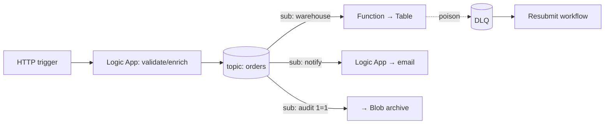

# 15 — Hands-On Portfolio Projects

Six projects, one per phase, each designed to (a) force you to use what you just learned, (b) produce an artifact you can demo, and (c) become an interview story ("tell me about something you built"). Put each project's code/IaC/docs in its own repo (or subfolder) with a README containing the architecture diagram — recruiters and interviewers *do* look.

> For every project: deploy with Bicep + pipeline once you reach Phase 5, add monitoring per Module 11, and write a half-page "design decisions" note. That habit is what makes these *architect* portfolio pieces instead of tutorials.

---

## Project 1 — Order Intake Pub/Sub (after Phase 2)
**Skills:** Logic Apps, Service Bus topics/filters, Functions, error basics.

Order JSON arrives via HTTP → Logic App validates & enriches → publishes to Service Bus topic → three subscribers: (1) Function writes to a "warehouse" table, (2) Logic App sends notification email, (3) audit subscriber archives to Blob. Include a poison-message path to DLQ + a resubmit workflow.

**Demo line:** "Fan-out with filtered subscriptions, competing consumers, DLQ handling — all serverless."

## Project 2 — Managed API Platform Slice (after Phase 3)
**Skills:** APIM, OAuth, policies, transformations, versioning.

Take Project 1's intake + a new "order status" Function → front both with APIM: products (Bronze rate-limited / Gold), subscription keys **and** Entra OAuth via `validate-jwt`, response caching on status GET, XML→JSON policy for one legacy consumer, v1/v2 versioning of the API, developer portal published. Postman collection with token fetch + tests.

## Project 3 — EDI Trading Partner Exchange (after Phase 4)
**Skills:** Integration Account, X12, AS2, archiving, reprocessing. **The enterprise-differentiator project.**

Play two companies (Fabrikam supplier, HostCo buyer): inbound 850 over AS2 → decode → 997 → map to canonical JSON → "SAP stub" API → outbound 855 encoded back. Archive raw + decoded to Blob by partner/doctype/controlnumber; build the failure drill (bad segment → 997 rejection → alert → fix → resubmit from archive).

## Project 4 — Secure File Processing Pipeline (after Phase 4)
**Skills:** Event Grid, SFTP/Blob, managed identity, Key Vault, claim check.

Partner drops CSV to Storage SFTP endpoint → Event Grid → Logic App → flat-file decode / parse → per-row Function processing via queue (claim check for the file) → results to SQL + summary email. Everything credential-less: managed identities + Key Vault only; private-ish networking as far as free tiers allow.

## Project 5 — Ops-Grade Platform (after Phase 5)
**Skills:** CI/CD, monitoring, testing — applied to projects 1–4.

Retrofit: Bicep for all infra; YAML pipelines (build+test+deploy, dev→test with approval); Newman integration tests in pipeline; xUnit for Functions; diagnostic settings everywhere; the standard **error-handling framework** (error topic + central handler + Teams alert); KQL query pack + health workbook; DLQ-depth and heartbeat alerts.

**Demo line:** "A commit deploys, tests, and is observable in production within minutes — here's the dashboard."

## Project 6 — Capstone: Enterprise End-to-End (Phase 6)
**Skills:** everything + HLD/LLD + cost model.

Scenario (invent realistic details): *Suppliers send EDI orders (AS2 + SFTP); internal Salesforce (mock) creates service requests; on-prem "SAP" (mock API) is the ERP; customers consume a real-time order-status API; ops needs dashboards; security requires OAuth + managed identity everywhere; finance wants a cost model.*

Deliverables: full HLD (Module 13 template, with sequence + deployment diagrams), LLD for two interfaces (one EDI, one API), working build of the core paths, cost estimate (calculator), 15-minute recorded demo walkthrough (practice for interviews!).

---

## Presentation tips (turn projects into interview wins)

1. For each project write: **Context → Decisions → Trade-offs → What broke → What you'd change.** Interviewers care about #4 and #5 the most.
2. Rehearse a 2-minute and a 10-minute version of each story.
3. Frame with your MuleSoft past: "In Mule I'd have done X; in Azure I chose Y because Z" — this *is* your transition narrative, made concrete.
4. Keep the Mermaid diagrams in the repo READMEs — walking an interviewer through your own architecture diagram is the strongest possible answer to "do you have Azure experience?"
