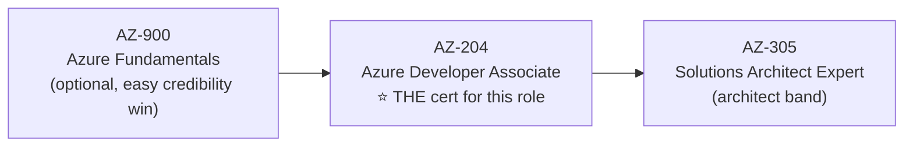

# 17 — Certifications, Resources & Community

## 1. Certification path (in order)

| Cert | Why for you | Study assets |
|---|---|---|
| **AZ-900** | Vocabulary + confidence; some employers filter on it. Doable early in Phase 1–2. | [Free MS Learn path](https://learn.microsoft.com/en-us/credentials/certifications/azure-fundamentals/) · John Savill's AZ-900 course (YouTube) |
| **AZ-204 Developer Associate** | Covers Functions, Service Bus, Event Grid, APIM, App Insights, Key Vault, managed identity — literally your Modules 04–11. Schedule it as your Phase 3–5 forcing function. | [AZ-204 study guide](https://learn.microsoft.com/en-us/credentials/certifications/resources/study-guides/az-204) · [free practice assessment](https://learn.microsoft.com/en-us/credentials/certifications/azure-developer/practice/assessment?assessment-type=practice&assessmentId=35) · Savill's "AZ-204 Study Cram" |
| **AZ-305 Architect Expert** | The architect-band signal (requires AZ-104 *or* strong prep; check current prerequisites). Take after Phase 6. | [AZ-305 study guide](https://learn.microsoft.com/en-us/credentials/certifications/resources/study-guides/az-305) · Savill's "AZ-305 Study Cram" |

> There is **no dedicated AIS certification** — AZ-204 + a strong EDI/B2B portfolio (Module 15, Project 3/6) *is* the market's proof for this specialization.

## 2. The permanent bookmark list

**Documentation roots:**
- [Logic Apps docs](https://learn.microsoft.com/en-us/azure/logic-apps/) · [Functions docs](https://learn.microsoft.com/en-us/azure/azure-functions/) · [Service Bus docs](https://learn.microsoft.com/en-us/azure/service-bus-messaging/) · [Event Grid docs](https://learn.microsoft.com/en-us/azure/event-grid/) · [APIM docs](https://learn.microsoft.com/en-us/azure/api-management/) · [Key Vault docs](https://learn.microsoft.com/en-us/azure/key-vault/) · [Azure Monitor docs](https://learn.microsoft.com/en-us/azure/azure-monitor/)
- [Azure Architecture Center](https://learn.microsoft.com/en-us/azure/architecture/) · [Cloud design patterns](https://learn.microsoft.com/en-us/azure/architecture/patterns/) · [Well-Architected Framework](https://learn.microsoft.com/en-us/azure/well-architected/)
- [WDL functions reference](https://learn.microsoft.com/en-us/azure/logic-apps/workflow-definition-language-functions-reference) · [Logic Apps limits](https://learn.microsoft.com/en-us/azure/logic-apps/logic-apps-limits-and-config) · [APIM policy reference](https://learn.microsoft.com/en-us/azure/api-management/api-management-policies)

**YouTube channels (subscribe):**
- **John Savill's Technical Training** — deep-dives + exam crams; the single best free Azure teacher
- **Adam Marczak — Azure for Everyone** — the best visual per-service intros
- **Microsoft Azure Developers** — official; Logic Apps/APIM community standups
- **Azure Friday** — product-team deep dives
- **dotnet** — official C#/.NET learning
- **IAmTimCorey** — C# fundamentals done slowly and well

**Blogs & newsletters:**
- [Azure Integration Services Blog (Tech Community)](https://techcommunity.microsoft.com/category/azure/blog/integrationsonazureblog) — announcements land here first
- [Sandro Pereira](https://blog.sandro-pereira.com/) — Logic Apps patterns/"Friday facts" firehose
- [Turbo360 (Serverless360) blog](https://turbo360.com/blog) — AIS ops & comparisons
- [Azure updates feed](https://azure.microsoft.com/en-us/updates/) — filter to Integration

**Practice & tools:**
- [Kusto Detective Agency](https://detective.kusto.io/) — learn KQL as a game
- [Azure pricing calculator](https://azure.microsoft.com/en-us/pricing/calculator/) · [Azure status](https://status.azure.com/)
- VS Code extensions: Azure Logic Apps (Standard), Azure Functions, Bicep, Azure Resources; Azure Functions Core Tools; Azurite (storage emulator); Service Bus Explorer (in-portal)
- [Stedi EDI reference](https://www.stedi.com/edi/x12) — best free X12 segment browser

**Community:**
- [Microsoft Q&A — Azure Integration tags](https://learn.microsoft.com/en-us/answers/tags/) · r/AZURE on Reddit · Azure Logic Apps GitHub issues (real-world edge cases) · local Azure user groups / Integration Down Under & Azure Integration Services meetups (recorded sessions on YouTube)

## 3. Keeping current (the habit)

AIS evolves fast (agentic Logic Apps, Flex Consumption, APIM v2 tiers all arrived recently). Routine: skim the AIS blog weekly, watch one Azure Friday/standup per week, re-check limits/docs before quoting numbers in designs or interviews — and once a quarter, re-run one of your portfolio pipelines to catch drift.
