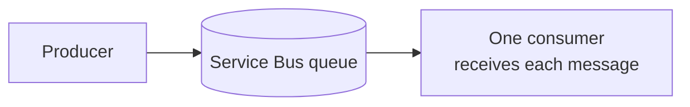
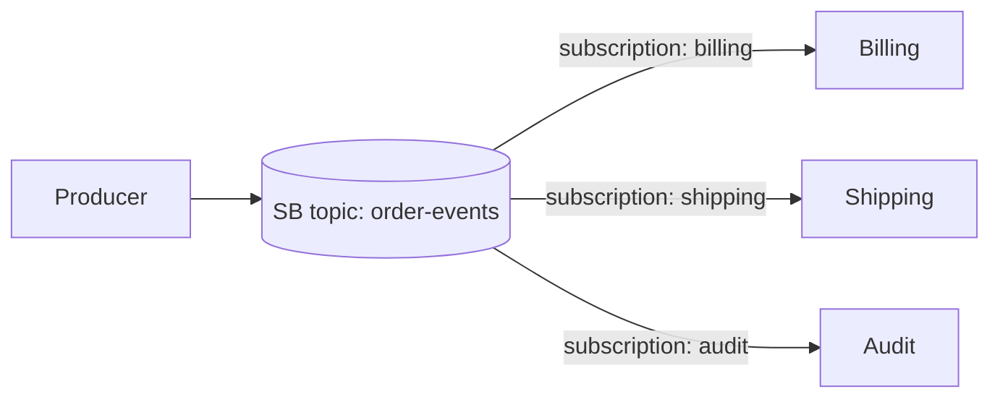
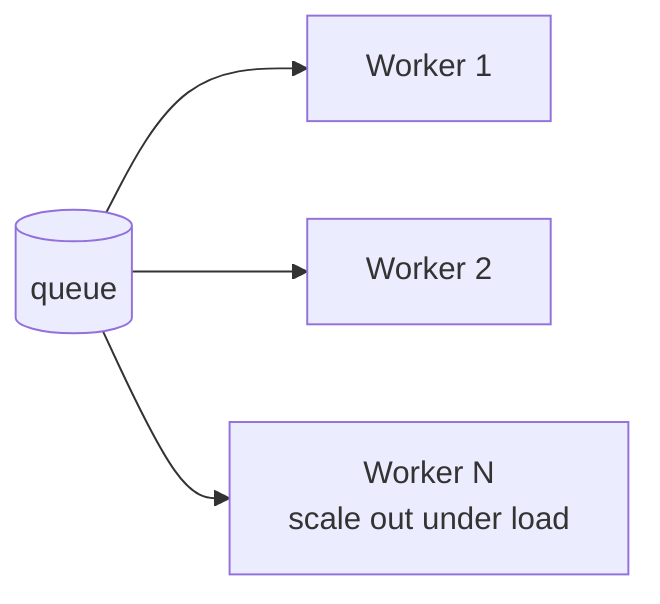
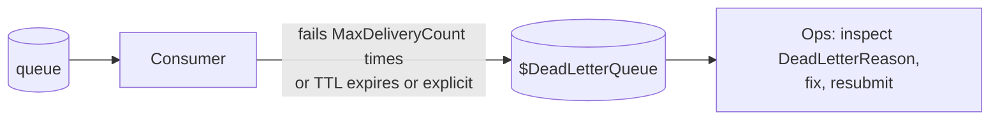
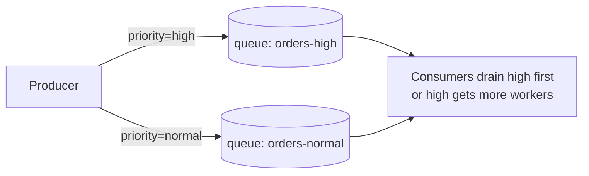
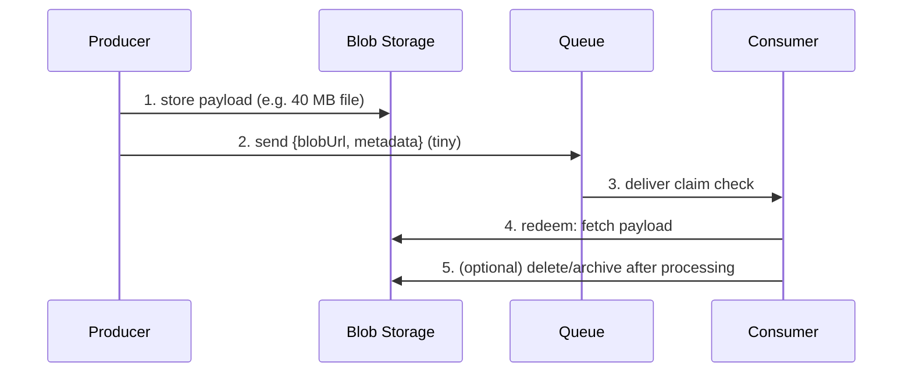

# 18.1 — Messaging Channel Patterns

The foundation layer: *how messages travel*. Everything here maps to Service Bus / Event Grid features you met in Module 05 — this file gives each feature its **pattern name** and its MuleSoft mirror.

---

## 1. Point-to-Point Channel

**Problem:** exactly one consumer must process each message, even with multiple workers running.

- **Azure:** Service Bus **queue**. One message → one successful receiver (peek-lock guarantees no double-processing while locked).
- **MuleSoft:** Anypoint MQ queue / JMS queue — identical semantics.
- **Use when:** commands and work items ("process this order").
- **Interview one-liner:** *"Queues are for commands with one logical processor; if two systems both need the message, I'm in pub/sub territory instead."*

## 2. Publish-Subscribe Channel

**Problem:** one event, many independent interested consumers, producers must not know about them.

- **Azure:** Service Bus **topic + subscriptions** (each subscription = a virtual queue with full queue semantics — DLQ, sessions, etc.). For lightweight *notifications* (no processing guarantees needed by the producer), **Event Grid**.
- **MuleSoft:** Anypoint MQ **exchange** bound to queues; JMS topics.
- **Azure advantage to mention:** subscriptions have **filters** (see Routing file) — Anypoint MQ exchanges deliver to all bound queues, filtering is cruder.
- **Use when:** business events with multiple downstream reactions; adding consumer #4 must not touch the producer.

## 3. Competing Consumers

**Problem:** one queue's throughput must scale beyond one worker.

- **Azure:** just add receivers — multiple Function instances (the Consumption/Premium **scale controller does this automatically** based on queue depth), multiple Logic App runs. Each message still processed once (peek-lock).
- **MuleSoft:** multiple app replicas/workers consuming one MQ queue; `numberOfConsumers` on the connector.
- **Gotchas:** ordering is lost (→ sessions if you need it, see Resequencer); consumers must be idempotent (at-least-once).
- **Interview one-liner:** *"Competing consumers is how queues scale horizontally; Azure Functions gives it to me for free via the scale controller."*

## 4. Dead Letter Channel

**Problem:** a message that can't be processed must not block the queue or vanish.

- **Azure:** every SB queue/subscription has a built-in DLQ; auto dead-letter on MaxDeliveryCount / TTL, or explicit `DeadLetterMessageAsync(reason)`. Event Grid dead-letters undeliverable events to a Storage account.
- **MuleSoft:** Anypoint MQ DLQ (configured per queue, max redeliveries).
- **Non-negotiable ops rule (from Module 11):** alert on DLQ depth; have a resubmission path; log the reason.

## 5. Priority Queue

**Problem:** urgent messages must jump ahead of bulk traffic.

- **Azure:** Service Bus has **no native message priority** → standard workaround is **separate queues per priority** with more/faster consumers on the high queue (this is Microsoft's documented [Priority Queue pattern](https://learn.microsoft.com/en-us/azure/architecture/patterns/priority-queue)).
- **MuleSoft:** same story — Anypoint MQ has no priority either; same two-queue workaround.
- **Interview trap:** if asked "how do you set message priority in Service Bus" the right answer is *"you can't — you design around it with priority-segregated queues."*

## 6. Claim Check

**Problem:** the payload is too big for the messaging layer (SB Standard 256 KB, Event Grid 1 MB).

- **Azure:** Blob Storage + message carrying the URI (+ SAS or, better, consumer's managed identity for access). Event Grid *is itself* a claim-check system for blob events (event carries the URL, not the file).
- **MuleSoft:** same pattern hand-built with S3/Object Store + reference in the MQ message.
- **Design notes:** include content hash for integrity; lifecycle-manage the blobs; the blob container access is part of your security design.

## 7. Guaranteed Delivery (and what "guaranteed" really means)

**Problem:** no message may be lost between producer and processing.

- **Azure building blocks:** durable broker storage (SB persists on send-ack) + **peek-lock** consume (message only deleted after `Complete`) + retries + DLQ as the final catchment + **duplicate detection** for producer resends.
- **MuleSoft:** MQ persistent delivery + CLIENT ack mode + redelivery policy — same trio.
- **The honest interview answer:** end-to-end you get **at-least-once**; exactly-once is a myth across distributed systems — you pair at-least-once transport with **idempotent consumers** (Reliability file, pattern 3). Producers must handle send-failures too (retry on send; the Outbox pattern if the send must be atomic with a DB write).

---

## Labs

1. **Priority queue:** two queues + one Logic App router by `priority` field + a consumer Function on each; flood normal, trickle high, verify high latency stays flat.
2. **Claim check end-to-end:** producer Logic App writes a 5 MB blob + sends reference; consumer Function fetches via managed identity, processes, archives blob.
3. **Guaranteed-delivery drill:** kill your consumer mid-processing (throw before `Complete`) — watch redelivery, then exceed MaxDeliveryCount → DLQ → resubmit. Narrate what happened at each step; that narration is an interview answer.

## Interview questions

1. Queue vs topic vs Event Grid — pattern names and when each? *(point-to-point vs pub/sub vs event notification)*
2. How does Azure implement competing consumers "for free"?
3. Service Bus message priority — how? *(trick question — segregated queues)*
4. Walk through claim check incl. security of the blob reference.
5. What does "guaranteed delivery" actually guarantee, and what must the consumer contribute? *(at-least-once + idempotency)*
6. Compare Anypoint MQ exchanges with SB topics — what do subscriptions add? *(filters, per-subscription DLQ/sessions)*
