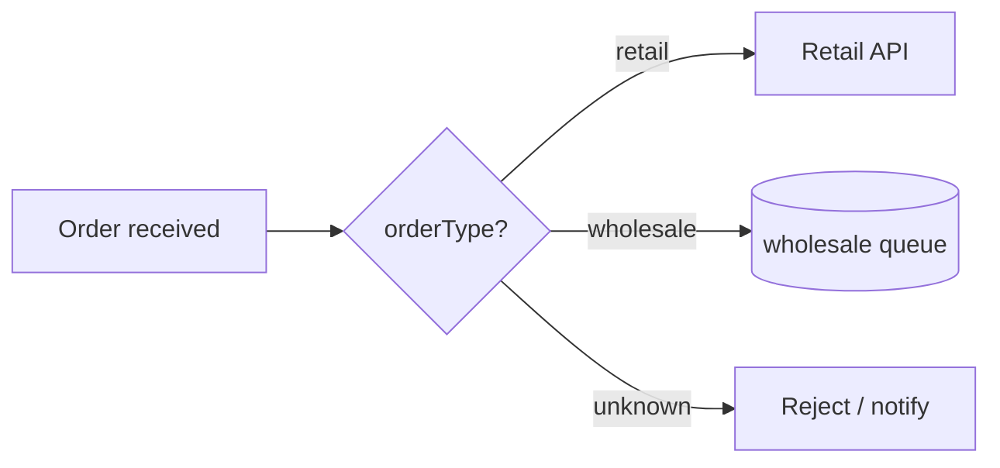
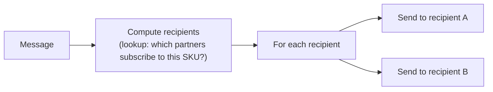
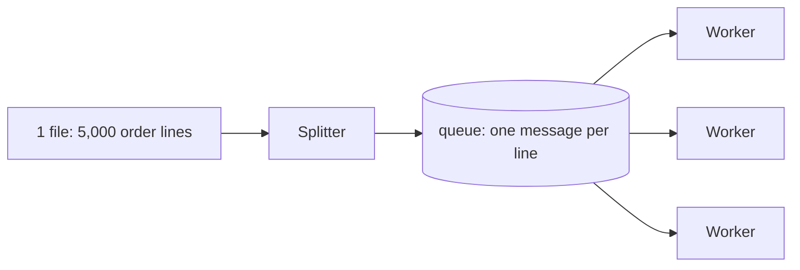
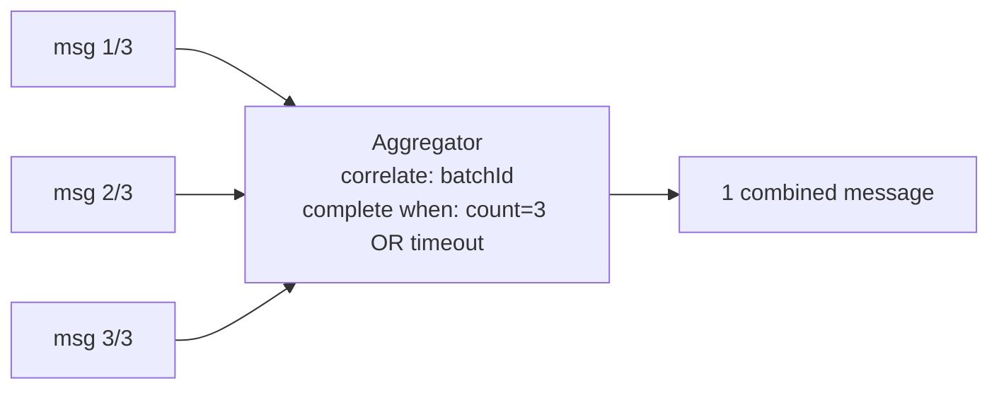
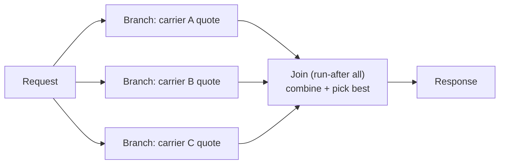

# 18.2 — Routing Patterns

*Which messages go where?* In MuleSoft, routing was mostly the Choice router and Scatter-Gather inside a flow. Azure gives you the same in-flow options **plus infrastructure-level routing** (subscription filters, Event Grid filters) — knowing when to route in-flow vs in-infrastructure is the senior-level distinction.

---

## 1. Content-Based Router

**Problem:** route each message to a different destination based on its content.

**Azure — three implementations, know all three:**
| Where | How | Choose when |
|---|---|---|
| In the workflow | Logic Apps **Switch / Condition** | Few destinations, logic owned by this flow, destinations are actions |
| In the broker | **SB topic + SQL subscription filters** (`orderType = 'wholesale'`) | Destinations are independent consumers; add/remove without touching producer |
| At the gateway | APIM `choose` policy routing to different backends | Routing HTTP APIs by header/claim/body |

- **MuleSoft:** Choice router (in-flow); MQ exchange bindings were much weaker than SB filters.
- **Interview one-liner:** *"Small and local → Switch; scalable and decoupled → topic filters; API traffic → APIM policy."*

## 2. Message Filter

**Problem:** consumer only wants *some* messages; the rest should be ignored (not errored).

- **Azure:** subscription **filters** discard non-matching messages for that subscription (cleanest); Logic Apps **trigger conditions** (fire only if expression true — also saves Consumption cost!); **Filter array** action for arrays in-flow.
- **MuleSoft:** Choice + empty branch, or filter processors; trigger-level filtering was rare.
- **Gotcha:** a message matching *no* subscription on a topic is **dropped silently** — add a catch-all audit subscription (`1=1`) in production designs. Great detail to volunteer in interviews.

## 3. Recipient List (dynamic router)

**Problem:** the set of destinations is computed at runtime (per message), not fixed at design time.

- **Azure:** workflow computes the list (SQL/config lookup) → For-each sends (HTTP/queue per recipient); or model recipients as **subscriptions with correlation filters on recipient tags** you stamp at send time.
- **MuleSoft:** the literal Recipient List / dynamic `foreach` with outbound endpoints.
- **Use when:** partner-specific distribution (EDI!), configurable notification fan-out.

## 4. Splitter (debatching)

**Problem:** one inbound message contains N items that need independent processing.

**Azure — the splitter ladder (size decides):**
1. Trigger **SplitOn** — array trigger output → one *run* per item (zero effort, per-item run history).
2. **For each** action → per-item actions inside one run (fine to ~hundreds).
3. For-each → **send each item to a queue** → competing consumers (the scalable version — combine with pattern 01.3).
4. Huge files (100k+ rows / GBs): don't split in Logic Apps at all — Function streaming the file, or Data Factory.

- **EDI note:** X12 decode **auto-splits** interchanges → per-transaction outputs (Module 08) — a built-in splitter.
- **MuleSoft:** For Each, Batch job (which was splitter+aggregator+threading in one), collection splitter.
- **Gotcha:** splitting destroys ordering and creates partial-failure semantics — decide *before* splitting how you'll report "3 of 5,000 failed" (tracking table keyed by batch ID; ties into Aggregator below).

## 5. Aggregator

**Problem:** combine N related messages into one (fan-in) — the splitter's mirror.

An aggregator needs three decisions (say these in interviews): **correlation key** (which messages belong together), **completeness condition** (count / timeout / marker message), **aggregation function** (concat, sum, first-wins…).

**Azure options:**
| Mechanism | Fit |
|---|---|
| Logic Apps **Batch trigger/action** (Consumption) | Collect messages, release by count/size/schedule — the literal EIP aggregator |
| **Durable Functions fan-in** | You control correlation/completeness in code — most flexible |
| SB **sessions + state** | Correlate by session ID, aggregate in a session-aware consumer |
| Storage table as bucket + timer check | The DIY version when Batch doesn't fit |

- **MuleSoft:** Batch aggregation, or the aggregator module (Mule 4 aggregators: size/time-based) — Logic Apps Batch is nearly a 1:1 concept.
- **Use when:** batching API calls (rate-limited target), reassembling split results, "wait for all approvals."

## 6. Scatter-Gather

**Problem:** call N systems in parallel, combine the answers, respond fast.

- **Azure:** Logic Apps **parallel branches** + a join action (run-after all branches); **Durable Functions fan-out/fan-in** (`Task.WhenAll`) for code-level control; plain `Task.WhenAll` in a single Function for HTTP fan-out.
- **MuleSoft:** the literal **Scatter-Gather router** — one of the few Mule constructs with a nicer out-of-box experience (auto-combines into a map).
- **Gotchas to mention:** timeout strategy per branch (don't let one slow system kill the response — branch-level timeouts + partial-result handling), error semantics (one branch fails: fail all or degrade gracefully?).

## 7. Resequencer

**Problem:** restore order after parallel/competing processing scrambled it.

- **Azure first answer: don't resequence — preserve order instead** with **Service Bus sessions** (FIFO per session key; "parallel across keys, ordered within key" from Module 14).
- True resequencing (buffer + reorder by sequence number): SB **defer** (park out-of-order messages, retrieve by sequence number when their turn comes) or a Durable entity buffering by index.
- **MuleSoft:** no native resequencer either — same buffer-and-sort approach.
- **Interview one-liner:** *"I design ordering in (sessions) rather than sorting it back later; resequencing is a smell unless the source itself is unordered."*

---

## Labs

1. **Router bake-off:** implement the same 3-way routing once with Switch, once with topic filters. Kill one consumer in each design — observe blast radius (the filters version keeps the others flowing; the Switch flow fails the run). Write down the lesson.
2. **Silent-drop trap:** send a message matching no subscription; prove it vanishes; add the `1=1` audit subscription.
3. **Splitter ladder:** process a 1,000-line JSON file at ladder levels 2 and 3; compare duration and run-history usability.
4. **Scatter-gather:** three parallel HTTP calls (use httpbin with delays) + join; add a 2s timeout on one branch and return partial results.
5. **Sessions as ordering:** 100 messages across 5 session IDs; prove per-session order with a session-aware Function.

## Interview questions

1. Three ways to do content-based routing in Azure and how you choose. *(the signature question of this file)*
2. What happens to a topic message matching no subscription filter? How do you protect against it?
3. How do you split a 5,000-item file for parallel processing? What breaks and how do you track partial failure?
4. Design an aggregator: what three decisions define it? Which Azure mechanism for "release every 100 messages or 5 minutes"? *(Batch)*
5. Scatter-gather with one slow participant — what's your timeout/partial-result strategy?
6. How do you keep per-customer ordering while processing customers in parallel? *(sessions)*
7. MuleSoft's Scatter-Gather vs Logic Apps parallel branches — what do you miss, how do you compensate? *(auto-combine → manual join/union)*
