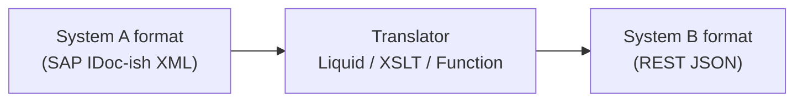
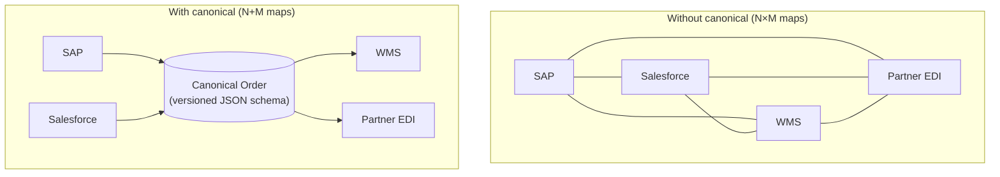
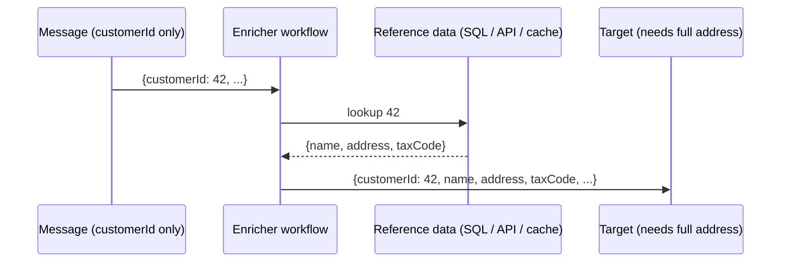
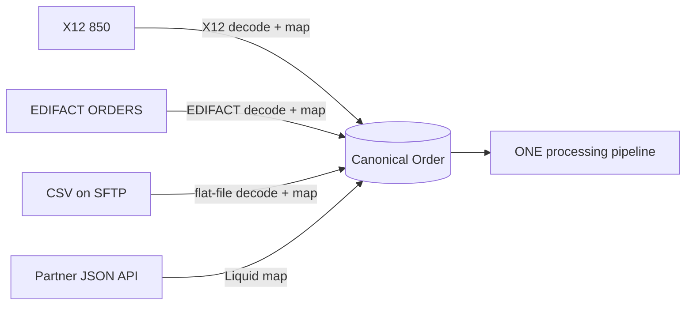
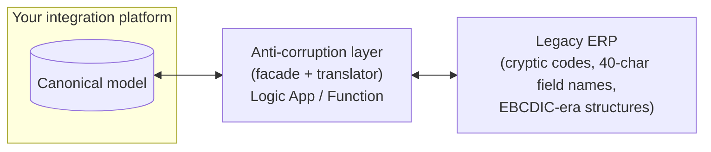

# 18.3 — Transformation Patterns

*How message content changes shape.* The **tools** are Module 07's (Liquid/XSLT/Data Ops/Functions); this file is about the **patterns** — the architectural decisions about *where and why* transformation happens. This is where your DataWeave years translate most directly into design credibility.

---

## 1. Message Translator

**Problem:** sender's format ≠ receiver's format.

- **Azure:** the Transform actions / mapping Functions — tool choice per Module 07's decision table.
- **MuleSoft:** Transform Message (DataWeave). One tool; in Azure you *pick* per case — that choice-making is itself the skill.
- **Design rule:** translators live **at the edges** of your integration (adapting external formats), never scattered mid-process — which leads directly to…

## 2. Canonical Data Model ⭐ (the architect's favorite)

**Problem:** N systems × M formats = N×M point-to-point maps that make every change expensive.

- **Azure:** canonical JSON schemas in a versioned repo (+ Integration Account/Standard artifacts for XSD flavors); every edge gets exactly one map to/from canonical; Service Bus topics carry **canonical** messages so all subscribers share one contract.
- **MuleSoft:** the same discipline — canonical types in a shared DW module / Exchange asset; process APIs speaking canonical.
- **When NOT to bother (balanced answer):** 2–3 systems, stable, point-to-point — canonical adds ceremony without payoff. It earns its keep from ~4+ edges or when the same business object flows on multiple routes.
- **Versioning:** additive changes only within a major version; breaking change = new major version + parallel-run window. Say this — everyone forgets schema evolution.

## 3. Content Enricher

**Problem:** the message doesn't carry everything the target needs — fetch and add it.

- **Azure:** lookup action (SQL/HTTP/Blob config) + **Compose/Select merge** (`union(triggerBody(), body('Lookup'))`); cache hot reference data (cache-aside, file 05) — Redis/Blob with TTL, the Module 03 "doc cache" pattern.
- **MuleSoft:** lookup connector + DW merge; Mule 4 target-variable enrichment (the old Message Enricher scope).
- **Gotchas:** enrichment source down = your flow down → decide degrade-or-fail per field; lookup latency × per-item loops = death → batch-lookup or pre-cache.

## 4. Content Filter (the enricher's opposite)

**Problem:** the message carries *too much* — strip to the minimum before passing on.

- **Azure:** **Select/Compose** projecting only needed fields; APIM **outbound policies** stripping fields/headers from responses; `secureData` hiding sensitive values from run history.
- **MuleSoft:** DW projection picking fields.
- **Why it's a *security* pattern too:** least-privilege data — don't ship PII/pricing to systems that don't need it. GDPR/data-classification answers live here; volunteering that connection scores points.

## 5. Normalizer

**Problem:** the same business document arrives in many formats (X12 850, EDIFACT ORDERS, CSV, JSON API) and must become one internal shape.

- **Azure:** normalizer = **router (by format) + translator-per-format + canonical model** — per-format ingestion workflows all emitting canonical onto the same topic. Your EDI stack (Module 08) *is* a normalizer.
- **MuleSoft:** per-format inbound flows → canonical → shared process API.
- **The payoff sentence:** *"Everything after the normalizer is written once, no matter how many partner formats exist — partner onboarding becomes 'add one edge map', not 'clone a pipeline'."*

## 6. Anti-Corruption Layer (ACL)

**Problem:** a legacy/external system's messy model must not leak into and "corrupt" your clean domain model.

- **Azure:** a dedicated facade (Function/Logic App, often fronted by APIM) that owns **all** knowledge of the legacy quirks — code-page conversions, magic values (`'ZZ9'` means null!), stateful call sequences — and exposes clean canonical operations.
- **MuleSoft:** this is exactly your **System API** in API-led connectivity — you've built ACLs for years; use that term equivalence in interviews.
- **Strategic role:** the ACL is what makes **strangler-fig migration** possible (file 05) — swap the legacy behind the ACL without touching consumers.

---

## Labs

1. **Canonical mini-build:** define a canonical order JSON schema; write 2 inbound maps (fake-SAP XML → canonical via XSLT; partner JSON → canonical via Liquid) and 1 outbound (canonical → "WMS" JSON via Function/LINQ). Publish canonical to a topic; consumers read one shape.
2. **Enricher with cache:** enrich orders with customer data from an API; add Blob-cached lookup with 1h TTL; measure per-run latency before/after.
3. **Normalizer:** feed the SAME logical order as X12 850 (Module 08 lab) and as CSV; verify both end as identical canonical messages on the topic.
4. **Content filter:** build the "notifications" subscriber to receive only orderId+status+email (Select projection) while "billing" gets full canonical; explain why in one sentence of data-classification language.

## Interview questions

1. Canonical data model — sell it, and tell me when you'd *skip* it. *(N×M→N+M, but ceremony for tiny estates — balance wins)*
2. How do you version canonical schemas without breaking 12 consumers?
3. Enricher: reference API is slow and flaky — options? *(cache-aside, batch lookups, degrade-vs-fail per field)*
4. What's an anti-corruption layer and where did you build one in MuleSoft? *(system APIs — direct equivalence)*
5. Normalizer vs translator — difference? *(normalizer = router + N translators into one canonical)*
6. Where should transformation NOT live? *(mid-process, in APIM policies beyond trivial tweaks, duplicated per consumer)*
7. Content filtering as security — give an example. *(strip PII for analytics subscriber; secureData in run history)*
