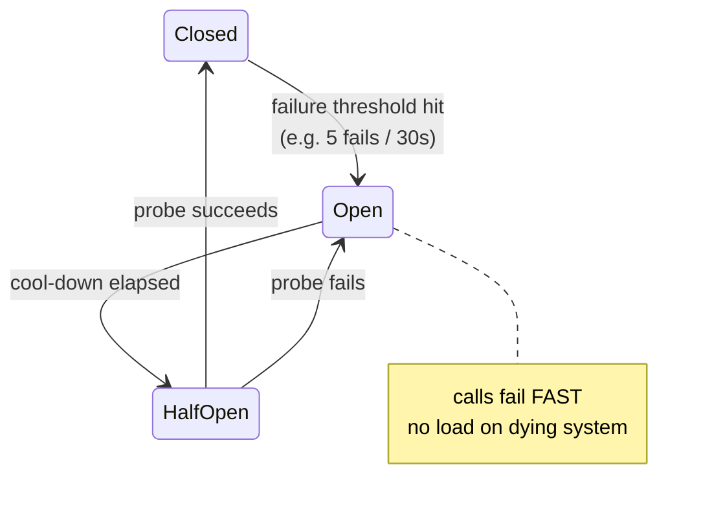
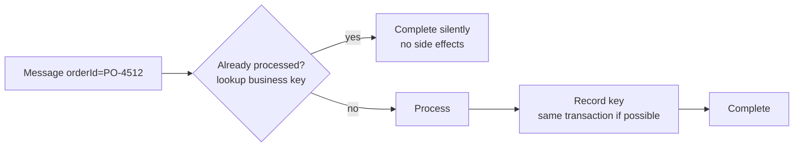
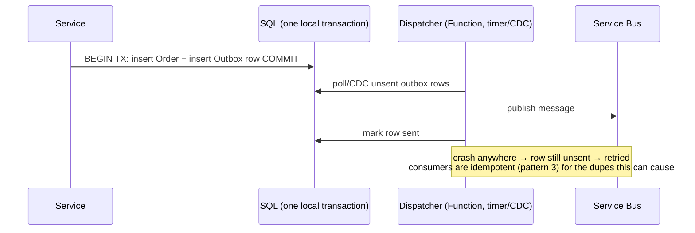
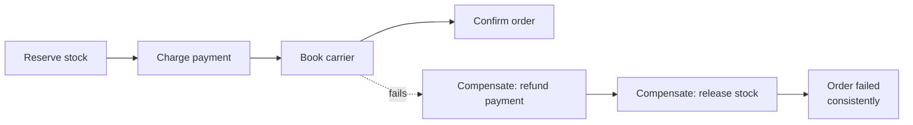
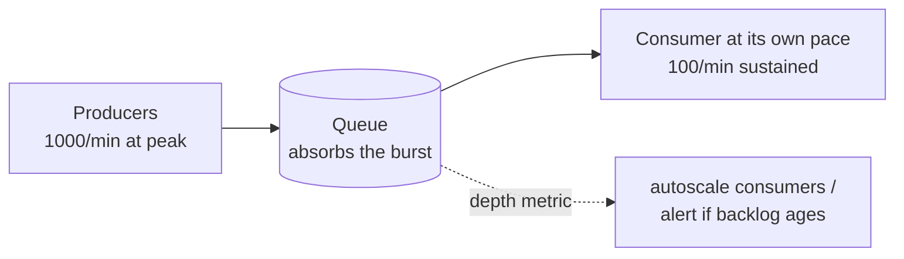
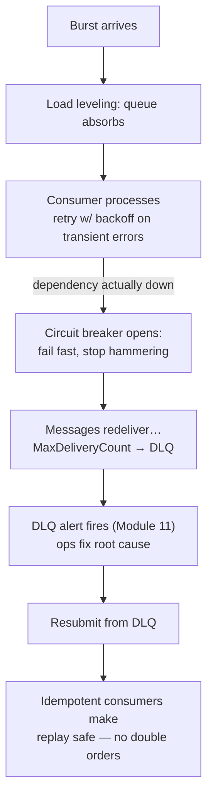

# 18.4 — Reliability Patterns

*How integrations survive failure.* This is the category that separates senior candidates — anyone can draw the happy path; interviews are won on "what happens when SAP is down / the message arrives twice / step 3 of 5 fails."

---

## 1. Retry with Exponential Backoff

**Problem:** transient faults (timeouts, 429s, brief outages) shouldn't fail the flow.

- **Azure:** retry is a **setting, not code** in most places — Logic Apps per-action retry policies (default 4×, exponential; configurable fixed/exponential/none), Azure SDKs retry built-in, APIM `retry` policy, Service Bus delivery retries via MaxDeliveryCount.
- **MuleSoft:** Until Successful scope; connector reconnection strategies.
- **The three rules to recite:** (1) retry **only transient** errors — retrying a validation failure 4 times is 4× the waste; (2) **backoff + jitter** so a recovering system isn't stampeded; (3) retries multiply — 3 layers × 4 retries = up to 64 attempts downstream. Cap total attempt budget end-to-end.
- **Beyond in-process retries:** scheduled Service Bus messages give you *long* retries (redeliver in 1 hour) that survive restarts.

## 2. Circuit Breaker

**Problem:** a *dead* (not briefly hiccuping) dependency + eager retries = resource exhaustion and cascading failure.

- **Azure:** in Functions → **Polly** library (`AddStandardResilienceHandler` in modern .NET gives retry+breaker+timeout on HttpClient); APIM can approximate (track backend failures with policy expressions + fail fast); Logic Apps has no native breaker — approximate with a "health flag" in Blob/Redis that flows check before calling (or front the fragile system with APIM).
- **MuleSoft:** no native breaker either (hand-rolled with Object Store flags) — so this is a *new strength* you can claim in Azure via Polly.
- **Breaker vs retry in one line:** *"Retry handles blips; the breaker handles outages — retry keeps trying, the breaker stops trying to protect both sides."*

## 3. Idempotent Consumer ⭐ (the pattern behind every messaging answer)

**Problem:** at-least-once delivery means duplicates *will* arrive (lock expiry, producer resend, operator resubmit) — processing twice must be harmless.

- **Azure toolbox (layered):** SB **duplicate detection** (drops same MessageId in a window — producer-side dupes only!) + **consumer-side business-key dedup** (processed-keys table / unique constraint / upsert semantics) + naturally idempotent operations where possible (SET status vs INCREMENT counter).
- **MuleSoft:** idempotent message validator (Object Store-backed) — same concept.
- **Interview must-say:** duplicate detection alone is NOT idempotency — a resubmitted message gets a *new* MessageId; only business-key dedup catches that.

## 4. Outbox Pattern

**Problem:** "write to DB **and** publish a message" — if you do them separately, a crash between them leaves them inconsistent; there's no distributed transaction across SQL + Service Bus.

- **Azure:** outbox table in the same SQL DB + dispatcher Function (timer or SQL trigger/CDC). Cosmos DB users get this nearly free via **change feed**.
- **MuleSoft:** same hand-built pattern (no native support there either).
- **When:** whenever a state change and its event must not diverge — order placed → OrderPlaced event, payment recorded → notification.

## 5. Saga / Compensating Transactions

**Problem:** a business transaction spans multiple systems; no ACID across them; step 4's failure must undo steps 1–3.

- **Azure:** **Durable Functions** orchestration (try/catch around activities, compensation stack in code — cleanest); Logic Apps scopes with run-after-failed compensation actions (visual version); choreographed saga via events (each service listens for failure events and self-compensates — harder to reason about).
- **MuleSoft:** try/catch + hand-written compensating flows; Mule had no saga framework either.
- **Design notes:** compensations must themselves be idempotent and retryable; some actions can't truly un-happen (email sent) → design *pending/confirm* steps (reserve → confirm) rather than *do → undo* where possible.

## 6. Queue-Based Load Leveling

**Problem:** bursty producers (9 AM order flood) vs a consumer that can only do X/sec.

- **Azure:** any SB queue between producer and consumer *is* this pattern; consumers pull at their capacity; queue depth becomes your elasticity signal (Functions scale controller uses it) and your early-warning metric (Module 11 alerts).
- **MuleSoft:** MQ as buffer — same.
- **Say the SLA math:** *"Leveling trades latency for stability — messages age in the queue at peak. I check backlog drain time (depth ÷ rate) against the business SLA, and autoscale consumers if it doesn't fit."*

## 7. Throttling / Rate Limiting (both directions)

- **Protecting YOUR APIs:** APIM `rate-limit(-by-key)` + `quota` (Module 06); Logic Apps trigger concurrency caps; 429 + `Retry-After` to well-behaved clients.
- **Respecting THEIR limits (the integration-heavy direction):** downstream SaaS/SAP allows N calls/sec → control your outbound rate: For-each concurrency=1..k, queue + limited consumers, batch APIs where offered, honor 429/`Retry-After` in retry policies.
- **MuleSoft:** API Manager policies inbound; `maxConcurrency`/pooling outbound.
- **Trap answer to avoid:** "I'll just retry on 429" — retrying *harder* at a rate limit makes it worse; you must *slow down* (backoff honoring Retry-After) or *level* (queue).

---

## How they compose (the 2 AM story)

Reliability patterns work as a **stack** — practice narrating this end-to-end, it answers half of all ops scenario questions:

---

## Labs

1. **Retry vs breaker:** Function calling a mock API you can toggle 503; first with naive retries (watch the hammering in App Insights), then add Polly resilience handler; compare dependency-call graphs.
2. **Idempotency proof:** consumer writing orders to SQL; send the same order 3× (new MessageIds!); first without dedup (3 rows 😱), then with business-key upsert (1 row).
3. **Outbox:** order API writing SQL + outbox row; dispatcher Function publishing; kill the dispatcher mid-cycle and verify nothing is lost or double-sent (with pattern-3 consumer).
4. **Saga:** 3-activity Durable orchestration (reserve→charge→book) where `book` throws; implement the compensation stack; inspect the orchestration history.
5. **The full stack drill:** flood your Project-1 pipeline (Module 15) with 1,000 messages while its downstream is dead; watch the composed story of the diagram above happen; screenshot the timeline for your portfolio.

## Interview questions

1. Retry vs circuit breaker — when is retry actively harmful? *(dead dependency, rate limits, non-transient errors)*
2. How do you make a consumer idempotent? Why isn't SB duplicate detection enough? *(resubmits get new MessageIds — business-key dedup)*
3. Explain the outbox pattern and the exact failure it prevents. *(dual-write inconsistency)*
4. Design a saga for order placement across 3 systems — where do compensations go, and what about steps that can't be undone? *(pending/confirm design)*
5. What does queue-based load leveling trade away? How do you check the trade is acceptable? *(latency; drain-time vs SLA)*
6. Downstream allows 10 req/s and you have 10,000 queued — walk me through your design. *(leveling + capped concurrency + Retry-After + batch APIs)*
7. Your MuleSoft estate had Until-Successful everywhere and it once melted a recovering ERP — what would you do differently in Azure? *(backoff+jitter, budget, breaker — great story-form answer to prepare)*
