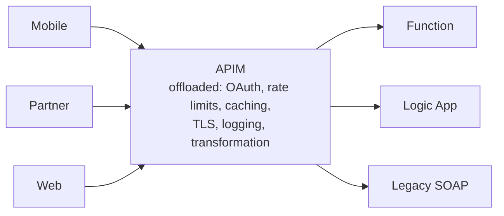
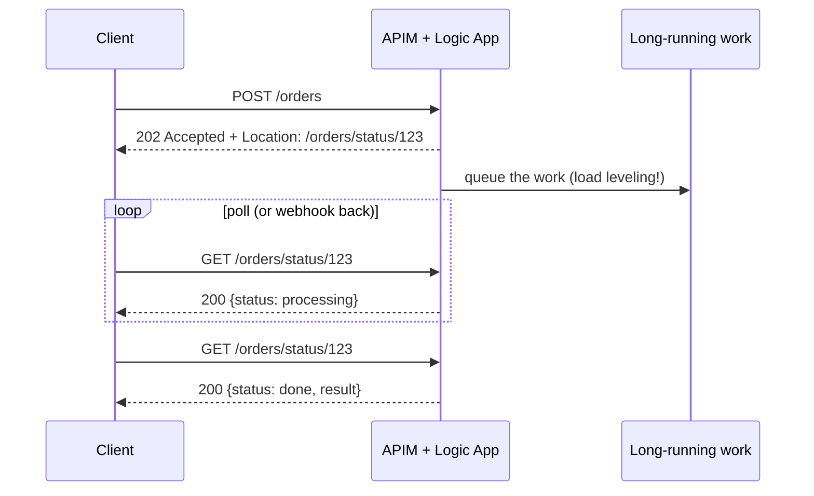
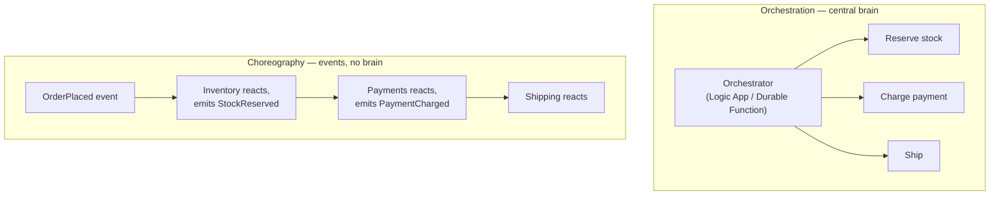
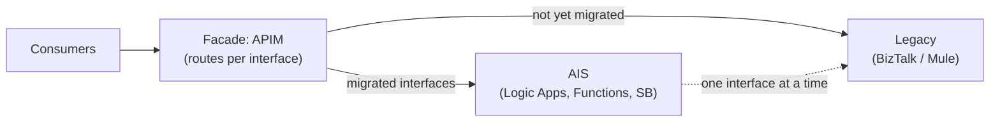
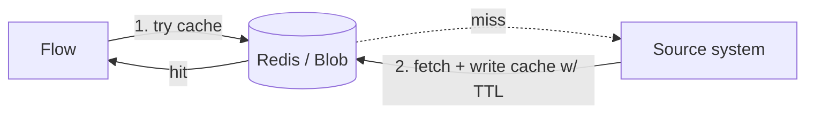

# 18.5 — API & Process Patterns

*How consumers reach your platform, and how multi-step processes are coordinated.* This file closes the catalog with the patterns that dominate whiteboard rounds: gateway, async request-reply, orchestration vs choreography, and the migration patterns (strangler fig) that most AIS programs actually are.

---

## 1. API Gateway (+ Gateway Offloading & Aggregation)

**Problem:** consumers hitting backends directly couple themselves to your implementation and force every backend to re-solve auth, throttling, monitoring.

- **Azure:** APIM (Module 06). **Offloading** = cross-cutting concerns live in the gateway once, not in N backends. **Aggregation** = one gateway operation fans out to several backends and combines (`send-request` policy — but keep it light; heavy aggregation belongs in a Logic App/Function behind the gateway).
- **MuleSoft:** API Manager + gateway; experience APIs did the aggregation.
- **Anti-pattern to name:** business logic creeping into APIM policies — gateways route and protect; they don't *decide*.

## 2. Async Request-Reply (202 + status polling)

**Problem:** HTTP consumers expect answers in seconds; the process takes minutes (EDI validation, ERP posting).

- **Azure:** Logic Apps does the **202 + location + polling contract natively** (async response setting; and the HTTP *action* auto-follows other services' 202s); Durable Functions generates status endpoints automatically (`CreateCheckStatusResponse`). Alternatives: webhook callback (client registers a URL) or client subscribes to an Event Grid/SB notification.
- **MuleSoft:** hand-built — 202 + a status API backed by Object Store. Azure's native support is a genuine upgrade; say so.
- **Design detail interviewers probe:** status resource lifetime (how long is the status queryable? where is it stored?) and what an *error* status carries (correlation ID → Module 11).

## 3. Orchestration vs Choreography ⭐ (the big process question)

**Problem:** a business process spans services — who coordinates?

| | Orchestration | Choreography |
|---|---|---|
| Coordinator | Central (Logic App / Durable Function) | None — services react to events (SB topics / Event Grid) |
| Visibility | One place shows the whole process ✅ | Distributed — needs correlation + tracing to see the flow |
| Coupling | Orchestrator knows all steps | Services only know events — max decoupling ✅ |
| Change | Edit one orchestrator | Add subscribers without touching anyone ✅ |
| Failure handling | Saga in one place ✅ | Each service self-compensates — hard |
| Risk | Orchestrator = god-flow bottleneck | "Event spaghetti" nobody can follow |

- **The balanced answer:** *"Orchestrate within a bounded process (order fulfillment = one Logic App/saga); choreograph between domains (fulfillment publishes OrderShipped; marketing/analytics/loyalty subscribe). Most real systems are hybrids."*
- **MuleSoft:** you mostly orchestrated (flows calling flows); heavy choreography is more idiomatic in Azure thanks to Event Grid/topics — expect interviewers to test whether you can think event-first.

## 4. Strangler Fig (migration pattern)

**Problem:** replace a legacy platform (BizTalk, aging Mule estate, monolith ESB) without a big-bang cutover.

- **Azure:** APIM (or DNS/routing layer) as the fig; migrate interface-by-interface; **parallel-run** (route a copy to both, compare outputs) before cutting each one; the **anti-corruption layer** (file 03) keeps new components clean while legacy still lives.
- **Relevance:** many AIS programs *are* BizTalk→AIS or Mule→AIS migrations (Module 14 §7) — this pattern is the program plan. Your MuleSoft-to-AIS *personal* transition story even mirrors it; interviewers enjoy that parallel.
- **Killer detail:** define the *decommission gate* per interface (traffic drained + parallel-run clean for N weeks) — migrations die from never-deleted legacy.

## 5. Cache-Aside

**Problem:** hot, slow-changing reference data (rates, product master, tokens) fetched on every message.

- **Azure:** Azure Cache for Redis (real cache: TTL, eviction, fast) or Blob/Table for cheap document caching (the Module 03 "doc cache"); APIM `cache-lookup/store` for *response* caching at the edge.
- **MuleSoft:** Object Store-backed cache scope.
- **The two hard questions:** invalidation (TTL vs event-driven refresh via Event Grid on source change) and stampede (many misses at once — locking/jittered TTLs). Naming those unprompted = senior signal.

## 6. Backends for Frontends (BFF) — awareness level

One API shape rarely fits mobile + web + partners. **Azure:** APIM **products/versions per audience**, or thin per-audience facade Functions in front of shared process APIs. **MuleSoft:** this was exactly your *experience API* layer. One-liner: *"BFF is experience APIs by another name — per-consumer facades over shared process capability."*

---

## Capstone lab — compose the whole catalog

Extend Portfolio Project 6 (Module 15) and label every pattern in your diagram — this artifact is your strongest interview prop:

1. APIM **gateway** with per-audience **products (BFF)**.
2. POST /orders → **202 async request-reply** with status endpoint.
3. Intake **normalizes** (X12 + JSON edges) to **canonical**, publishes to a topic (**pub/sub**).
4. Subscription **filters route** (content-based); a **splitter** debatches lines to a queue; **competing consumers** process; **sessions** keep per-order lines ordered.
5. SAP adapter behind an **anti-corruption layer**, wrapped in **retry + circuit breaker + throttled** concurrency; the queue in front is **load leveling**.
6. Fulfillment is a Durable **saga** with compensation; DB writes use an **outbox**; consumers are **idempotent**.
7. Reference data via **cache-aside**; oversized payloads via **claim check**; failures land in **DLQs** with the Module 11 framework.

Draw it, name every label out loud, time yourself at 15 minutes. That *is* the architect interview.

## Interview questions

1. What belongs in the gateway vs behind it? Give an example of gateway aggregation and its limits.
2. Design a long-running API: walk the 202 contract end-to-end — status storage, lifetime, error shape.
3. Orchestration vs choreography — trade-offs, and your hybrid rule of thumb. *(the guaranteed question of this file)*
4. Plan a BizTalk→AIS migration for 150 interfaces. *(strangler fig + parallel run + decommission gates + wave plan)*
5. Cache-aside: how do you handle invalidation and stampede?
6. Map MuleSoft's API-led three layers onto Azure patterns. *(experience=BFF/APIM products, process=orchestration, system=ACL)*
7. Pick any five patterns from this module and show how they compose in one architecture. *(use the capstone lab diagram)*
