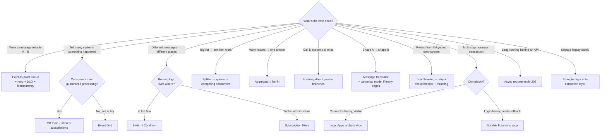

# 18 — Integration Patterns in Azure (with MuleSoft References)

**The pattern vocabulary is your strongest transferable asset.** You already *use* these patterns daily in MuleSoft — this module makes sure you can (1) name them precisely, (2) implement each with the right Azure service, and (3) answer the design-round question every AIS interview contains: *"Which pattern would you use here, and how would you build it in Azure?"*

Most patterns here come from two canons — know both names in interviews:
- **Enterprise Integration Patterns (EIP)** — Hohpe & Woolf ([enterpriseintegrationpatterns.com](https://www.enterpriseintegrationpatterns.com/)) — the messaging classics MuleSoft was built around.
- **Azure Cloud Design Patterns** — [Microsoft's catalog](https://learn.microsoft.com/en-us/azure/architecture/patterns/) — cloud-era additions (circuit breaker, claim check, saga…).

---

## Files in this module

| File | Patterns covered |
|---|---|
| `README.md` (this file) | How to study + the master mapping table + pattern-selection flowchart |
| [`01-Messaging-Channel-Patterns.md`](./01-Messaging-Channel-Patterns.md) | Point-to-point, pub/sub, competing consumers, DLQ, priority, claim check, guaranteed delivery |
| [`02-Routing-Patterns.md`](./02-Routing-Patterns.md) | Content-based router, message filter, recipient list, splitter, aggregator, scatter-gather, resequencer |
| [`03-Transformation-Patterns.md`](./03-Transformation-Patterns.md) | Message translator, canonical data model, content enricher, content filter, normalizer, anti-corruption layer |
| [`04-Reliability-Patterns.md`](./04-Reliability-Patterns.md) | Retry, circuit breaker, idempotent consumer, dedup, outbox, saga/compensation, load leveling, throttling |
| [`05-API-and-Process-Patterns.md`](./05-API-and-Process-Patterns.md) | Gateway patterns, async request-reply, orchestration vs choreography, strangler fig, cache-aside, BFF |

Each pattern is documented the same way: **Problem → Diagram → Azure implementation → MuleSoft reference → When to use / avoid → Interview one-liner.**

---

## The master mapping table (EIP → Azure → MuleSoft)

Your revision sheet — if you can reproduce this table from memory, you're interview-ready:

| Pattern | Azure implementation | MuleSoft implementation | File |
|---|---|---|---|
| Point-to-point channel | Service Bus **queue** | Anypoint MQ queue / JMS queue | 01 |
| Publish-subscribe | Service Bus **topic + subscriptions**; Event Grid | Anypoint MQ exchange; JMS topic | 01 |
| Competing consumers | Multiple receivers on one queue; Functions scale-out | Multiple app instances on one MQ queue | 01 |
| Dead letter channel | Built-in **DLQ** per queue/subscription | Anypoint MQ DLQ config | 01 |
| Priority queue | Two queues + priority routing (no native priority) | Same workaround in MQ | 01 |
| Claim check | Blob Storage + message with reference | Object Store / S3 + reference | 01 |
| Guaranteed delivery | Peek-lock + retries + duplicate detection | MQ ack modes + redelivery policy | 01 |
| Content-based router | **Switch/Condition** (Logic Apps); **subscription SQL filters** (SB); APIM policy routing | Choice router; MQ routing rules | 02 |
| Message filter | Subscription filters; trigger conditions; Filter array | Filter processor / Choice + discard | 02 |
| Recipient list | Topic with dynamic subscriptions; workflow fan-out | Recipient list (dynamic routing) | 02 |
| Splitter | **SplitOn**; For-each; EDI decode debatching | For Each / Batch; collection splitter | 02 |
| Aggregator | **Batch trigger/action**; fan-in with state (Durable Functions) | Aggregator / batch aggregation | 02 |
| Scatter-gather | **Parallel branches** + join; Durable fan-out/fan-in | Scatter-Gather router | 02 |
| Resequencer | Service Bus **sessions** + defer | Manual (sorting after aggregation) | 02 |
| Message translator | Liquid/XSLT/Data Ops/Functions (Module 07) | **DataWeave** | 03 |
| Canonical data model | Central JSON/XSD schemas + map-per-edge | Canonical model in DW + Exchange assets | 03 |
| Content enricher | Workflow lookup step (SQL/API) + Compose merge | Enricher scope / lookup + DW merge | 03 |
| Content filter | Select/Compose projecting fewer fields; APIM outbound policy | DW projection | 03 |
| Normalizer | Per-format decode → canonical (X12/EDIFACT/flat file) | Per-format inbound flows → canonical | 03 |
| Anti-corruption layer | Facade Logic App/Function + canonical model around legacy | System API layer (API-led!) | 03 |
| Retry (backoff) | Action **retry policies**; SDK retries; APIM `retry` | Until Successful / reconnection strategies | 04 |
| Circuit breaker | Code (Polly) in Functions; APIM policy approximation | Until Successful + flow control (manual) | 04 |
| Idempotent consumer | Business-key dedup + SB duplicate detection | Idempotent message validator | 04 |
| Outbox | SQL transactional outbox + dispatcher Function | Same pattern, hand-built | 04 |
| Saga / compensation | **Durable Functions**; Logic Apps with compensation steps | Try/catch + compensating flows (manual) | 04 |
| Queue-based load leveling | Queue between producer & consumer | MQ as buffer | 04 |
| Throttling | APIM rate-limit/quota; trigger concurrency | API Manager SLA tiers/policies | 04 |
| API gateway / facade | **APIM** | API Manager + gateway | 05 |
| Async request-reply | 202 + status endpoint (Logic Apps native!) | HTTP 202 + polling flow (manual) | 05 |
| Orchestration | Logic Apps / **Durable Functions** | Mule flows as orchestrator | 05 |
| Choreography | Event Grid / SB topics, no central brain | Event-driven flows via MQ | 05 |
| Strangler fig | APIM routing old→new during migration | Same idea fronted by Mule gateway | 05 |
| Cache-aside | Redis/Blob lookup-then-fill | Object Store cache | 05 |

---

## Pattern selection flowchart (design-round compass)

---

## How to study this module

1. **Recognize before you memorize.** For each pattern, first ask: *where did I build this in MuleSoft?* You have 7 years of concrete examples — attach each pattern name to one of your real projects. That memory hook is stronger than any flashcard, and those stories are your interview answers.
2. Read the five files in order (channels → routing → transformation → reliability → API/process). Later files assume earlier vocabulary.
3. Do the **labs** at the end of each file — most reuse infrastructure you built in Modules 03–05.
4. Self-test: cover the Azure column of the master table and reproduce it; then cover the pattern column and name patterns from the Azure features.
5. In design interviews, **say pattern names out loud** ("I'd put queue-based load leveling here, with an idempotent consumer because Service Bus is at-least-once") — examiners score vocabulary + justification, not just a working design.

## Reference library

- 📖 [Azure Cloud Design Patterns catalog](https://learn.microsoft.com/en-us/azure/architecture/patterns/) ⭐ — read every card
- 📖 [Enterprise Integration Patterns site](https://www.enterpriseintegrationpatterns.com/patterns/messaging/) — the EIP catalog with diagrams
- 📖 [Asynchronous messaging options in Azure](https://learn.microsoft.com/en-us/azure/architecture/guide/technology-choices/messaging) — Microsoft's own "which service for which pattern"
- 📖 [Enterprise integration using queues and events (reference architecture)](https://learn.microsoft.com/en-us/azure/architecture/example-scenario/integration/queues-events)
- 🎥 Search **"enterprise integration patterns Azure"** — several conference talks map EIP→Azure end-to-end
- 📚 Book: *Enterprise Integration Patterns* (Hohpe/Woolf) — skim-worthy even if you only read the pattern intros
