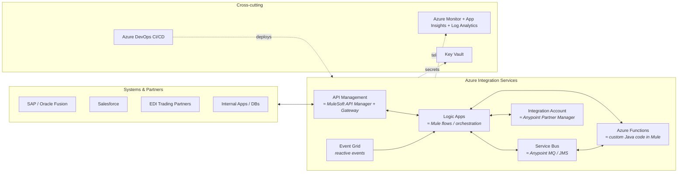

# MuleSoft → Azure Integration Services (AIS) — Complete Transition Course

> **Who this is for:** A MuleSoft developer (~7 years experience) transitioning to **Azure Integration Services (AIS)** — built around a typical enterprise AIS job description (Developer → Sr. Developer → Architect), and designed to make you employable for *any* AIS role in the market (NTT DATA, Accenture, Cognizant, TCS, Infosys, Capgemini, EY, Deloitte product teams, etc.).
>
> **Starting point assumed:** Strong integration fundamentals (you have them from MuleSoft), beginner-level .NET/C#.
> **End point:** Architect-level understanding — design, build, secure, deploy, monitor, and defend AIS solutions in interviews.

---

## How to use this course

1. **Follow the roadmap** in [`00-Roadmap`](./00-Roadmap/README.md) — it sequences every module into phases with clear exit criteria.
2. **Keep the MuleSoft bridge open** — [`01-MuleSoft-to-AIS-Bridge`](./01-MuleSoft-to-AIS-Bridge/README.md) is your translation dictionary. Every time you learn a new Azure concept, find its MuleSoft equivalent there. Learning by analogy is 3–4x faster than learning from zero.
3. **Do the labs** — every module has hands-on labs. AIS interviews are heavily scenario-based; you cannot fake hands-on experience.
4. **Build the portfolio projects** in [`15-Hands-On-Projects`](./15-Hands-On-Projects/README.md) — these become your interview stories.
5. **Drill the interview guide** in [`16-Interview-Guide`](./16-Interview-Guide/README.md) throughout, not just at the end.

> **Free Azure account:** Sign up at [azure.microsoft.com/free](https://azure.microsoft.com/free/) — you get $200 credit for 30 days + always-free tiers (Functions 1M executions/month, Logic Apps consumption free grants, Service Bus basic is cheap). Almost every lab in this course can be done for free or a few dollars.

---

## Course map

| # | Module | What you'll master | Maps to JD skill |
|---|--------|--------------------|------------------|
| 00 | [Roadmap](./00-Roadmap/README.md) | The full phased plan, week-by-week study order, exit criteria | Everything |
| 01 | [MuleSoft → AIS Bridge](./01-MuleSoft-to-AIS-Bridge/README.md) | Concept-by-concept translation dictionary | Transition accelerator |
| 02 | [Integration & Azure Fundamentals](./02-Integration-and-Azure-Fundamentals/README.md) | iPaaS, Azure core (resource groups, ARM, regions), message formats (JSON/XML/CSV/flat file/EDI) | "Integration (iPaaS) and APIM fundamental knowledge", "Payload / Message formats" |
| 03 | [Logic Apps](./03-Logic-Apps/README.md) | Workflows, connectors, set properties, branch/decision, doc cache, try/catch, routing | "Logic App & workflows", "Routing", "Flows, Process call (sync/async)" |
| 04 | [Azure Functions & C#](./04-Azure-Functions-and-CSharp/README.md) | C#/.NET from scratch → durable functions | ".Net coding, Scripting, Azure Functions" |
| 05 | [Messaging](./05-Messaging-ServiceBus-EventGrid/README.md) | Service Bus queues/topics, Event Grid, Event Hubs, JMS comparison | "Communication protocols (JMS, Azure Service Bus, Events)" |
| 06 | [API Management](./06-API-Management/README.md) | APIM policies, products, subscriptions, security, versioning | "APIM fundamental knowledge" |
| 07 | [Data Transformation](./07-Data-Transformation-and-Maps/README.md) | Data Operations, Liquid, XSLT, Integration Account maps — vs DataWeave. Includes the [Liquid Data Mapping deep-dive](./07-Data-Transformation-and-Maps/Liquid-Data-Mapping/README.md) (20 scenarios + mapping sheet + DataWeave correlation) | "Transformation and Maps" |
| 08 | [EDI & B2B](./08-EDI-B2B-Integration/README.md) | X12, EDIFACT, AS2, trading partners, agreements, archiving, re-processing | "EDI formats (X12, EDIFACT, SWIFT)", "EDI Integration Design" |
| 09 | [Security](./09-Security/README.md) | OAuth 2.0, Entra ID, managed identity, Key Vault, HTTPS/SSL, network isolation | "Logging, Security (policy, OAuth, HTTPS, SSL)" |
| 10 | [DevOps & CI/CD](./10-DevOps-CICD/README.md) | Azure DevOps, pipelines, ARM/Bicep, deployment of Logic Apps/Functions/APIM | "Azure DevOps (CI/CD)" |
| 11 | [Monitoring, Logging & Error Handling](./11-Monitoring-Logging-ErrorHandling/README.md) | App Insights, Log Analytics, KQL, alerts, error-handling frameworks, Splunk/Cribl awareness | "Error handling concepts, Logging framework, Monitoring tools" |
| 12 | [Testing](./12-Testing/README.md) | Postman, SOAP UI, unit testing Functions, test automation | "Integration testing using Postman, SOAP UI" |
| 13 | [Architecture & Design](./13-Architecture-and-Design/README.md) | HLD/LLD, UML & deployment diagrams, patterns, environments, licensing/cost, effort estimation | Architect band of the JD |
| 14 | [Advanced Topics & AI](./14-Advanced-and-AI/README.md) | Parallel processing, clustering/scaling, design patterns, Copilot/AI-augmented delivery, accelerators | "Advanced Features … AI augmented design" |
| 15 | [Hands-On Projects](./15-Hands-On-Projects/README.md) | 6 portfolio projects from starter to architect level | Everything, practically |
| 16 | [Interview Guide](./16-Interview-Guide/README.md) | 250+ Q&A, scenario questions, company-specific prep, salary/negotiation notes | Getting the role |
| 17 | [Certifications & Resources](./17-Certifications-and-Resources/README.md) | AZ-900 → AZ-204 → AZ-305 path, all links, YouTube channels, blogs, communities | Credibility |
| 18 | [Integration Patterns](./18-Integration-Patterns/README.md) | Full EIP + cloud-pattern catalog implemented in Azure, each with MuleSoft reference: channels, routing, transformation, reliability, API/process | Design rounds; "Design Patterns" in the JD |

---

## The big picture — what is AIS, in one diagram

**The one-sentence mental model:** everything you did in *one* runtime (Mule) is decomposed in Azure into *specialized managed services* — orchestration (Logic Apps), compute (Functions), messaging (Service Bus/Event Grid), API gateway (APIM), B2B/EDI (Integration Account) — glued together by shared security (Entra ID/Key Vault), shared observability (Azure Monitor), and shared deployment (Azure DevOps).

---

## Rules for the journey

- **Hands-on beats videos.** Watch a video once; build the thing twice.
- **Write notes in your own words** inside each module folder (add your own `my-notes.md` files — the folders are yours).
- **One portfolio project per phase.** By the end you'll have 6 projects you can demo and talk about.
- **Interview prep is continuous.** After each module, answer that module's interview questions out loud.
